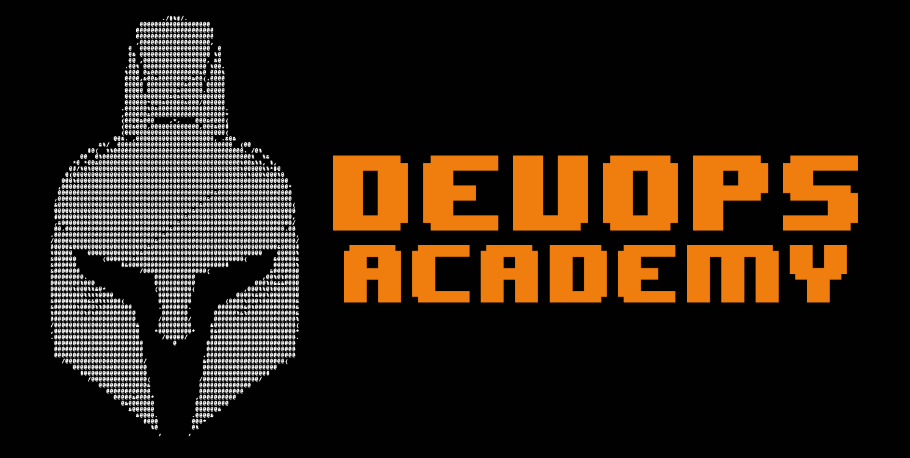

# DevOps Academy

<p align="center">
    
</p>

This repository's intention is to help the community in learning the DevOps methodologies and culture throughout a series of classes and hands-on exercises. The content of the classes that will be presented has been designed in a way to prepare you for working as an Automation/Cloud/DevOps Engineer.

These classes start with explaining different concepts at a high level and then goes into some detail. Some of the main topics currently being covered can be seen [here](#content).

Feel free to contribute to this repository with content through Pull Requests, help peer reviewing code or just going through the exercises!

If you want to be part of the team behind this, get in touch on help@devopsacademy.com.au.

# Table of Content

- [DevOps Academy](#devops-academy)
- [Table of Content](#table-of-content)
- [How it Works](#how-it-works)
- [Requirements](#requirements)
- [Live/Online Applications](#liveonline-applications)
  - [How to Submit a PR as part of your application](#how-to-submit-a-pr-as-part-of-your-application)
- [Content](#content)
  - [Classes](#classes)
  - [Exercises](#exercises)
    - [For each class **exercise**:](#for-each-class-exercise)
    - [Example of the submission process](#example-of-the-submission-process)
    - [Available labs](#available-labs)
  - [Projects](#projects)
- [Contributors and Instructors](#contributors-and-instructors)
  - [Create a dashboard (CSV file) about  exercise submissions](#create-a-dashboard-csv-file-about-exercise-submissions)
  - [Presentation format](#presentation-format)
  - [Clean up Ready to Review tag from Closed PRs](#clean-up-ready-to-review-tag-from-closed-prs)
- [Authors](#authors)
  - [Caio Trevisan](#caio-trevisan)
  - [Denis Storti](#denis-storti)
  - [Francisco Collet](#francisco-collet)
- [Sponsors](#sponsors)
  - [ITBR Australia Community](#itbr-australia-community)
  - [Contino](#contino)


# How it Works

To complete the DevOps Academy, you will have to go through 8 classes with hands-on exercises. For each exercise, you will have to submit your code via pull requests to this repository as per [instructions](#exercises). The last two labs are complete projects based on current industry needs.

You will also be required to peer review at least 5 pull requests from other students to finish this course.

There will be 2 modes of learning the content in these classes:

1. Self-learning. Where you go through all the classes on your own pace and submit the exercises when you're ready.

2. Face-to-Face Classes or Virtual Classes. Where the instructors will go through the content of each class and answer any questions or concerns you might have. To sign up for the classes you can email help@devopsacademy.com to get the presentation dates and the availability for the upcoming class. 

**The first round of classes has been completed and we are starting our second round of classes on the 2nd of June 2020. If you are interested in joining the upcoming classes, email us at help@devopsacademy.com.au or come and chat to us on our [Slack channel](https://join.slack.com/t/devopsacademyau/shared_invite/zt-ajsfpwsj-GcTGG6tpZp~MOZd2DM92QA).**

From time to time we also run the live/online classes of the Academy content with a selected group of students. Those classes uses this same repository and have no additional content. The only benefit is to have the opportunity to interact with a group of students as well as with the instructors in a more structured learning process. 

Because in this live/online mode the classes occurs every fortnighly, the pace of the exercises completion are based on the course schedule, so students requires a considerable amount of hours available during the week to be able to keep the course pace and complete exercises. 

Also, considering the limited number of students that are accepted for each live/online term, we ask people to only apply for those classes if they will be able to commit to have a 100% class attendance and are willing to invest their time in the learning process by doing the exercises and complete th group projects.


# Requirements

Please find below the requirements to complete this course:

- Slack
- Github Account
- AWS Account
- AWS cli
- Terraform
- Visual Studio Code
- Docker

If you need help in any of these topics, [a tutorial is available on the pre-class](classes/00pre-class/README.md):

# Live/Online Applications

If you intend to apply for the Live/Online classes, you'll need to fill the form available [here](https://devopsacademy.com.au/), and as part of your application, you'll need to submit a PR to this repository under the applications folder following the instructions below. 

Your application will only be reviewed once you have create a Pull Request with your requirements. It's essential that you have a proper environment setup before being able to undergo the DevOps Academy.

If there is no form available on the link provided, there is no scheduled classes in place. Reach out to any of us through our [Slack channel](https://join.slack.com/t/devopsacademyau/shared_invite/zt-ajsfpwsj-GcTGG6tpZp~MOZd2DM92QA) to get more information on next Live/Online classes.

## How to Submit a PR as part of your application

- Make sure you have all the Requirements mentioned above installed on the machine you'll use for the course. 
- Fork this Repository
- Go into the applications folder and execute the `application.sh` script. This script will generate an `output.txt` file with information about the following tools:
    - your computer os version
    - git version
    - docker version
    - aws cli version
    - terraform version
- Rename the output.txt file to [your_git_account_username].txt
- Create a PR on this repository from your forked repo including only the file with your GitHub user account name.

If you need instructions on how to fork a repository and how to create a PR from your fork, take a look on [this](https://help.github.com/en/github/getting-started-with-github/fork-a-repo) and [this](https://help.github.com/en/github/collaborating-with-issues-and-pull-requests/creating-a-pull-request-from-a-fork) tutorials.

# Content

- Version Control (GIT)
    - What is it?
    - Benefits
    - Basic commands
    - How to clone/fork/pr this repository
- Agile methodology
    - Frameworks
    - Scrum
    - Kanban
- Infrastructure as Code
    - Concepts
    - Terraform introduction
- Containers
    - Concepts
    - Docker images
    - Docker Compose
    - 3Musketeers
- CI/CD
    - What is CI
    - What is CD
    - Pipelines
- Amazon Web Services (AWS)
    - Cloud concepts
    - Identity and Access Management (IAM) / CloudTrail / CloudWatch
    - VPC / Subnet / Route table / Network ACL / Security Group
    - EC2 / Auto-scaling Group / Load Balancer
    - Simple Storage Service (S3)
    - RDS / DynamoDB
    - Cloudfront / WAF
    - Route53 / Certificate Manager (ACM)
    - Elastic Container Service (ECS) / Elastic Container Registry (ECR)
    - Lambda

The content can be accessed through each specific README link below.

## Classes

- [Class 01](classes/01class/README.md)
    - DevOps Academy Introduction
    - Introduction to AWS
    - Git
- [Class 02](classes/02class/README.md)
    - Agile Methodologies
    - Networking Introduction
      - AWS VPC
    - AWS IAM (Identity and Access Management)
    - AWS CLI
- [Class 03](classes/03class/README.md)
    - AWS EC2
        - Load Balancing
        - Auto Scaling Group
    - AWS Route 53
    - Container - Docker
        - Repositories
        - Images
        - Dockerfile
    - Make
    - Docker-Compose
- [Class 04](classes/04class/README.md)
    - AWS ECS (Elastic Container Service)
    - AWS ECR (Elastic Container Repository)
    - AWS Fargate
    - IaC - Terraform
    - Project #1 Kick-off
- [Class 05](classes/05class/README.md)
    - 3 Musketeers
    - AWS S3 (Simple Storage Service)
    - AWS RDS (Relational Database Service)
    - CI/CD Concepts
      - GitHub Actions
    - AWS CloudWatch
- [Class 06](classes/06class/README.md)
    - Project #1 Delivery
    - Serverless introduction
    - AWS Lambda
    - AWS API Gateway
    - Project #2 Kick-off
- [Class 07](classes/07class/README.md)
    - AWS DynamoDB
    - AWS KMS (Key Management Service)
    - AWS SSM - Parameter Store
    - AWS SNS
    - AWS SQS
- [Class 08](classes/08class/README.md)
    - Project #2 Delivery
    - Next steps
    - Course Closure


## Exercises

We highly recommend doing the exercises from this repository. However, you will first need to raise a Pull Request from a [fork](https://help.github.com/en/github/getting-started-with-github/fork-a-repo) to add yourself permission to push branches.

- Create a new branch from `master`
- Open the file [/scripts/tf/github.com/team-external-students.tf](/scripts/tf/github.com/team-external-students.tf)
- Add your GitHub username on the `members` variable in an alphabetical order (that will help you avoid merge conflicts)

i.e: username is `caiocezart`

```
members = [
  "aaa",
  "bbb",
  "caiocezart",
  "ccc"
]
```
- Save, add and commit the change
- Raise a Pull Request
- Send a message on our [Slack workspace](https://join.slack.com/t/devopsacademyau/shared_invite/zt-ajsfpwsj-GcTGG6tpZp~MOZd2DM92QA) and one of us will review as soon as possible

As soon as the pull request is approved, the automation will give you `Write` permission and you will be able to push branches to the repository.


### For each class **exercise**:

1. Clone this repository
   
```bash
git clone <repo-url>
```

2. Switch to **master** branch and **pull** it 

3. Create a new branch **from master** with branch name containing exercise number and your name, e.g `<github-username>/<exercise-number>` 

```bash
git checkout -b caiocezart/c01-e01
```
4. create a folder with your `<github-username>` (e.g. `denstorti`, `kikobr82`, ...)

```bash
cd <repo-name>

mkdir classes/01class/exercises/c01-e01/<my-username>
```

5. Add your work on a folder like `classes/<class name>/exercises/<exercise-number>/<github-username>/`.

Exercise submissions can be textual like a simple .txt file or more complex containing several files and folders.

Example: 
`classes/01class/exercises/c01-e01/caiocezart/<my-files>`

6. Create one or more commits with changes for this exercise
7. Push it to the remote repo regularly
8. Only open a Pull Request with the name `<github-username>/<exercise-number>` ***when your work is ready to be reviewed***
9. Once you have the approvals, we will merge your code to **master** branch and complete the exercise. Congrats!
10. Upon completion of your first exercise, you will be given permission to start/help peer reviewing other community members code! 

### Example of the submission process
```bash
# starting with exercise1
git checkout master
git pull
git checkout -b "my_github_username/exercise1"
# code code code 
# Remember to add files inside the correct folder
# e.g. .../classes/01class/exercises/exercise1/<my_github_username>
git add file1 file2
git commit -m "comment about the changes on this commit"
# ... several commits later
git push origin "my_github_username/exercise1"
# ... several pushes later, when you are ready for a review
# Open a PR via Github website with the name 

# now, doing exercise2
git checkout master
# update your work directory from remote repo
git pull 
git checkout -b "my_github_username/exercise2"
...
...
```

### Available labs

- [Class 01: (AWS & GIT 101)](/classes/01class/exercises/README.md)


## Projects

More info to come..

- [Project 01 - Application migration from on-prem to the cloud](projects/project01/README.md)
- [Project 02 - Cloud native application architecture on AWS](projects/project02/README.md)

Projects will be submitted in the respective project `submissions` folder via PRs.

Example:
`projects/project01/submissions/caiocezart/<my-files>`


# Contributors and Instructors

## Create a dashboard (CSV file) about  exercise submissions

It will use the file `labs.txt`and `students.txt`from the `scripts/dashboard` folder.
It runs through GitHub Actions, based on the cron definition of the [dashboard,yaml](.github/workflow/dahboard.yaml) and updates the spreadsheet with the latest information.

It can also be executed manually with the following commands:

```
make dashboard \
  GOOGLE_KEY=[GOOGLE_KEY] \
  SHEET_KEY=[SHEET_KEY] \
  WKS_NAME="Dashboard" \
  GH_USER=[GH_USER] \
  GH_TOKEN=[GH_TOKEN]
```

| VARIABLE | DESCRIPTION   |
|----------|:-------------|
| GOOGLE_KEY | Google Service Account key with permissions to the spreadhseet |
| SHEET_KEY | The Sheet ID   |
| WKS_NAME | The Worksheet Name |
| GH_USER | GutHubs user with permission to query the repository |
| GH_TOKEN | The token from the GitHub user above |

## Presentation format

* We are using plain README.md files with markdown or [GitPitch](https://gitpitch.com/docs/markdown-features/basics/) for slideshow presentations

* Generate the presentation by running: 
  * `make presentation`
* Generate a README.md file from the PITCHME.md file:
  * `make pitchme_to_readme`

* For GitPitch, use PITCHME.md files and subfolders using query string "p=FOLDERNAME" with the class name
* GitPitch can run either online (out-of-the-box for Github public repos):
    * Online: access `https://gitpitch.com/${ORG_NAME}/${REPO_NAME}/${BRANCH_NAME}?p=${FOLDER_NAME}`. Folder must contain a PITCHME.md file.
    * Offline: use a [Docker container](https://github.com/kns-it/Docker-GitPitch/), run `make presentation` and `open http://localhost:9000/${ORG_NAME}/${REPO_NAME}/${BRANCH_NAME}?p=${FOLDER_NAME}`
    For running in a specific folder: `FOLDER_NAME=class2 make presentation`


## Clean up Ready to Review tag from Closed PRs

To clean up the `Read to Review` tags of the closed PRs, the below make target can be executed.

Run:  `make rtr-cleanup`

Optionally you can pass the Github User and Token, so the API calls are not throttled.

Run:  `make rtr-cleanup GH_USER=<YOUR_USER> GH_TOKEN=<YOUR_TOKEN>`

# Authors

## Caio Trevisan

- Linkedin: [https://www.linkedin.com/in/caiocezart/](https://www.linkedin.com/in/caiocezart/)
- Website: [www.caiotrevisan.com](https://www.caiotrevisan.com)

## Denis Storti

- Linkedin: [https://www.linkedin.com/in/denstorti/](https://www.linkedin.com/in/denstorti/)
- Github: [https://github.com/denstorti](https://github.com/denstorti)

## Francisco Collet

- Linkedin: [https://www.linkedin.com/in/fcollet/](https://www.linkedin.com/in/fcollet/)

# Sponsors

## ITBR Australia Community
[www.itbr.com.au](https://www.itbr.com.au)

## Contino
[https://www.contino.io](https://www.contino.io/)
