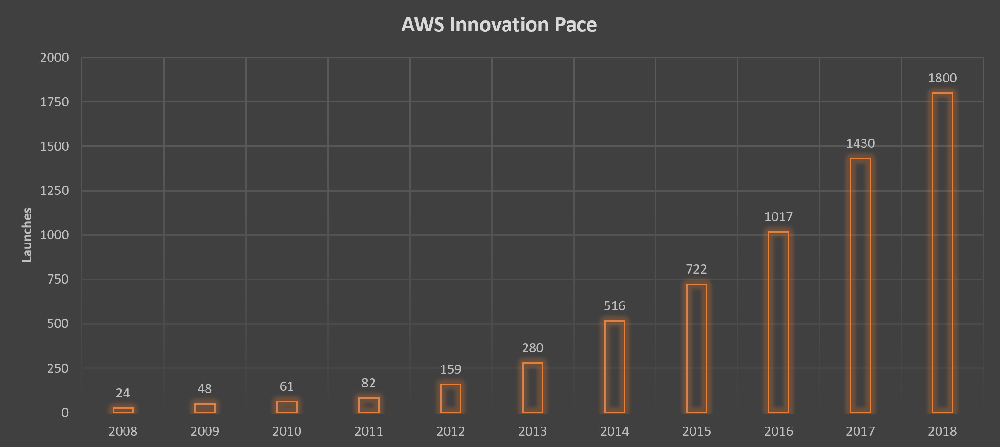

# Class 01

## AWS 101

### Agenda

- General cloud concepts
- Cloud Benefits
- AWS Foundations
- AWS Services
- Labs and Exercises

### General Cloud Concepts

- Someone’s else computer with:
    - “Infinite” resources
        - Most of the services can scale to unlimited values and also very fast
    - Elastic services
        - Services can scale up and down so you can only pay what you need
    - Easy and cheap to test new technologies
        - Because you only pay for what you use, and during the time you use, you can run tests with new technologies for a week and only pay for the resources consumed during that week.
    - Fast innovation pace
        - Being able to test without big investments, the feedback on tests are quicker and you can continuosly innovate

- Architecting and developing for the cloud
    - Pets vs Cattle
        - Instead of having servers that you will try to fix, you'll just kill it and replace it
    - Decoupled systems
        - Ideally there is no interdependency between your servers/services.
    - Ephemeral Environments
        - Components are not changed/upgraded. They are fully replaced and nothing is expected to be lost
    - Automation
        - Automation is an important factor to be able to recreate environments faster and without human errors

### Cloud Benefits

- Many managed services
    - Most services can be consumed without any management required. 
- Easy to test new solutions
    - Testing new solutions is cheaper and faster, speeding innovation
- No upfront investments
    - There is no need for initial investments in server/network equipments from day one.
- Pay as you go
    - You only pay for what you use, generally based on hours/minutes/seconds

### AWS Foundations

- Availability Zone
    - Consider it as a Datacenter
    - Currently at 69
- Region
    - A geographical location with 2 or more Azs
    - Currently at 22
- Edge Location
    - AWS Endpoint used for caching content(CDN)
    - Currently at 205

    

Image from this [link](https://aws.amazon.com/about-aws/global-infrastructure/).

### AWS Services (+130)

    

    

### Main AWS Services

#### Computing
- EC2
    - Virtual Machines on the cloud
    - https://aws.amazon.com/ec2/faqs/
- ECS/EKS
    - Container orchestrations tools.
    - https://aws.amazon.com/ecs/faqs/
    - https://aws.amazon.com/eks/faqs/
- Lambda
    - Serverless code execution
    - https://aws.amazon.com/lambda/faqs/
#### Database
- RDS
    - Managed Relational Database Service
    - https://aws.amazon.com/rds/faqs/
- ElastiCache
    - Managed Redis/Memcache services
    - https://aws.amazon.com/elasticache/faqs/
- DynamoDB
    - Managed NoSQL Database
    - https://aws.amazon.com/dynamodb/faqs/
- DocumentDB
    - Managed Document Database
    - https://aws.amazon.com/documentdb/faqs/
#### Storage
- S3
    - Unlimited object storage
    - https://aws.amazon.com/s3/faqs/
- EBS
    - Block storage
    - https://aws.amazon.com/ebs/faqs/
- EFS
    - Managed Elastic File System(NFS)
    - https://aws.amazon.com/efs/faq/
#### Networking
- VPC
    - Virtual Private Cloud (Isolated Network for your workload)
    - https://aws.amazon.com/vpc/faqs/
- CloudFront
    - Managed CDN Solution
    - https://aws.amazon.com/cloudfront/faqs/
- Route53
    - Managed DNS Service
    - https://aws.amazon.com/route53/faqs/
- API Gateway
    - Reverse proxy for your API services(Lambda functions)
    - https://aws.amazon.com/api-gateway/faqs/
#### Management
- CloudWatch
    - Managed Monitoring service
    - https://aws.amazon.com/cloudwatch/faqs/
- CloudTrail
    - Managed Auditing service
    - https://aws.amazon.com/cloudtrail/faqs/
- CloudFormation
    - IaC for AWS resource management
    - https://aws.amazon.com/cloudformation/faqs/
- SystemManager
    - Central Management of several AWS resources
    - https://aws.amazon.com/systems-manager/faq/
#### Messaging
- SQS
    - Managed message queue service
    - https://aws.amazon.com/sqs/faqs/
- SNS
    - ManagedNotification service
    - https://aws.amazon.com/sns/faqs/
- SES
    - Managed Email Service
    - https://aws.amazon.com/ses/faqs/
#### Security/Compliance
- IAM
    - Identity Manager
    - https://aws.amazon.com/iam/faqs/
- Certificate Manager
    - Maages SSL certificates
    - https://aws.amazon.com/certificate-manager/faqs/
- KMS
    - Criptographic Key Management
    - https://aws.amazon.com/kms/faqs/
- WAF
    - Web Application Firewall
    - https://aws.amazon.com/waf/faqs/
#### Development Tools
- Code*
    - Several services relate to versioning, build and deploy process as a managed service
    - https://aws.amazon.com/codecommit/faqs/
    - https://aws.amazon.com/codebuild/faqs/
    - https://aws.amazon.com/codedeploy/faqs/
    - https://aws.amazon.com/codepipeline/faqs/
