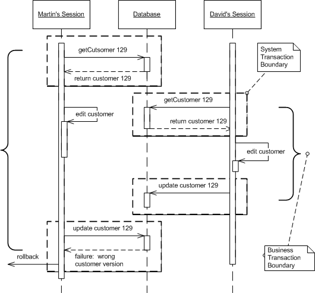
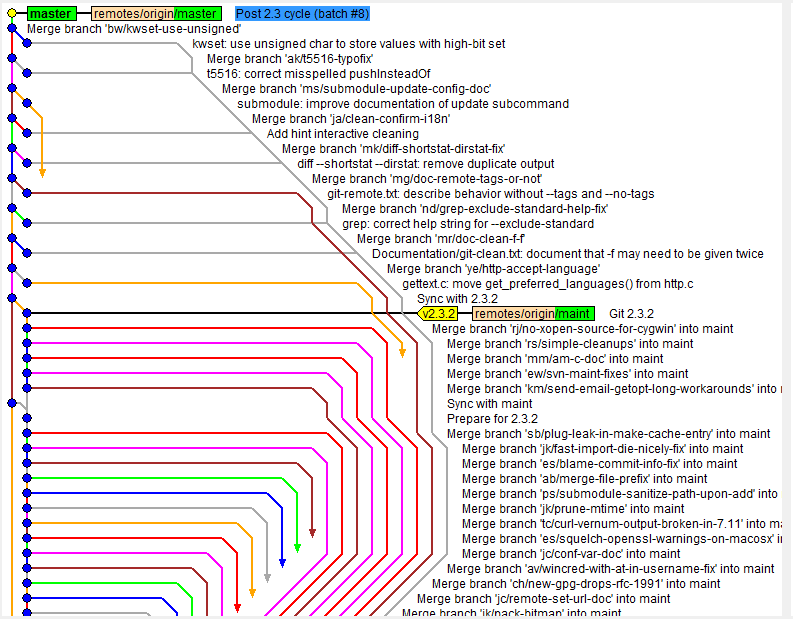
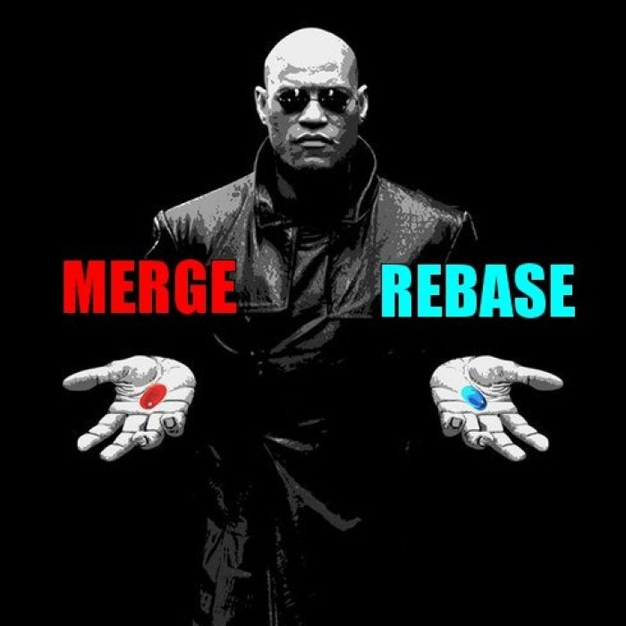
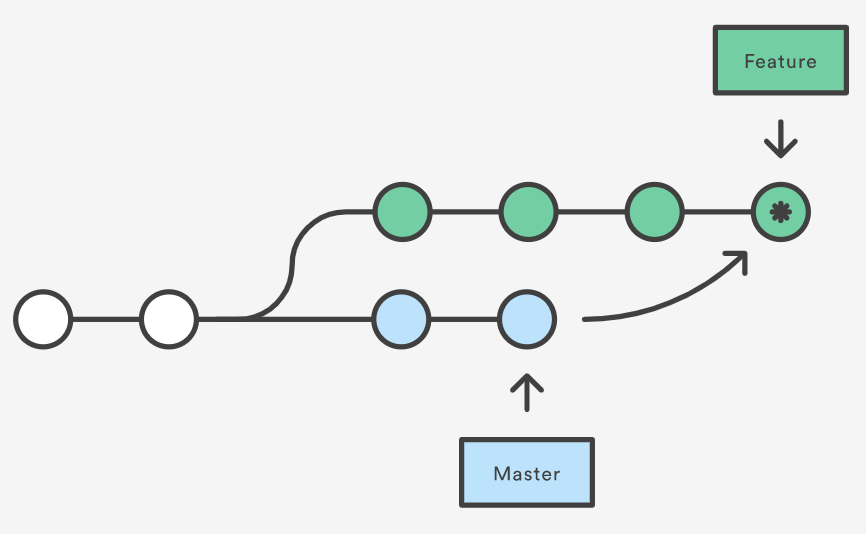
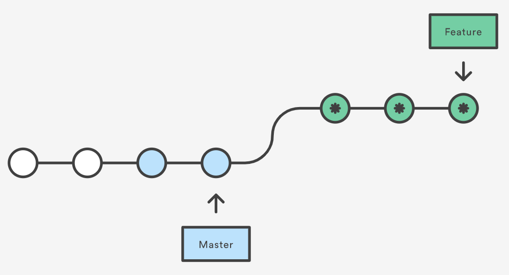

#### Presentation URL: https://gitpitch.com/devopsacademyau/academy?p=classes/01class/git/

# Let's Get **Started** with Git

---
### Versioning: The "old way"

- Pessimistic locking, code duplication
    - Local versioning -> Copy and paste (Let's duplicate!)
    - Version overwriting (Who deleted my version!?)
    - Locked file (Can you please release file customers.xls, please!?)
- Are there other problems?

---
### What is Git?

- Created by Linus Torvalds in 2005 for development of the Linux kernel
- Git is a distributed VCS
- Centralized vs Distributed VCS?
- Optimistic vs Pessimistic locking?

---

### Centralised vs Distributed VCS

- Centralised:
    - Centralised master version
    - Code Check outs (one developer is allowed to work on that part of the code at any one time.)
    - Locking controlled by the server
    - Release records version numbers of all elements
- Distributed:
    - Entire history of changes cloned by developers
    - No locking
    - Changes modify history (append or rewrite)
    - Release is a history of changes

---

### Optimistic Locking

---

So, how git achieves optimistic locking so developers can work in parallel in the same file?

---

### Git Storage

---

### Git Main Commands 

- start a working area (see also: git help tutorial)
   - **clone**      Clone a repository into a new directory
   - **init**       Create an empty Git repository or reinitialize an existing one

- work on the current change (see also: git help everyday)
   - **add**        Add file contents to the index
   - **mv**         Move or rename a file, a directory, or a symlink
   - **reset**      Reset current HEAD to the specified state
   - **rm**         Remove files from the working tree and from the index

- examine the history and state (see also: git help revisions)
   - **bisect**     Use binary search to find the commit that introduced a bug
   - **grep**       Print lines matching a pattern
   - **log**        Show commit logs
   - **show**       Show various types of objects
   - **status**     Show the working tree status

---

### Git Main Commands (more)

- grow, mark and tweak your common history
   - **branch**     List, create, or delete branches
   - **checkout**   Switch branches or restore working tree files
   - **commit**     Record changes to the repository
   - **diff**       Show changes between commits, commit and working tree, etc
   - **merge**      Join two or more development histories together
   - **rebase**     Reapply commits on top of another base tip
   - **tag**        Create, list, delete or verify a tag object signed with GPG

- collaborate (see also: git help workflows)
   - **fetch**      Download objects and refs from another repository
   - **pull**       Fetch from and integrate with another repository or a local branch
   - **push**       Update remote refs along with associated objects

---

### Let's do it together
Let's add a folder to hold exercises for classes

1. Check README.md in the root for instructions.
2. Add, commit and push it to your remote dev branch :tada:
3. Create a Pull Request (PR)

---

### Checking in code can get complex (quickly!)

How can we have a standard approach to work as one team?

---
### A solution: Trunk based development 

Short lived branches simplify a lot of things!
https://trunkbaseddevelopment.com/

[See also GitFlow](https://www.atlassian.com/git/tutorials/comparing-workflows/gitflow-workflow)
---

---

### Merging vs Rebasing

`git checkout feature`
`git merge master`

`git checkout feature`
`git rebase master`

---

## What is the problem of re-writing the history with **git rebase**?

---

### Let's do it together - Exercise

**Merging and Rebasing**
1. Access https://learngitbranching.js.org/
2. Merging exercise:
   1. type `level intro3`
3. Rebasing exercise:
   1. type `level intro4`

---

**OMG, I don't know what I did!**

https://ohshitgit.com/

---

### References

1. https://martinfowler.com/eaaCatalog/optimisticOfflineLock.html
1. https://www.teamstudio.com/blog/distributed-vs-centralized-version-control-systems-for-lotus-notes
1. https://www.atlassian.com/git/tutorials/merging-vs-rebasing
