# Agile 101

This class is an introduction to Agile methodology and frameworks.

The main goal is to explain the difference between sequential life cycle software development and iterative ones. 

There is also a brief introduction to Scrum and Kanban frameworks.

***Contents***

- [Agile 101](#agile-101)
  - [Software Development Methodologies and Frameworks](#software-development-methodologies-and-frameworks)
    - [What is Waterfall methodology?](#what-is-waterfall-methodology)
    - [What is Agile?](#what-is-agile)
  - [How about DevOps?](#how-about-devops)
  - [Agile Frameworks and Methodology](#agile-frameworks-and-methodology)
    - [Kanban](#kanban)
      - [What's it?](#whats-it)
      - [Getting started](#getting-started)
      - [Metrics](#metrics)
      - [Limit the work-in-progress (WIP) to deliver more!](#limit-the-work-in-progress-wip-to-deliver-more)
    - [Scrum](#scrum)
      - [What's it?](#whats-it-1)
      - [Roles](#roles)
      - [Sprints](#sprints)
    - [Really important! Don't forget about those!](#really-important-dont-forget-about-those)
      - [Refinement](#refinement)
      - [Definition of ready](#definition-of-ready)
      - [Definition of done](#definition-of-done)
  - [Appendix](#appendix)
      - [Reduce utilisation, batch size and item size](#reduce-utilisation-batch-size-and-item-size)
    - [Kanban vs Scrum](#kanban-vs-scrum)
    - [Scaled Agile frameworks](#scaled-agile-frameworks)
  - [References](#references)

## Software Development Methodologies and Frameworks 

### What is Waterfall methodology?

Waterfall methodology is a Liner Sequential Life Cycle Model.

In this methodology, the processes follow a sequential order, and so project development team only moves to next phase of development or testing when the previous step is completed successfully. [[1]](#r1)

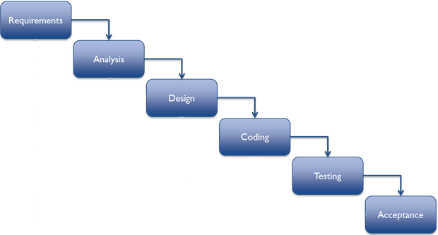
*Waterfall example [[2]](#r2)*

> How do you do with always-changing requirements while using a waterfall methodology?
> How often you test and release?

### What is Agile?

Agile is an iterative approach to project management and software development that helps teams **deliver value to their customers faster** and with fewer headaches. Instead of betting everything on a "big bang" launch, an **agile team delivers work in small, but consumable, increments**. Requirements, plans, and results are evaluated continuously so teams have a natural mechanism for responding to change quickly.

Four main values:
1. **Individuals and interactions** over processes and tools
1. **Working software** over comprehensive documentation
1. **Customer collaboration** over contract negotiation
1. **Responding to change** over following a plan

[Agile Manifesto - 12 Principles](https://agilemanifesto.org/principles.html):

**So, what's agility?**

The problems faced with Waterfall and similar methodologies, come down to delivering value faster.

> Value, in software, means any software component that **achieves or supports business goals, present and future**, and that has an **affordable cost to operate and change** with new business requirements.

The fact here is that business is ever changing to keep up with the competition or innovate, and software needs to quickly adapt and support these new scenarios.

It does not matter much if the final product is a software product or if the IT area is just supporting the business goals (e.g. banking, healthcare, energy, etc). It needs to keep up with the business, meaning that it needs to bring more money in or reduce costs.

**So, what changes in terms of Software Development Life Cycle?**

We need to iterate more with a smaller set of requirements that bring value to the business!

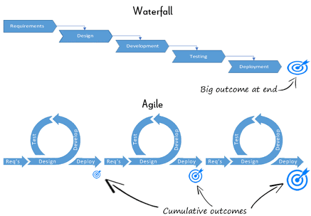
*Waterfall vs Agile [[3]](http://customerthink.com/agile-versus-waterfall-for-crm-implementation-success/)*

***Lean***

The term "*lean thinking*" was coined by  James P. Womack and Daniel T. Jones to capture the essence of their in-depth study of Toyota's fabled Toyota Production System.

The "*lean process*" is a method for creating a more effective business by eliminating wasteful practices and improving efficiency. More widely referred to as “lean,” the lean process focuses on improving products and services based on what customers want and value. [[4]](https://www.graphicproducts.com/articles/lean-process/)

[from less.works website:](https://less.works/less/principles/lean-thinking.html)
  > Consider a relay race. The racers are standing around waiting for the baton from their colleague. The accountant in the finance department, looking aghast at this terrible underutilization ‘waste,’ would probably mandate a policy goal of “95% utilization of resources” to ensure all the racers are busy and “productive.” Maybe—he would suggest—the runners could run three races at the same time to increase “resource utilization,” or they could run up a mountain while waiting for the baton.

  > Does your organization measure “productivity” or “efficiency” in terms of how busy people are, or how much time is spent watching the runners? Or does it measure “productivity” in terms of fast delivery of value to the real customer, thereby “watching the baton”? 

## How about DevOps?

But it is common to see that companies that didn't embrace a new different development culture (Agile or DevOps) might still have **separate Teams (or even Managing Directors) for Development and Operations**.

> So, what do you do after your team followed beautifully all of the Agile best practices and delivered a feature?
> **Someone needs to maintain it (Operation guys)!**

So, DevOps is all about culture!

It is a way of organising teams to deliver value through software, tearing down the walls left behind by Agile methodologies.

Gene Kim explains The Three Ways as principles of DevOps:

* The first way: **System Thinking**	
  * emphasizes the performance of the entire system, as opposed to the performance of a specific silo of work or department — this can be as large as a division or as small as an individual contributor.
* The second way: **Amplify Feedback Loops**
  * creating the right to left feedback loops. The goal of almost any process improvement initiative is to shorten and amplify feedback loops so necessary corrections can be continually made.
* The third way: **Culture of Continual Experimentation and Learning**	
  * creating a culture that fosters two things: continual experimentation, taking risks and learning from failure; and understanding that repetition and practice is the prerequisite to mastery.

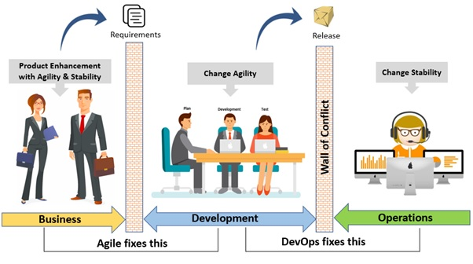

*Agile and DevOps work together as a cultural change* [[5]](https://www.accenture.com/us-en/blogs/blogs-reshma-shinde-devops-transformations-operations)

> As it is a cultural change, people need to change actions, processes need to evolve!

## Agile Frameworks and Methodology

Framework: set of practices --> not a methodology.

Methodology: step by step description.

Frameworks are adaptable as the team wish, as long as it keeps the same goal of the original framework.

### Kanban

#### What's it?

A Kanban board is an agile project management tool designed to help:

- **Visualize what you do today (workflow)**: seeing all the items in context of each other can be very informative
- **Limit the amount of work in progress (WIP)**: this helps balance the flow-based approach so teams done™t start and commit to too much work at once
- **Enhance flow**: when something is finished, the next highest thing from the backlog is pulled into play

#### Getting started

Get started with Kanban, you'll need:
* Board (physical or digital)
* Cards
* Define the workflow (columns)
  * One or more `backlog` columns (e.g. To Do, Next tasks, Ready for Dev, etc)
  * One or more `in-progress` columns (e.g. In Progress, Development, Test, Review, Acceptance Test, QA, etc)
  * One or more `done` columns (e.g. Done, Closed)
* Work as *one* team. Everybody is responsible for improving the process. 
[(Read about Kaizen)](https://blog.kainexus.com/improvement-disciplines/kaizen/best-practices-for-effective-kaizen-management)!

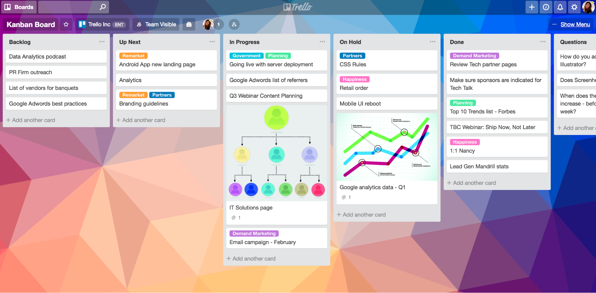

[*Kanban board example*](https://www.atlassian.com/agile/kanban/boards)

#### Metrics

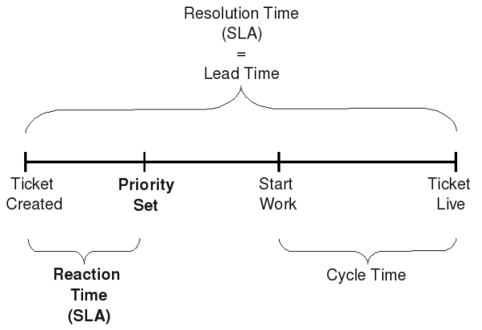

[*Metrics in Kanban*](https://stefanroock.wordpress.com/2010/03/02/kanban-definition-of-lead-time-and-cycle-time/)

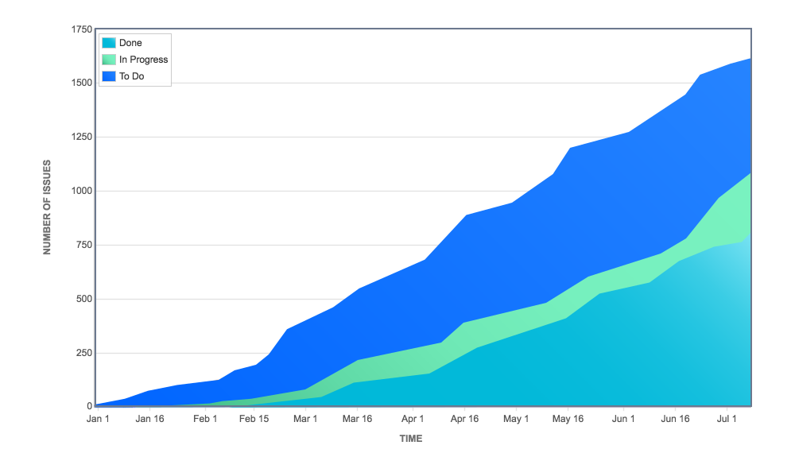

[*Cumulative Flow Diagram*](https://stefanroock.wordpress.com/2010/03/02/kanban-definition-of-lead-time-and-cycle-time/) shows the number of issues in each state.

#### Limit the work-in-progress (WIP) to deliver more!

WIP limits are the maximum number of cards that can be in one column at any given time. 

A column with a WIP limit of three cannot have more than three cards in it. **When the column is “maxed-out” the team needs to swarm on those cards** and move them forward before new cards can move into that stage of the workflow. 

These WIP limits are critical for exposing bottlenecks in the workflow and maximizing flow. WIP limits give you an early warning sign that you committed to too much work

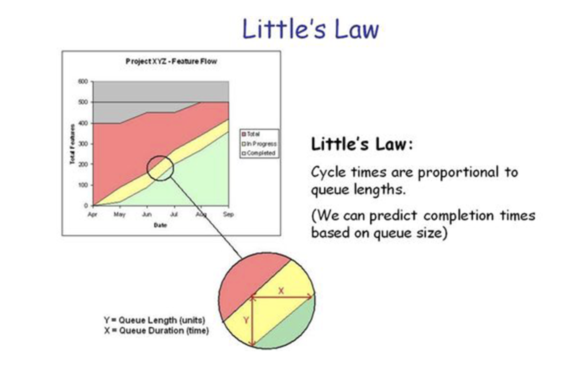

[*Little's Law*](https://www.process.st/littles-law/). WIP = Throughput x Lead time

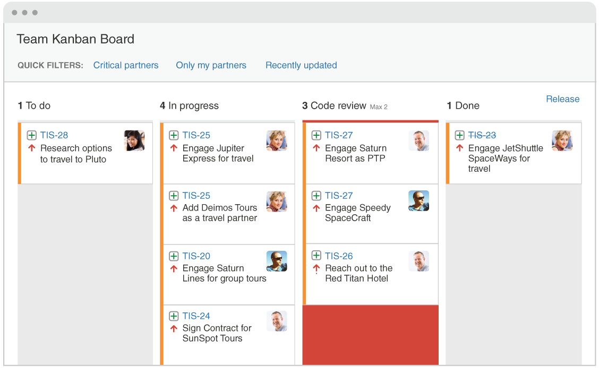

[*Kanban WIP limit example*](https://www.atlassian.com/agile/kanban/wip-limits).
Above, a WIP limit has been set on code review. Since the column is exceeding its limit, the background has turned red.

### Scrum

[OFFICAL SCRUM GUIDE](https://www.scrumguides.org/scrum-guide.html)

#### What's it?

Scrum is a framework that helps teams work together. Much like a rugby team (where it gets its name) training for the big game, Scrum encourages teams to learn through experiences, self-organize while working on a problem, and reflect on their wins and losses to continuously improve. [[6]](https://www.atlassian.com/agile/scrum)

What it doesn’t do is provide a one-size-fits-all model for teams to work within. 

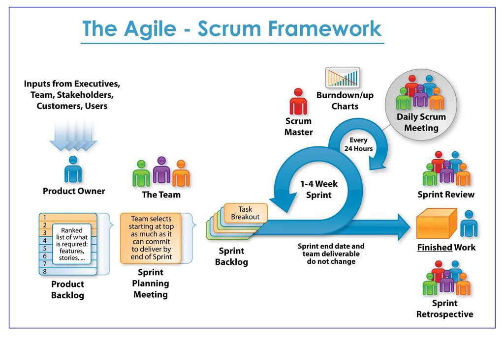

*Scrum overview* (https://medium.com/jorgeacetozi/agile-and-scrum-overview-fb68fc04aff8)

It is composed by:
* The Scrum **Team**:
  * The Product Owner
  * The Development Team
  * The Scrum Master
  
* Scrum **Events**:
  * The Sprint
    * The heart of Scrum is a Sprint, a **time-box** of one month or less during which a "Done", useable, and potentially **releasable product Increment is created**.
  * Sprint Planning
    * Plan on **what** can be be delivered and **how** to deliver an Increment
  * Daily Scrum
    * The Daily Scrum is a **15-minute time-boxed event** for the **Development Team**. The Daily Scrum is held every day of the Sprint. At it, the Development Team plans work for the next 24 hours.
  * Sprint Review
    * During the Sprint Review, the Scrum Team and stakeholders collaborate about what was done in the Sprint.
  * Sprint Retrospective
    * The Sprint Retrospective is an opportunity for the Scrum Team to inspect itself and create a plan for improvements (of the process) to be enacted during the next Sprint.
  
* Scrum **Artifacts**:
  * Product Backlog
    * The Product Backlog is an ordered list of everything that is known to be needed in the product. The Product Owner is responsible for the Product Backlog.
  * Sprint Backlog
    * The Sprint Backlog is the **set of Product Backlog items selected for the Sprint, **plus a plan**** for delivering the product Increment and realizing the Sprint Goal
  * Increment
    * At the end of a Sprint, the **new Increment must be "Done"** which means it must be in **useable condition** and meet the Scrum Team’s **definition of "Done"** (DoD).

#### Roles

See Atlassian website (https://www.atlassian.com/agile/scrum/roles).

* Product Owner

* Scrum Master
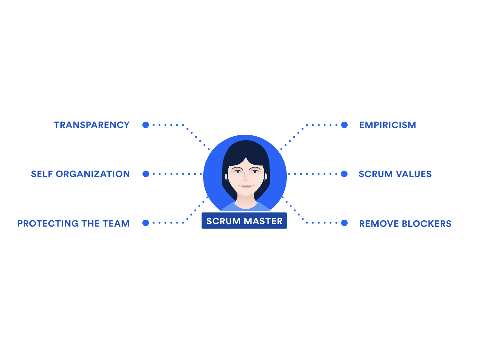

* Development Team

> They are self-organizing

> Development Teams are cross-functional

> No titles for Development Team members

> No sub-teams in the Development Team

> Accountability belongs to the Development Team as a whole

#### Sprints

Sprints contain and consist of:
-  the Sprint Planning, 
-  Daily Scrums, 
-  the development work, 
-  the Sprint Review, 
-  and the Sprint Retrospective.

During the Sprint:

- No changes are made that would endanger the Sprint Goal;
- Quality goals do not decrease; and,
- Scope may be clarified and re-negotiated between the Product Owner and Development Team as more is learned.

### Really important! Don't forget about those!

#### Refinement
Product Backlog refinement is the act of adding detail, ***estimates***, and order to items in the Product Backlog. 

This is an ***ongoing process*** in which the Product Owner and the Development Team collaborate on the details of Product Backlog items. 

During Product Backlog refinement, items are reviewed and revised. *The Scrum Team decides how and when refinement is done*.

#### Definition of ready
Product Backlog items that can be "Done" by the Development Team within one Sprint are deemed "Ready" for selection in a Sprint Planning.

Refinement enables this.

#### Definition of done
Although this may vary significantly per Scrum Team, members must have a shared understanding of what it means for work to be complete, to ensure transparency.

Is it a software delivered in production? Is it a software tested in non-production environment? Is it a documentation released?

## Appendix

#### Reduce utilisation, batch size and item size

[Check out Theory of Constraints and Queue Theory applied to Agile](https://www.slideshare.net/andrewrusling/improving-throughput-with-the-theory-of-constraints-and-queuing-theory)

### Kanban vs Scrum

Both Kanban and Scrum focus on releasing software early and often. Both require highly-collaborative and self-managed teams.

The major differences between Scrum and Kanban is that in Scrum work is divided into sprints that last a fixed amount of time, whereas in Kanban the flow of work is continuous.

There are, however, differences between the approaches [[6]](https://resources.collab.net/agile-101/what-is-kanban):

Kanban	| 	Scrum
--------|----------
No prescribed roles	| Pre-defined roles of Scrum master, Product owner and team member
Continuous Delivery	| Timeboxed sprints
Work is pulled through the system (single piece flow)	| Work is pulled through the system in batches (the sprint backlog)
Changes can be made at any time	| Teams should strive to not make changes to the sprint forecast during the sprint. Doing so compromises learnings around estimation.
Cycle time | Velocity
More appropriate in operational environments with a high degree of variability in priority	| More appropriate in situations where work can be prioritized in batches that can be left alone

Organization, culture and team dynamics often determine which method is the best fit.

### Scaled Agile frameworks

When working in an Enterprise composed by many teams, with well defined process for change management, portfolio/project management and valuation, capacity management, compliance and regulation auditing, etc., this Agile methodologies need to scale so several teams work in harmony to achieve the strategic Enterprise goals.

There some variations of the Scrum framework, as:
- [LeSS](https://less.works/)

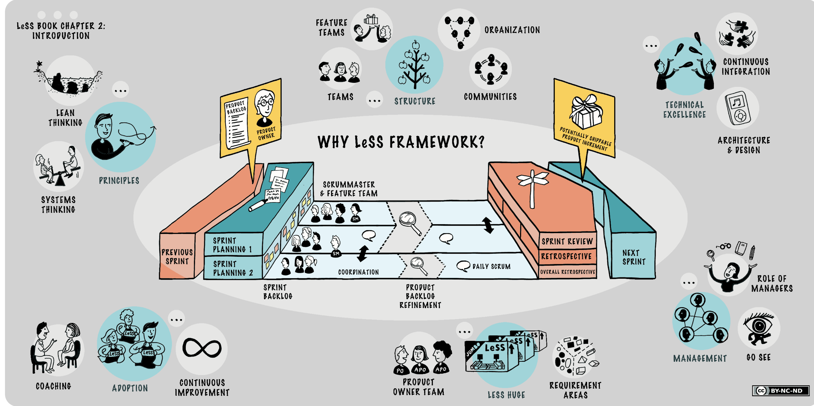
*LeSS framework*

- [Nexus](https://www.scrum.org/resources/scaling-scrum)
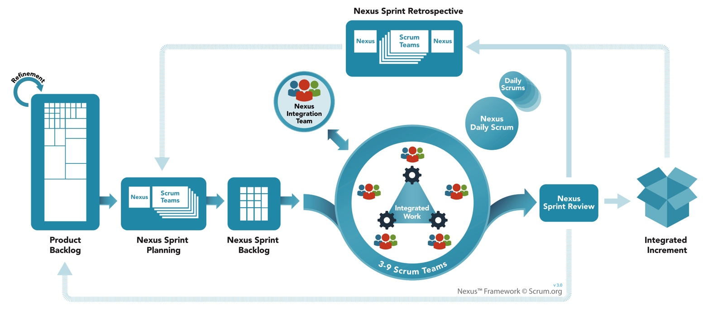
*Nexus framework*
- [Scrum of Scrums](http://guide.agilealliance.org/guide/scrumofscrums.html)
- [SAFe](https://www.scaledagileframework.com/)
- Many others...

## References
<!-- [1](#f1) -->
 1. <small id="r1"> https://www.guru99.com/waterfall-vs-agile.html </small> 
 2. <small id="r2"> http://www.covalentmarketing.com/blog/2015/10/19/software-development-lifecycle-waterfall-vs-agile-2/  </small>
 3. https://www.atlassian.com/agile/devops