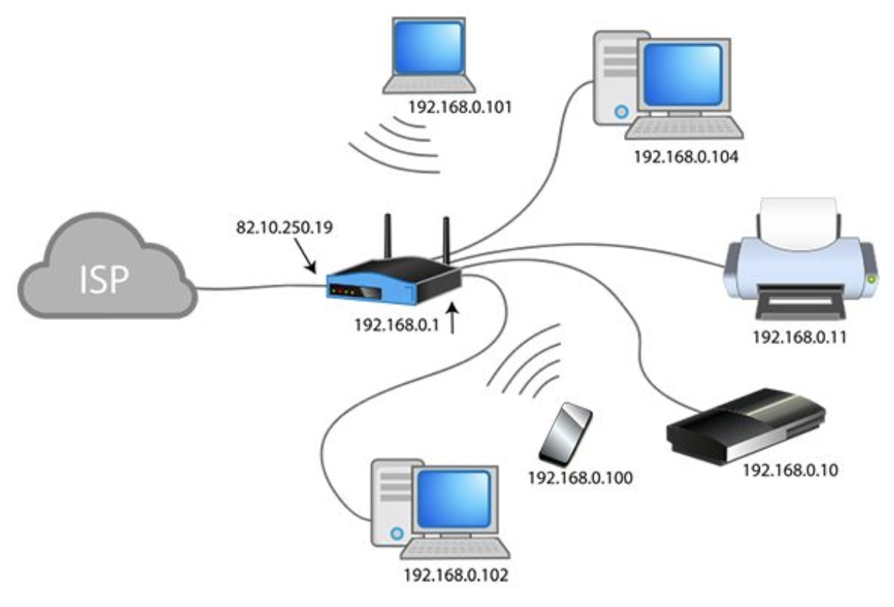
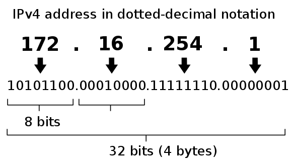
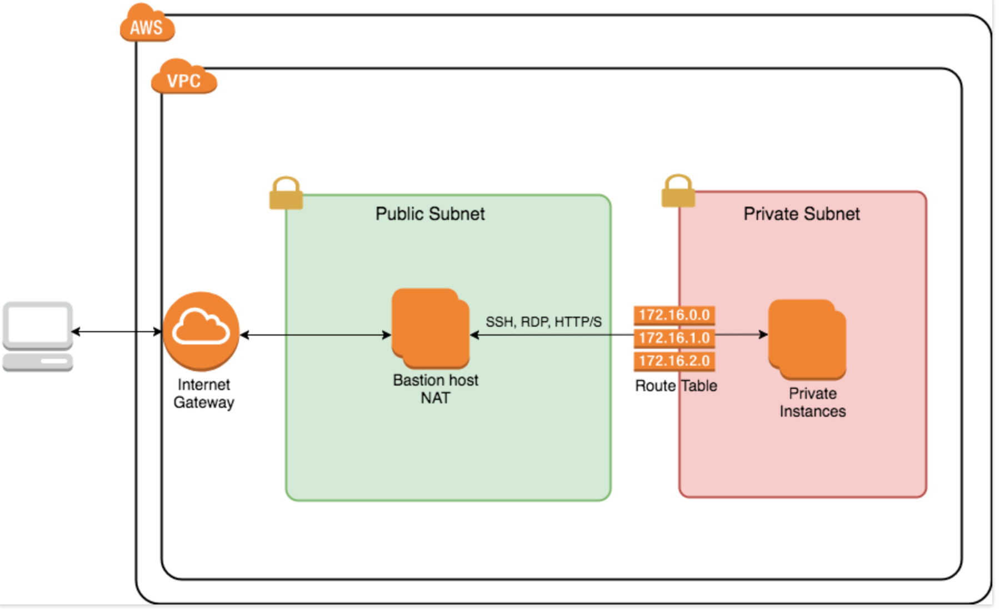
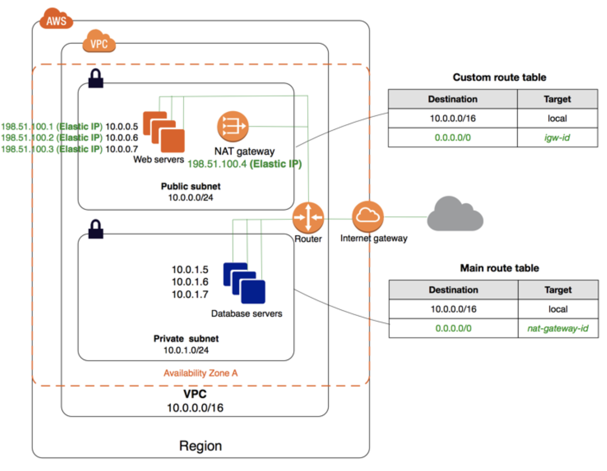
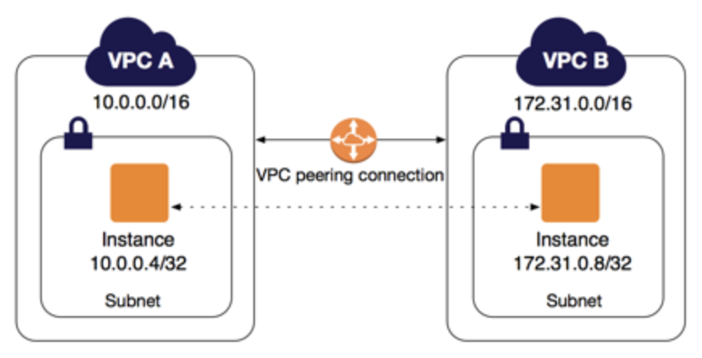

## Contents

- [Introduction](#introduction)
- [Basic Networking](#basic-networking)
- [Cloud Networking](#cloud-networking)
  - [AWS Networking](#aws-networking)
    - [VPC](#vpc)
    - [Subnet](#subnet)
    - [Internet Gateway](#internet-gateway)
    - [NAT Gateway](#nat-gateway)
    - [Routing Table](#routing-table)
    - [Network ACL](#network-acl)
    - [Security Group](#security-group)
    - [Elastic Network Interface](#elastic-network-interface)
    - [Direct Connect and VPN](#direct-connect-and-vpn)
    - [VPC Peering](#vpc-peering)
    - [Transit Gateway](#transit-gateway)
- [References](#references)

## Introduction

Networking is one of the hardest subjects to learn (and teach) in Information Technology alongside with development, data, and others. This class does not have the intention to be a scientific topic about network but rather a tentative of abstracting complex definitions in simple situations for beginners to understand.

### In a traditional infrastructure, what establishes that I have a LAN (local area network)?

A computer with a manual IP address configured constitutes in a LAN, although it won't be able to communicate with 

- One computer connected directly to another by cable (very old method)
- A computer sharing its wireless connection (WLAN)
- Computers connected to a switch (switch is basically a controller that enables devices to talk to each other within ONE LAN - you can still have VLANS to segregate that ONE lan)

### What if from my LAN, I need to connect to the wide area network (WAN), often called internet, or to a second LAN i.e. another office branch?

For connecting multiple networks together, a router is needed. Either as a full hardware device or just an application working as a Router. This device will be in charge of knowing all existing paths, receive requests from a network and forward the packages to its destination.

### Internet Protocol Address (IP address)

An IP is a numerical, human-readable way of assigning a computer to a network. For example ``. The protocol has two addressiong versions are available:

- IPv4 as a 32-bit address. i.e.: 172.16.254.1
- IPv6 as a 128-bits address. i.e.: 2001:db8:0:1234:0:567:8:1

IPv6 was introduced a few years ago due to the growth of the internet and the depletion of available IPv4 addresses. IPv6 is out of context of this material. For reference: https://docs.aws.amazon.com/vpc/latest/userguide/get-started-ipv6.html

A few IPv4 network ranges are considered private and thus need to be routed across different networks to work.

|Network|Range|Number of addresses
|-|-|-|
|10.0.0.0/8|10.0.0.0 - 10.255.255.255|16 777 216|
|172.16.0.0/12|172.16.0.0 - 172.31.255.255|1 048 576|
|192.168.0.0/16|192.168.0.0 - 192.168.255.255|65 536|

Reference content for deep-dive information:

- [Wikipedia IP_address](https://en.wikipedia.org/wiki/IP_address)
- [AWS IP Addressing](https://docs.aws.amazon.com/vpc/latest/userguide/vpc-ip-addressing.html)

I highly recommend going deeply and trully understanding how networks work through the above reference links before moving on.

## Basic networking

What we need to understand to get started with networking in the cloud is how to do some basic network seggregation with subnets and ip addressing.

Subnets are made to isolate traffic within a network and provide security on the data being transmitted. Moving forward our examples will be based on a four individual subnets scenario.

It is a best practice to isolate networks that have databases or private systems running from workloads that can be accessible from the internet. The naming convention for these subnets are: 

- `public` subnet
  - good fit for frontend webservers where clients will have the first point of contact. From the webserver you can then communicate with backend servers running on private subnets
  - nat gateways (translate private IP's to public IP's)
  
- `private` subnet
  - Workloads like databases or identity management systems will run here
  - Any service running in this subnet won't be accessible direct from public networks (like internet).
  - Services can go out to the internet through a nat gateway.
    - A NAT Gateway will receive the internal request, masquerade as if it was its own and forward to the external service. The external service will only know the gateway and return the response to it. Then the gateway will forward the packet to the internal instance.
  - to access a workload here, a jumpbox from the public subnet is neccesary

Very often a `secure` subnet will also be presented and is mainly used for databases. The secure subnet won't have neither IN or OUT access to internet and can only be accessed from workloads running in `private` subnet.

Don't get me wrong here, those are just conventions.

## Cloud Networking

Most of today's cloud providers share the same concept of Virtual Private Cloud (VPC) for stablishing a logically isolated section of network within your account.

A VPC can then be sliced into multiple networks called subnets where you will have control on IP address ranges, route tables and control security within these sections.

### AWS Networking

Subnets within a VPC on AWS environment are bound to only one Availability Zone (AZ). To achieve high availability (in case one AZ goes off) we need to create a public and a private subnet per AZ, so 4 subnets in total for this example.

Reference: 

- https://docs.aws.amazon.com/vpc/latest/userguide/VPC_Subnets.html
- https://aws.amazon.com/premiumsupport/knowledge-center/move-ec2-instance/

This article will now move into a tutorial style with information needed for creating a fully working VPC with a few subnets. Explicit instructions/commands/where to go on AWS console can easily be found on the provider documentation. 

As always, we recommend to play around in the console and familiarise yourself with it. There is no better way to learn.

What we will be doing:

- ip addressing design
- build a VPC
  - subnet public
    - internet gateway
  - subnet private
    - network gateway
  - routing table

#### VPC

The first thing is to determine what will be the network size for the whole VPC. AWS supports networks up to `65.536` IP's reffered as a `/16` network. 

It's always ideal to think ahead how many devices your network will support and only reserve the right amount of addresses need with some extra for future expansions. Although we won't need this many IP's, for this example we will be using the `/16` network as it will simplify the big picture understanding.

|field|value|
|-|-|
|Name tag|devopsacademy|
|IPv4 CIDR Block|10.0.0.0/16|
|IPv6|no|
|Tenancy|default

There is no cost for creating a VPC.

#### Subnet

The VPC subnet can then be sliced into smaller subnets to spread the workloads between multiple AZs as well to isolate public and private workloads. The most common size for a subnet is a `/24` which will support `256` IP's.

It's important to mention that only `251` IP's out of `256` will be available to be assigned to hosts as a few of them are special addresses.

- of any subnet:
  - first ip (0) is known as `network`
    - IP network address range
  - last ip (255) is used for broadcasting
    - used to map the logical address (IP address) to the correct MAC address (physical address)
    - DHCP protocol also uses broadcasting to dynamically assign IP addresses to host
    - all devices listen to broadcast in addition of its own
 
- of any AWS subnet:
  - second ip (1) is reserved to be used by the VPC Router
  - third ip (2) is reserved to be used by AWS DNS
  - forth ip (3) is reserved for future use

Based on that, our subnetting will look like this:

Note that the range `from` and `to` of each network can't overlap with each other. This is a network routing restriction.

|subnet|Availability Zone|network|cidr|from|to|ips|
|-|-|-|-|-|-|-|
|private-a|ap-southeast-2a|10.0.1.0|24|10.0.1.4|10.0.1.254|251
|private-b|ap-southeast-2b|10.0.2.0|24|10.0.2.4|10.0.2.254|251
|public-a|ap-southeast-2a|10.0.10.0|24|10.0.10.4|10.0.10.254|251
|public-b|ap-southeast-2b|10.0.11.0|24|10.0.11.4|10.0.11.254|251

For each subnet:

|field|value|
|-|-|
|Name tag|refer to above table|
|VPC|devopsacadem|
|Availability Zone|refer to above table
|VPC CIDR|none
|IPv4 CIDR Block|refer to above table

Now, what it makes a `public`/`private` subnet actually be considered `public` or `private` ?

#### Internet Gateway

To be able to route internal VPC requests from public subnets to the internet, a Internet Gateway is required. This is a managed service and it is included on the free-tier. Only need to attach it to a VPC when creating.

Reference: https://docs.aws.amazon.com/vpc/latest/userguide/VPC_Internet_Gateway.html

#### NAT Gateway

From private subnets, access from the internet shouldn't be allowed direct to the instances. However, the instances still need access to the internet for updates or consuming external services. The NAT Gateway masquerades the private requests to the internet.

Reference: https://docs.aws.amazon.com/vpc/latest/userguide/vpc-nat-gateway.html

#### Routing Table

As any other junction of networks, a router is needed. AWS abstracts the concept of the router completing managing the VPC Router (this is a virtual thing and can't be accessed directly). The only job left to be done is configuring routes between your networks through routing tables.

Reference: https://docs.aws.amazon.com/vpc/latest/userguide/VPC_Route_Tables.html

#### Network ACL

AWS offers two types of network security/firewall: 1) Network ACL (NACL's) and 2) Security Groups (SG's). NACL's are controls on the network layer, managing the access that goes out from one subnet to another. 

NACL's are stateless, which means that responses to allowed inbound traffic are subject to the rules for outbound traffic (and vice versa). Basically, you need to add a rule for inbound AND outbound.

Reference: https://docs.aws.amazon.com/vpc/latest/userguide/vpc-network-acls.html

#### Security Group

Security Groups are at the instance level, acting as a virtual firewall can be used to control inbound and outbound traffic. It controls requests from services for specific protocols and ports.

You might set up similar rules on both NACL's and SG's for an additional layer of security.

Reference: https://docs.aws.amazon.com/vpc/latest/userguide/VPC_SecurityGroups.html

#### Elastic Network Interface

ENI's are like a virtual network card that will be always available independent from the instance itself. So in a case that you lose your instance for any reason, you can always re-attach the existing ENI to a new instance and maintain all network configurations like IP address the same.

Reference: https://docs.aws.amazon.com/AWSEC2/latest/UserGuide/using-eni.html

#### Direct Connect and VPN

What if you want to connect your AWS VPC to your local datacenter/home network and maintain everything as one `local` network? You can either create a VPN between AWS and your external network or connect your network to AWS through a direct fiber link.

Those two subjects are not included in this course.

Reference:
- https://aws.amazon.com/directconnect/
- https://aws.amazon.com/vpn/

#### VPC Peering

What if you decide to have multiple VPC's on your network for a complete isolation of traffic between production and development but also to share some similar resources? Each VPC would be considered an external network to each other and would require some sort of routing between them so the applications could reach each other. 

AWS then offers a way to `peer` two VPC's and create a automatic routing connection. This way you only need to setup routing rules and network acls. Important to mention that a VPC A peering with VPC B, where VPC B is also paired with VPC C. VPC A does not have access to VPC C through VPC B.

VPC Peering is out of this course context.

Reference: https://docs.aws.amazon.com/vpc/latest/peering/what-is-vpc-peering.html

#### Transit Gateway

When the network starts to get complex with multiple VPC's and Direct Connect/VPN links across the environment, it becomes a nightmare to manage all the routing tables. Transit Gateway simplify the process becoming just one centralised point where you will connect all your VPC's and external networks and control just one routing table.

This is also not included on this course.

Reference: https://aws.amazon.com/transit-gateway/

## References

- [Wikipedia IP_address](https://en.wikipedia.org/wiki/IP_address)
- [AWS IP Addressing](https://docs.aws.amazon.com/vpc/latest/userguide/vpc-ip-addressing.html)
- [AWS VPC](https://aws.amazon.com/vpc/)
- [AWS VPC with Public and Private Subnets](https://docs.aws.amazon.com/vpc/latest/userguide/VPC_Scenario2.html)
- [Public and Private subnets](https://cloudacademy.com/lab/securing-your-vpc-using-public-and-private-subnets-with-network-acl/)
