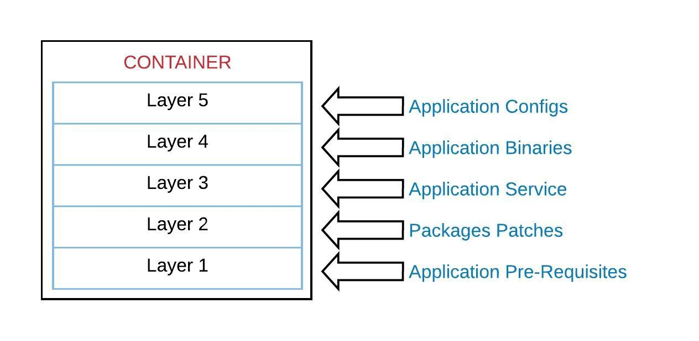

# Introduction to Containers

This class is an introduction to Containers and Docker.
The main goal is to explain the purpose of containers, the benefits and how to use it.
We'll also take a look into how the AWS ECS Service works and its purpose.

***Contents***

- [Docker](#docker)
- [Containers](#containers)
  - [What is a container?](#what-is-a-container)
  - [Difference between Virtual Machine and Container](#difference-between-virtual-machine-and-container)
  - [Benefits of COntainers](#benefits-of-containers)
    - [Container](#container)
    - [Virtual Machine](#virtual-machine)
  - [What is Docker?](#what-is-docker)
- [Registries](#registries)
- [Dockerfile](#dockerfile)
  - [Main Dockerfile Instructions](#main-dockerfile-instructions)
  - [Let's Give it a Go](#lets-give-it-a-go)
- [Docker Image](#docker-image)
  - [Remember when creating a docker image](#remember-when-creating-a-docker-image)
- [Main docker commands](#main-docker-commands)
- [ECS](#ecs)
  - [ECS Cluster](#ecs-cluster)
  - [ECS Service](#ecs-service)
  - [ECS Task Definition](#ecs-task-definition)
- [ECR](#ecr)
- [Main Take Aways](#main-take-aways)

## Containers

### What is a container?
A container is a standard unit of software that packages up code and all its dependencies so the application runs quickly and reliably from one computing environment to another. 

A container is supposed to run a single main process. Once the process is completed/stoppped, the container will exit.
<p align="center">
    
</p>

### Difference between Virtual Machine and Container
Both the virtual machine and the container have resource isolation, but they work in a different way. While the virtual machine virtualizes the hardware, the container virtualizes the operating system. This makes the container a lot more portable and efficient.
**Add diagram with difference between VM and container**

#### Container
Containers are an abstraction at the app layer that packages code and dependencies together. Multiple containers can run on the same machine and share the OS kernel with other containers, each running as isolated processes in user space. Containers take up less space than VMs (container images are typically tens of MBs in size), can handle more applications and require fewer VMs and Operating systems. 

#### Virtual Machine
Virtual machines (VMs) are an abstraction of physical hardware turning one server into many servers. The hypervisor allows multiple VMs to run on a single machine. Each VM includes a full copy of an operating system, the application, necessary binaries and libraries - taking up tens of GBs. VMs can also be slow to boot.

### Benefits of Containers
Before talking about the benefits of containers, it's important to make clear that not all kinds of workloads are a good fit for a container. Because of the container nature, an application with multiple processes and services running on a single machine is not a good fit for a container. 

Once you confirm that a specific service is a good fit for a container, the benefits of a container includes:
- Container images are normally small compared to VMs, so it's easy to move them around
- Because everything required by the application is inside the container, the execution of the container will be the same anywhere
- Speeds up the development process since the Developer can have multple containers running on his local computer to simulate a very reliable production environment(in terms of funcionality)

### What is Docker?
[Docker](https://www.docker.com) is the most common container option in the market and have thousands of public images available to pack your application, but there are other options like the ones listed below:
- [rkt](https://coreos.com/rkt/)
- [LXC](https://linuxcontainers.org/)
- [OpenVZ](https://openvz.org/)

Docker is a tool to faciliate the creation, deployment and execution of applications by using containers.
It's composed by the Docker daemon and the Docker client. The first is the service that runs on the operating system(like Linux, MacOS, Windows) that will execute containers. 

The Docker deamon exposes a RestAPI that is accessed by the Docker client. We use the Docker client to submit instructions to the Docker daemon so it can execute the containers, create new images, delete existing containers, connect to a running container, etc.

## Registries
A container registry is a place where images can be stored and it can be public or private.
Examples of registries:
- [DockerHub](https://hub.docker.com/)
- [AWS ECR](https://aws.amazon.com/ecr/)
- [Artifactory](https://jfrog.com/artifactory/)

Registries are used to share an image that was created for a specific purpose. It can be used to store an image with specific pre-requisites to run multiple applications like:
- an image with apache+php+modules to run multiple php applications
- an image with a specific version of jdk to run multiple java applications
- an image with a specific version of mysql to run multiple databases

It can also be used to store the final version of your application(artifact) that will run in production
- an image with apache+php+modules+yourapp
- an image with python binaries and your application to run a machine learning algorythm
- an image with terraform cli that executes any terraform code

A Docker registry is often used as a tool in the middle of the CI/CD process, since the Docker image created during the CI pipeline needs to be stored somewhere so it can be used during the CD pipeline. More related to this in class #6.

## Dockerfile
A Dockerfile is a set of instruction(like a recipe) to create a new Docker image. Those instructions will be used to install the application pre-requisites as well as inlcude all the application related files into the image that is being created.
A Dockerfile is always based on an existen image and the instructions included in the Docker file goes over that base image.
Example of Dockerfile:
```
FROM golang:1.14rc1-buster
COPY bin/ /
RUN chmod 544 /app/app1.bin && \
    chmod 500 /var/logs/* 
CMD [ "/app/app1.bin", "run" ]
```
### Main Dockerfile Instructions
- FROM
  - The base image that will be used to build the new image
- COPY
  - Copy files between the local filesystem to the container file system
- ADD
  - Similar to the COPY instruction, but it can be used to copy directly froma remote URL(http or https)
- RUN 
  - Executes a command into the container. The binary that will be executed must reside inside the container
- ENV
  - Creates an Environment Variable in the container
- EXPOSE
  - Expose a TCP or UDP port to inform Docker that the container will listen on the specified ports
- USER
  - Specify which user account will be used to run the commands inside the container when it runs
- CMD
  - Set a default command and default parameters which will be executed when Docker is run. Those values can be overwritten during the contianer execution
- ENTRYPOINT
  - Used when the container needs to be run as an executable. The commandd inside ENTRYPOINT instruction will can't be overwritten during container execution.
- WORKDIR
  - Sets the working directory to run the instructions: RUN, CMD, ENTRYPOINT, COPY and ADD

Reference to all Dockerfile Instructions: [https://docs.docker.com/engine/reference/builder/](https://docs.docker.com/engine/reference/builder/)

### Let's give it a go
Simple [Docker file](artifacts/Dockerfile):

```bash
docker build -t website:01 .
```
```bash
docker run -it -p 8081:80 website:01
```

## Docker Image
An Image is an ordered collection of root filesystem changes and the corresponding execution parameters for use within a container runtime. An image typically contains an union of layered filesystems stacked on top of each other. An image does not have state and it never changes.

Each instruction in a Docker file adds a new layer during the build of the image.

An image is supposed to have everything required(pre-requisites and binaries) to run a specific application. Ideally we target for very small images, to make the container as much portable as possible.

Below we have three examples of a Dockerfile that creates an image with the same purpose, but the difference on how the image is created(which instructios we have on the Dockerfile) can make a huge difference in the final result. Let's build three Docker images with those Dockerfiles.

```
docker build -t image:01 -f artifacts/Dockerfile.Image1 .
docker build -t image:02 -f artifacts/Dockerfile.Image2 .
docker build -t image:03 -f artifacts/Dockerfile.Image3 .
```

```bash
docker images|grep ^image
```

```
docker history image:01
docker history image:02
docker history image:03
```

The objective of those three images is the same: Have the contents of the `httpd-2.4.41.tar.gz` file uncompressed into the `/tmp` folder. 
Even considering that all three Dockerfiles achieved the objective, there are huge differences on how this objective was reached on each approach. Additionally the final result of each image is really different(final image almost 50% from the biggest to the smallest image). This shows the importance of properly writing a Dockerfile. 

On the third approach, whcih is the most appropriate for our objective, it was used the multi-stage build functionality. You can learn more about this approach [here](https://docs.docker.com/develop/develop-images/multistage-build/). 

### Remember when creating a Docker image
- Always use a tag in the image you'll use(FROM).

The tag represents a specific image and is supposed to be immutable. This means that the image with the same tag will *always* be the same. This is important, so by specifying a versioned tag(not using the tag `latest`), you know exaclty which base image will be used during the build of your own image.
Keep the same mindset when creating your images. Once an image is created and published with a specific tag, that tag should belong to that artefact only. Any new image published should use a different tag. 

- Because of the way images are build(layers), keep the instructions that will change less on top of your Dockerfile

During the build of an image, Docker can re-use layers previously created. This only happens when the lower layers are the same.

Consider two very similar images, where the only difference between it is a `RUN` step. Even that this step only adds a single file with 13 bytes to the image, it completely affects the result of remaining layers of the image. Observe that the `apt-get update` steps are exacly the same and adds the same amount of MB to the image, however, it has a different sha(79b65ac314b1 on the first image and a70625894939 on the second).
```
IMAGE               CREATED              CREATED BY                                      SIZE   
bc8d9068fd51        25 seconds ago       /bin/sh -c rm -rf /tmp/httpd-2.4.41.tar.gz      0B     
510793020658        27 seconds ago       /bin/sh -c tar xzvf /tmp/httpd-2.4.41.tar.gz    39.5MB 
2ae1c163c167        29 seconds ago       /bin/sh -c #(nop) ADD cc9f7bcc45b8069f007672…   9.27MB 
fa26d5204572        35 seconds ago       /bin/sh -c apt-get -y install curl              14.3MB 
79b65ac314b1        About a minute ago   /bin/sh -c apt-get update                       27.9MB 
c3234c0c7372        About a minute ago   /bin/sh -c echo "image change" > /tmp/devops…   13B    
5ba0d7847404        2 days ago           /bin/sh -c #(nop) WORKDIR /tmp                  0B     
ccc6e87d482b        4 weeks ago          /bin/sh -c #(nop)  CMD ["/bin/bash"]            0B     
<missing>           4 weeks ago          /bin/sh -c mkdir -p /run/systemd && echo 'do…   7B     
<missing>           4 weeks ago          /bin/sh -c set -xe   && echo '#!/bin/sh' > /…   745B   
<missing>           4 weeks ago          /bin/sh -c [ -z "$(apt-get indextargets)" ]     987kB  
<missing>           4 weeks ago          /bin/sh -c #(nop) ADD file:08e718ed0796013f5…   63.2MB
```
```
IMAGE               CREATED             CREATED BY                                      SIZE 
95a90787b890        2 days ago          /bin/sh -c rm -rf /tmp/httpd-2.4.41.tar.gz      0B
1631588fac44        2 days ago          /bin/sh -c tar xzvf /tmp/httpd-2.4.41.tar.gz    39.5MB
7141d3a52fe8        2 days ago          /bin/sh -c #(nop) ADD cc9f7bcc45b8069f007672…   9.27MB
06e2b5d8b3e7        2 days ago          /bin/sh -c apt-get -y install curl              14.3MB
a70625894939        2 days ago          /bin/sh -c apt-get update                       27.9MB
5ba0d7847404        2 days ago          /bin/sh -c #(nop) WORKDIR /tmp                  0B    
ccc6e87d482b        4 weeks ago         /bin/sh -c #(nop)  CMD ["/bin/bash"]            0B    
<missing>           4 weeks ago         /bin/sh -c mkdir -p /run/systemd && echo 'do…   7B    
<missing>           4 weeks ago         /bin/sh -c set -xe   && echo '#!/bin/sh' > /…   745B  
<missing>           4 weeks ago         /bin/sh -c [ -z "$(apt-get indextargets)" ]     987kB 
<missing>           4 weeks ago         /bin/sh -c #(nop) ADD file:08e718ed0796013f5…   63.2MB 
```

Considering the behaviour exposed above, it's important to keep the steps that will result in identical state, to be executed before steps that will result in different states. For example, if you're building an image with an application under development and you have the following steps on your image build:

1) Copying application files
2) Installing application pre-requisites(apache+php) with specific versions
3) Installing updates on the image

In that case, you can consider that the step 2 will always have the same result. If building the image multiple times a day, the step 3 will most likely have the same result as well. On the other hand, the step one, because is being constantly changed during the development process, will have a different result mostly every build.
In that case, ordering the steps as 2-3-1 in your Dockerfile, will make Docker reuse the step 2 and 3 for mostly every build, so the build process will be faster and you won't  need to keep downloading and installing the application pre-requites and updates on every build you do.

## Main Docker commands
- docker run
    - Creates and execute a new container    
- docker build
    - Build a new image from a Dockerfile
- docker exec
    - Execute a command on a running container
- docker images
    - List the images stored on the local system managed by the Docker daemon
- docker ps
    - List the running containers
- docker container [action]
    - Execute an action related to containers
- docker image [action]
    - Execute an action related to images

Reference for all Docker commands and options: [https://docs.docker.com/engine/reference/commandline/docker/](https://docs.docker.com/engine/reference/commandline/docker/)

## AWS ECS
[ECS](https://aws.amazon.com/ecs/)(Elastic Container Service) is a fully managed containers orchestration service available on AWS. A container orchestration tool is responsible to coordinate and manage all aspects of the lifecycle of  containers execution. As an example, it can be configured to run 2 replicas of a specific image and whenever something goes wrong with one the replicas, the orchstration tool will notice it and spin up a new container, so it keeps 2 replicas running all the time.

### How does ECS works?
ECS is composed mainly by three components: [ECS Cluster](#ecs-cluster), [ECS Service](#ecs-service) and [ECS Task Definition](#ecs-task-definition). 

#### ECS Cluster
The [ECS Cluster](https://docs.aws.amazon.com/AmazonECS/latest/developerguide/clusters.html) is a group of EC2 instances that will be used to run containers. ECS Clusters are Region-specific but it can span across multiple AZs in a that specific Region, providing a high availability container solution.

#### ECS Service
The [ECS Service](https://docs.aws.amazon.com/AmazonECS/latest/developerguide/ecs_services.html) is responsible by run and maintain the requested number of tasks(containers) of a specific image in the cluster. It's also responsible by associating the containers running with a specific load balance, so the traffic trying to access the service can be balanced between multiple containers.

#### ECS Task definition
The [ECS Task definition](https://docs.aws.amazon.com/AmazonECS/latest/developerguide/task_definitions.html) describes the container execution parmeters. Informations like the image to be used, the resources(cpu and memory) that will be made available for that container, the AWS IAM Role used by the container and volumes to be mounted will be specified in the Task definition, so when a new instance of the container is created, it will always have the same configurations.

### More information
- You can also run containers on AWS ECS through [Fargate](https://aws.amazon.com/fargate/) to provide serverless compute for containers. With fargate you won't need to manage compute instances to run your containers, as your containers will run in a serverless engine.
- ECS fully integrates with AWS Load Balancer and AutoScaling groups, so you can balance the requests among multiple containers, as well your ECS service and increase the number of replicas of your task definition based on things like CPU and memory, so if your application is receiving a larger number of users, more containers will be available to support that load.

## AWS ECR
[ECR](https://aws.amazon.com/ecr/)(Elastic Container Registry) is a fully managed Docker Container Registry to store your Docker images. It fully integrated with ECS and it eliminates the  need to operate and manage a  container repository tool. All images are stored in a high-available and scalable architecture. It also integrates with IAM, so you can make use of roles and policies to manage the resource-level permissions for each repository.

In order to push an image to ECR, you can follow this [guide](https://docs.aws.amazon.com/AmazonECR/latest/userguide/docker-push-ecr-image.html).

In order to pull and image from ECR, you ca follow this [guide](https://docs.aws.amazon.com/AmazonECR/latest/userguide/docker-pull-ecr-image.html).

## Main Take Aways
- We should know what is a container and it's benefits
- We should know what is a container registry and what it's used for
- We should know how to run a container
- We should know how to create a new container image
- We should be able to access the service being served from a container running on our local machine
- We should know what is ECS and what its used for
- We should know what is ECR and how we pull and push images to it

