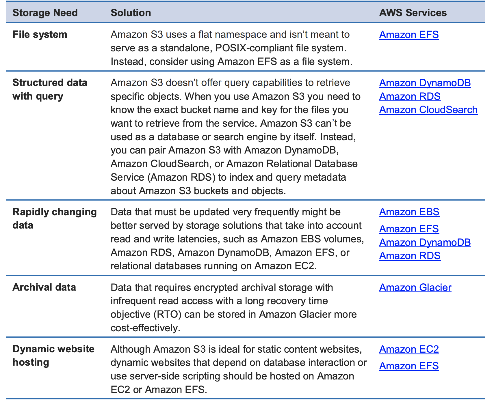

# Introduction to AWS S3 and RDS services

This class is an introduction to the AWS storage service S3 and database service RDS.

**Contents**
- [Introduction to AWS S3 and RDS services](#introduction-to-aws-s3-and-rds-services)
- [AWS Simple Storage Service (S3)](#aws-simple-storage-service-s3)
  - [What's S3?](#whats-s3)
  - [Main Use Cases](#main-use-cases)
  - [Amazon S3 Concepts](#amazon-s3-concepts)
    - [Buckets](#buckets)
      - [Important stuff](#important-stuff)
    - [Objects](#objects)
      - [Important stuff](#important-stuff-1)
    - [Keys](#keys)
  - [Storage classes](#storage-classes)
  - [When not to use it](#when-not-to-use-it)
- [AWS Relational Database Service (RDS)](#aws-relational-database-service-rds)
  - [Why RDS?](#why-rds)
    - [Permissions](#permissions)
    - [Database on EC2 vs RDS](#database-on-ec2-vs-rds)
- [Main class takeaways](#main-class-takeaways)
- [Appendix](#appendix)
    - [Archiving/Backup - Amazon Glacier](#archivingbackup---amazon-glacier)

# AWS Simple Storage Service (S3)

Extracted from [AWS Whitepaper - AWS Storage Services Overview](https://d0.awsstatic.com/whitepapers/AWS%20Storage%20Services%20Whitepaper-v9.pdf)

## What's S3?
Amazon Simple Storage Service (Amazon S3) provides secure, durable, highly scalable **object storage** at a very low cost.

You can store and retrieve any amount of data, at any time, from anywhere on the web through a simple web service interface.

## Main Use Cases
There are four common usage patterns for Amazon S3:

1. Store and distribute **static web content and media**. This content can be delivered directly from Amazon S3 because each object in S3 has a unique HTTP URL.
   
2. Host entire **static websites**. Amazon S3 provides a low-cost, highly available, and highly scalable solution, including storage for static HTML files, images, videos, and client-side scripts in formats such as JavaScript.
   
3. **Data store** for computation and large-scale analytics, such as financial transaction analysis and clickstream analytics. You can access your data from multiple computing nodes concurrently without being constrained by a single connection.
   
4. **Backup and archiving** of critical data.

## Amazon S3 Concepts

### Buckets
A bucket is a container for objects stored in Amazon S3. 

*Every* object is contained in a bucket. 

For example, if the object named `photos/puppy.jpg` is stored in the `johnsmith` bucket in the US West (Oregon) Region, then it is addressable using the URL https://johnsmith.s3.us-west-2.amazonaws.com/photos/puppy.jpg.

#### Important stuff
- Bucket names must be globally unique in AWS.
- Amazon S3 has no physical hierarchy; it only has buckets that contain objects in a [flat file structure](https://docs.amazonaws.cn/en_us/AmazonS3/latest/dev/walkthrough1.html).

### Objects

Objects are the fundamental entities stored in Amazon S3. 

Objects consist of object *data* and *metadata*.

The metadata is a set of name-value pairs that describe the object. These include some default metadata, such as the date last modified, and standard HTTP metadata, such as `Content-Type`. You can also specify custom metadata at the time the object is stored.

#### Important stuff
- Individual Amazon S3 objects can range in size from a minimum of **0 bytes** to a maximum of **5 terabytes** (to go over 5 gigabytes for an object, you need to use [multi-part upload](https://docs.aws.amazon.com/AmazonS3/latest/dev/mpuoverview.html)).
- The largest object that can be *uploaded in a single PUT* is **5 gigabytes**. 
- Amazon S3 offers eventual consistency for overwrite PUTS and DELETES in all Regions (the object is ***not*** deleted or update synchronously, i.e., a subsequent read might return the old data or the updated data, but it never returns corrupted or partial data.).

### Keys
A key is the unique identifier for an object within a bucket.

Every object in a bucket has exactly one key. 

The combination of a `bucket, key, and version ID`uniquely identify each object. 

 For example, in the URL `http://doc.s3.amazonaws.com/2006-03-01/AmazonS3.wsdl`:
 - `doc` is the name of the bucket
 - `2006-03-01/AmazonS3.wsdl` is the key.

> **Prefix**
> 
> The prefix value is similar to a directory in a traditional filesystem, and enables you to store similar data in an organised way in a bucket.
> 
> For example, for the key `Development/project1.xls`, the prefix is `Development/` (including the delimiter `/`).

## Storage classes

S3 offers different storage classes with different durability and availability options. In summary they are:

|Storage Class|Designed for|Durability (designed for)|Availability (designed for)|Availability Zones|Min storage duration|Min billable object size|Other Considerations|
|--- |--- |--- |--- |--- |--- |--- |--- |
|STANDARD|Frequently accessed data|99.999999999%|99.99%|>= 3|None|None|None|
|STANDARD_IA|Long-lived, infrequently accessed data|99.999999999%|99.9%|>= 3|30 days|128 KB|Per GB retrieval fees apply.|
|INTELLIGENT_TIERING|Long-lived data with changing or unknown access patterns|99.999999999%|99.9%|>= 3|30 days|None|Monitoring and automation fees per object apply. No retrieval fees.|
|ONEZONE_IA|Long-lived, infrequently accessed, non-critical data|99.999999999%|99.5%|1|30 days|128 KB|Per GB retrieval fees apply. Not resilient to the loss of the Availability Zone.|
|S3 Glacier|Long-term data archiving with retrieval times ranging from minutes to hours|99.999999999%|99.99% (after you restore objects)|>= 3|90 days|40 KB|Per GB retrieval fees apply. You must first restore archived objects before you can access them. For more information, see Restoring Archived Objects.|
|S3 Glacier Deep Archive|Archiving rarely accessed data with a default retrieval time of 12 hours|99.999999999%|99.99% (after you restore objects)|>= 3|180 days|40 KB|Per GB retrieval fees apply. You must first restore archived objects before you can access them. For more information, see Restoring Archived Objects.|
|RRS (Not recommended)|Frequently accessed, non-critical data|99.99%|99.99%|>= 3|None|None|None|

[Check here for more information](https://docs.aws.amazon.com/AmazonS3/latest/dev/storage-class-intro.html)

## When not to use it

*AWS Whitepaper - AWS Storage Services Overview* [[source]](https://d0.awsstatic.com/whitepapers/AWS%20Storage%20Services%20Whitepaper-v9.pdf)

# AWS Relational Database Service (RDS)

## Why RDS?
RDS is a scalable managed relational database service provided by AWS that eliminates most of the daily operational tasks that you have with your databases. 

It's available on multiple database management systems (DBMS), including very common ones like:
- MySQL
- MSSQL
- Oracle
- PostgreSQL

With RDS, there is no need to worry with hardware provisioning, database installation and patching or even backups. RDS provides all those things automatically. YOu simply sleect the type of database instance that you need, the version and the size, and it will be created for you with an admin user and password so you can create your databases and tables.

Similar to an EC2 instance, a RDS instance needs to be created on a VPC and it will receive an IP address based on the subnet it's created into. Also, Security Groups can be used to secure your database instance connectity, so make sure you only allow access to your database instances from the right IP ranges and in the right ports. 

### Permissions
RDS is one of the few AWS services that does not fully integrates with IAM. IAM roles and policies can be used to allow users to interact with the RDS service for actions like create, update or delete a RDS instance, but IAM will not have any control of the data inside the RDS instance. 

For that you'll need to rely on regular database users, by creating the required users in your tables.

### Database on EC2 vs RDS
An EC2 instance can also be used to host your relational database instances, and it might be necessary to do it depending on the database requirements. It may require a specific database version that is not available on RDS or you may need some database permissions that are not available on RDS, but most of the cases you will have the option to have database on either option.

If you don't have any of those requirements, RDS will be preferable most of the cases, since you won't need to worry about patching or backup. Also, most of the database options provide a high-availability option, which also reduces the initial configuration work that someone would have by installing the database service on an EC2 instance.

# Main class takeaways 

- S3 is one of the main services in AWS and commonly used as data store for many use cases.
- RDS can alleviate the load on operations as it is an AWS database managed service.

# Appendix
- [AWS Storage Services](https://docs.aws.amazon.com/whitepapers/latest/aws-overview/storage-services.html)
- [AWS Database Services](https://docs.aws.amazon.com/whitepapers/latest/aws-overview/database.html)

### Archiving/Backup - Amazon Glacier
Ref: https://aws.amazon.com/glacier/

Amazon Glacier is a storage service for data archiving and online backup.

You store data in Amazon Glacier as **archives**. An archive can represent a single file, or you can combine several files to be uploaded as a single archive.

Amazon Glacier is designed for use with other Amazon web services. You can seamlessly move data between Amazon Glacier and Amazon S3 using S3 data lifecycle policies.
