# Introduction to Amazon ECS, ECR and AWS Fargate

This class is an introduction to the managed services ECS, ECR and Fargate, which help to orchestrate, execute and store containers.

**Contents**
- [Introduction to Amazon ECS, ECR and AWS Fargate](#introduction-to-amazon-ecs-ecr-and-aws-fargate)
- [ECS](#ecs)
  - [What's ECS](#whats-ecs)
  - [ECS Main Use Cases](#ecs-main-use-cases)
  - [Deployment Types](#deployment-types)
    - [Container Agent](#container-agent)
    - [Fargate](#fargate)
      - [What's Fargate](#whats-fargate)
      - [Fargate Spot](#fargate-spot)
  - [Concepts](#concepts)
    - [ECS Task](#ecs-task)
    - [ECS Cluster](#ecs-cluster)
    - [ECS Service](#ecs-service)
  - [CLIs](#clis)
    - [ECS CLI](#ecs-cli)
    - [Copilot CLI (Preview)](#copilot-cli-preview)
- [ECR](#ecr)
  - [What's ECR](#whats-ecr)
  - [Repository Policy Example](#repository-policy-example)
  - [Image Scanning](#image-scanning)
  - [How to use](#how-to-use)
  - [ECR Lab](#ecr-lab)
- [Deploying](#deploying)
  - [CDK](#cdk)
    - [What's CDK](#whats-cdk)
    - [CDK Sample](#cdk-sample)
  - [Docker Compose and ECS - NEW](#docker-compose-and-ecs---new)
    - [Let's play with Docker compose](#lets-play-with-docker-compose)

# ECS

Parts of the tutorial below have been extracted from [Amazon Elastic Container Service Developer Guide](https://docs.aws.amazon.com/AmazonECS/latest/developerguide/ecs-dg.pdf#Welcome)

## What's ECS

Amazon Elastic Container Service (Amazon ECS) is a highly scalable, fast, container management service that makes it easy to run, stop, and manage Docker containers on a cluster. You can host your cluster on a serverless infrastructure that is managed by Amazon ECS by launching your services or tasks using the **[Fargate](#fargate)** launch type. For more control over your infrastructure, you can host your tasks on a cluster of **Amazon Elastic Compute Cloud (Amazon EC2)** instances that you manage by using the EC2 launch type.

Amazon ECS lets you launch and stop container-based applications with simple [API calls](https://docs.aws.amazon.com/AmazonECS/latest/APIReference/Welcome.html). You can also get the state of your cluster from a centralized service and access many familiar Amazon EC2 features.

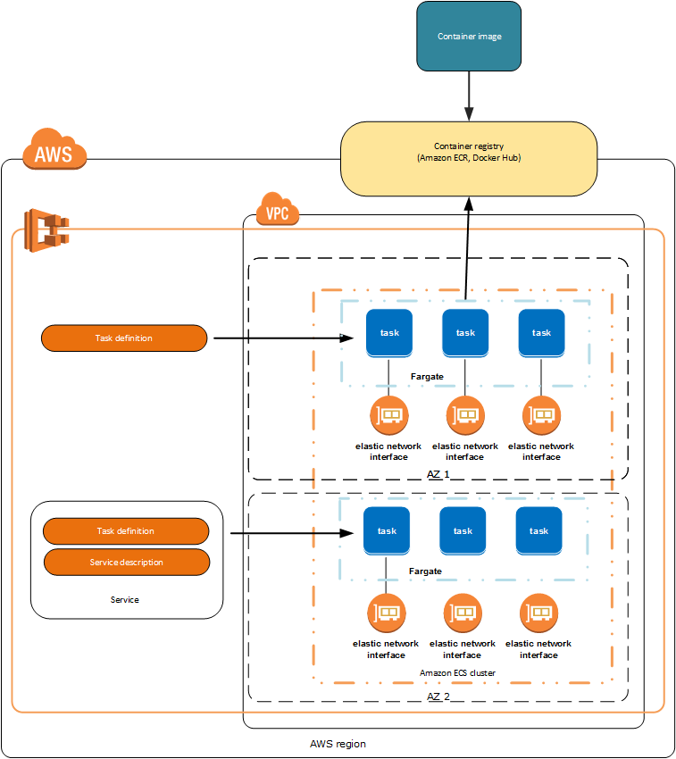

## ECS Main Use Cases
The are 3 common use cases for ECS.

1. `Microservices` are built with a software architectural method that decomposes complex applications into smaller, independent services. Containers are optimal for running small, decoupled services.

2. `Batch Jobs`, docker containers are particularly suited for batch job workloads. Batch jobs are often short-lived and embarrassingly parallel. You can package your batch processing application into a Docker image so that you can deploy it anywhere, such as in an Amazon ECS task.

3. `Machine Learning`, another important use case for ECS is the ability to deploy custom ML environments that run consistently in different environments. [AWS Deep Learning Containers](https://aws.amazon.com/machine-learning/containers/) provides pre-packaged docker images with the required frameworks. E.g. TensorFlow and PyTorch

## Deployment Types

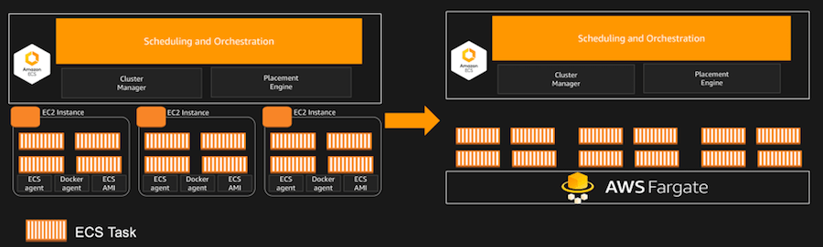

### Container Agent

The Amazon ECS container agent allows container instances to connect to your cluster. The Amazon ECS container agent is included in the Amazon ECS-optimized AMIs, but you can also install it on any Amazon EC2 instance that supports the Amazon ECS specification. The Amazon ECS container agent is only supported on Amazon EC2 instances.

The source code for the Amazon ECS container agent is available on [GitHub](https://github.com/aws/amazon-ecs-agent).

### Fargate

Parts of the tutorial below have been extracted from [AWS Fargate](https://aws.amazon.com/fargate/faqs/)

#### What's Fargate

AWS Fargate is a serverless compute engine for containers that works with both Amazon Elastic Container Service (ECS) and Amazon Elastic Kubernetes Service (EKS). Fargate makes it easy for you to focus on building your applications. Fargate removes the need to provision and manage servers, lets you specify and pay for resources per application, and improves security through application isolation by design.

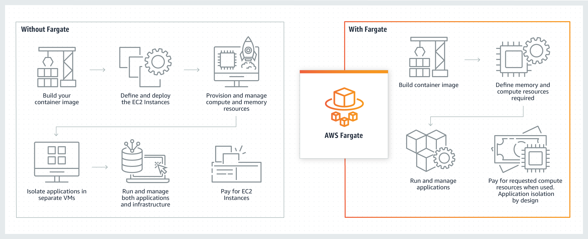

#### Fargate Spot

Fargate spot is similar to the concept used by EC2 Spot Instance as it uses spare capacity to spin tasks. However, when AWS needs the capacity back, tasks running on Fargate Spot will be interrupted with two minutes of notification. Fargate spot is designed for fault-tolerant workloads which can save up to 70% in cost.

In addition, you can specify the minimum number of regular tasks that should run at all times and then add tasks running on Fargate Spot to improve service performance in a cost-efficient way.

The interruption signal is sent via Amazon EventBridge and a SIGTERM signal to the running task to make sure that you can gracefully exit the container. Also, the service scheduler will attempt to spin new tasks on Fargate spot if capacity is available.

It is important to remember that Fargate Spot is great for stateless, fault-tolerant workloads; however, it is not recommended to rely only on Fargate Spot for critical workloads, you can configure a mix of regular Fargate Tasks to avoid interruption.

Reference:
- [YouTube - Scaling a Containerized Application Seamlessly with AWS Fargate](https://www.youtube.com/watch?v=HkBleSbYu4k)

## Concepts

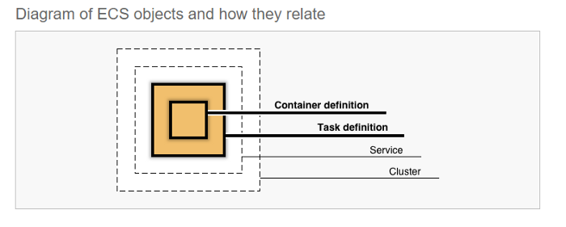

### ECS Task

To prepare your application to run on Amazon ECS, you create a task definition. The task definition is a text file, in JSON format, that describes one or more containers, up to a maximum of ten, that form your application. It can be thought of as a blueprint for your application. Task definitions specify various parameters for your application. Examples of task definition parameters include which containers to use, which launch type to use, which ports should be opened for your application, and what data volumes should be used with the containers in the task. The specific parameters available for the task definition depend on which launch type you are using. 

The following is an example of a task definition containing a single container that runs an NGINX web server using the Fargate launch type. [Click here](https://docs.aws.amazon.com/AmazonECS/latest/developerguide/example_task_definitions.html) for a more extended example demonstrating the use of multiple containers in a task definition.

    {
        "family": "webserver",
        "containerDefinitions": [
            {
                "name": "web",
                "image": "nginx",
                "memory": "100",
                "cpu": "99"
            },
        ],
        "requiresCompatibilities": [
            "FARGATE"
        ],
        "networkMode": "awsvpc",
        "memory": "512",
        "cpu": "256",
    }

In addition, the ECS Task can also be created using the console, which generates the JSON above.

The screenshots below show some steps when the console is used to create the task.

*ECS Launch Type*
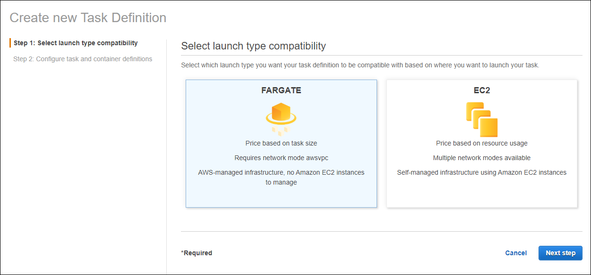

*Container size and the docker image*
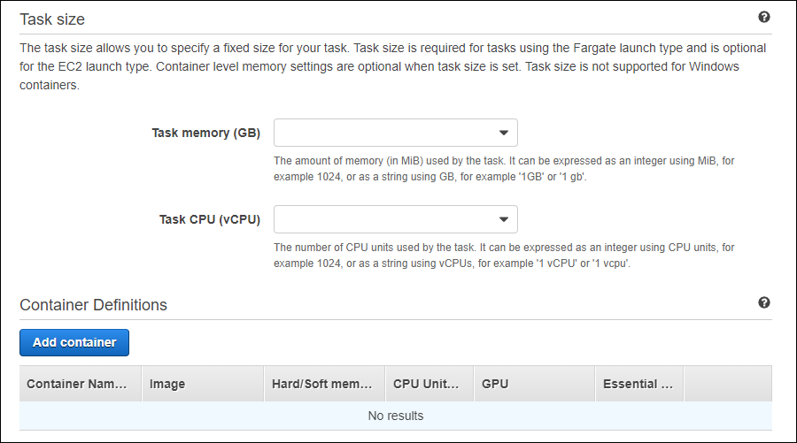

### ECS Cluster

When you run tasks using Amazon ECS, you place them on a cluster, which is a logical grouping of resources. When you use the Fargate launch type with tasks within your cluster, Amazon ECS manages your cluster resources. When you use the EC2 launch type, your clusters are a group of container instances that you manage. An Amazon ECS container instance is an Amazon EC2 instance that is running the Amazon ECS container agent. Amazon ECS downloads your container images from a registry that you specify, and runs those images within your cluster.

*Reference: 
- [Deploy dockerized services on AWS ECS cluster using cloudformation.](https://medium.com/@anupam.ncsu/deploy-dockerized-services-on-aws-ecs-cluster-using-cloudformation-9d6f9a703805)*

### ECS Service

An Amazon ECS service enables you to run and maintain a specified number of instances of a task definition simultaneously in an Amazon ECS cluster. If any of your tasks should fail or stop for any reason, the Amazon ECS service scheduler launches another instance of your task definition to replace it in order to maintain the desired number of tasks in the service.

In addition to maintaining the desired number of tasks in your service, you can optionally run your service behind a load balancer. The load balancer distributes traffic across the tasks that are associated with the service.

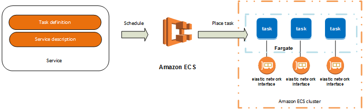

## CLIs
### ECS CLI

The Amazon Elastic Container Service (Amazon ECS) command line interface (CLI) provides high-level commands to simplify creating, updating, and monitoring clusters and tasks from a local development environment. The Amazon ECS CLI supports Docker Compose files, a popular open-source specification for defining and running multi-container applications. Use the ECS CLI as part of your everyday development and testing cycle as an alternative to the AWS Management Console.

Follow the steps below to create an ECS Cluster with a Fargate Task using the ECS and AWS CLI. For this test only, ensure that the AWS profile loaded on the command line has full permission for the IAM and ECS services.

Before you start, ensure that you are inside the folder `labs/ecs`.

Lastly, the commands below uses variable in order to demonstrate how to add these lines to a pipeline.

**1. Create the task execution role using the AWS CLI.**

*If you have already created the ECS task role in your account, you may skip the steps 1 and 2*

    aws iam --region ap-southeast-2 create-role --role-name ecsTaskExecutionRole --assume-role-policy-document file://task-execution-assume-role.json

**2. Attache the `AmazonECSTaskExecutionRolePolicy` policy to the role created above**

    aws iam --region ap-southeast-2 attach-role-policy --role-name ecsTaskExecutionRole --policy-arn arn:aws:iam::aws:policy/service-role/AmazonECSTaskExecutionRolePolicy

**3. Create a cluster configuration, which defines the AWS region to use, resource creation prefixes, and the cluster name to use with the Amazon ECS CLI:**

    ecs-cli configure --cluster tutorial --default-launch-type FARGATE --config-name tutorial --region ap-southeast-2

**4. Create an Amazon ECS cluster with the ecs-cli up command. Because you specified Fargate as your default launch type in the cluster configuration, this command creates an empty cluster and a VPC configured with two public subnets.**

    ecs-cli up --cluster-config tutorial --region ap-southeast-2

Cloudformation used to set up the environment

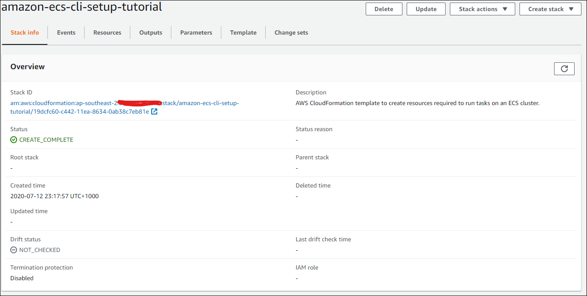

**5. The command `ecs-cli up` creates a cloudformation that provisioned a VPC and two subnet for your ECS Cluster. Use the command below to export the generated VPC ID to a variable that will be used later in these steps.**

    VPC_ID=$(aws cloudformation describe-stack-resources --stack-name amazon-ecs-cli-setup-tutorial --logical-resource-id Vpc --region ap-southeast-2 --query 'StackResources[].PhysicalResourceId' --output text)

**6. Retrieve the default Security Group ID from the VPC retrieved above.**

    SG_GROUP_ID=$(aws ec2 describe-security-groups --filters Name=vpc-id,Values=$VPC_ID Name=description,Values="default VPC security group" --region ap-southeast-2 --query 'SecurityGroups[].GroupId' --output text)

**7. Using AWS CLI, add a security group rule to allow inbound access on port 80 as it is required for the container used during this test.**

    aws ec2 authorize-security-group-ingress --group-id $SG_GROUP_ID --protocol tcp --port 80 --cidr 0.0.0.0/0 --region ap-southeast-2

**8. Collect the subnets ids to update the `ecs-params.yml`**

    SUBNET1=$(aws cloudformation describe-stack-resources --stack-name amazon-ecs-cli-setup-tutorial --logical-resource-id PubSubnetAz1 --region ap-southeast-2 --query 'StackResources[].PhysicalResourceId' --output text)

    SUBNET2=$(aws cloudformation describe-stack-resources --stack-name amazon-ecs-cli-setup-tutorial --logical-resource-id PubSubnetAz2 --region ap-southeast-2 --query 'StackResources[].PhysicalResourceId' --output text)

**9. Update the file `ecs-params.yml` with the subnets and security group.**

When using the ecs-cli compose or ecs-cli compose service commands to manage your Amazon ECS tasks and services, there are certain fields in an Amazon ECS task definition that do not correspond to fields in a Docker compose file. You can specify those values using an ECS parameters file with the --ecs-params flag. By default, the command looks for an ECS parameters file in the current directory named ecs-params.yml. 

    sed -i "s/subnet ID 1/$SUBNET1/g"  ecs-params.yml

    sed -i "s/subnet ID 2/$SUBNET2/g"  ecs-params.yml

    sed -i "s/security group ID/$SG_GROUP_ID/g" ecs-params.yml

**10. Deploy the Compose File to a Cluster.**

The folder labs also contain the `docker-compose.yml`, which uses a docker image for testing when you run the `ecs-cli compose service up`. By default, the command looks for files called docker-compose.yml and ecs-params.yml in the current directory; you can specify a different docker compose file with the --file option..

    ecs-cli compose --project-name tutorial service up --create-log-groups --cluster-config tutorial 

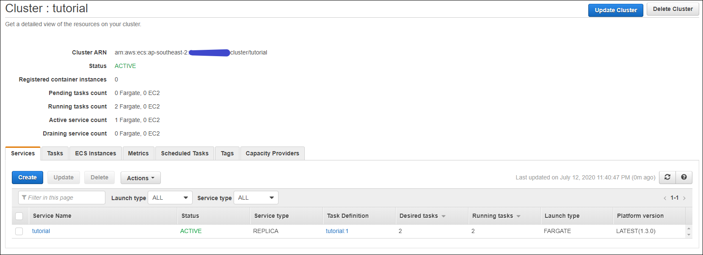

**11. View the Running Containers on a Cluster.**

    ecs-cli compose --project-name tutorial service ps --cluster-config tutorial

In the above example, you can see the web container from your compose file, and also the IP address and port of the web server. If you point your web browser at that address, you should see the PHP web application. Also in the output is the task-id value for the container. Copy the task ID as you use it in the next step.

**12. View the Container Logs.**

Replace the TASK_ID with the id from the previous command.

    ecs-cli logs --task-id `TASK_ID` --follow --cluster-config tutorial

The --follow option tells the Amazon ECS CLI to continuously poll for logs.

**13. Scale the Tasks on the Cluster.**

You can scale up your task count to increase the number of instances of your application with ecs-cli compose service scale. In this example, the running count of the application is increased to two.

    ecs-cli compose --project-name tutorial service scale 2 --cluster-config tutorial 

Now you should see two more containers in your cluster:

    ecs-cli compose --project-name tutorial service ps --cluster-config tutorial

In addition, you can see the new task being provisioned as shown in the screenshot below

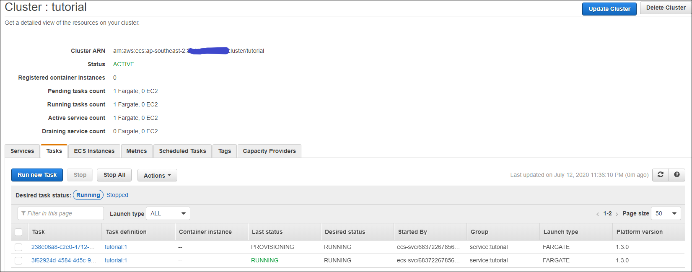

**14. View your Web Application.**

Enter the IP address for the task in your web browser and you should see a webpage that displays the Simple PHP App web application.

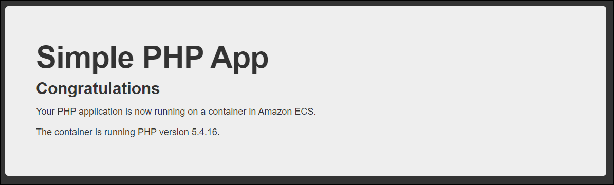

**15. Clean Up.**

When you are done with this tutorial, you should clean up your resources so they do not incur any more charges. First, delete the service so that it stops the existing containers and does not try to run any more tasks.

    ecs-cli compose --project-name tutorial service down --cluster-config tutorial

Now, take down your cluster, which cleans up the resources that you created earlier with ecs-cli up.

    ecs-cli down --force --cluster-config tutorial

References:
- [Docker Composer](https://docs.docker.com/compose/)
- [How to Install ECS Cli](https://docs.aws.amazon.com/AmazonECS/latest/developerguide/ECS_CLI_installation.html)

### Copilot CLI (Preview)

The AWS Copilot command line interface (CLI) provides application-first, high-level commands to simplify modeling, creating, releasing, and managing production-ready containerized applications on Amazon ECS from a local development environment. Provisioned with application templates, infrastructure as code, and CI/CD pipeline options, the AWS Copilot CLI aligns with application workflows that support modern application best practices. Use the AWS Copilot CLI as part of your everyday development and testing cycle as an alternative to the AWS Management Console.

Use Copilot to:

- Organize all your related micro-services in one application
- Set up test and production environments, across regions and accounts
- Set up production-ready, scalable ECS services and infrastructure
- Set up CI/CD Pipelines for all of the micro-services
- Monitor and debug your services from your terminal

Example:

    $ git clone git@github.com:aws-samples/aws-copilot-sample-service.git demo-app
    $ cd demo-app
    $ copilot init --app demo                \
      --svc api                              \
      --svc-type 'Load Balanced Web Service' \
      --dockerfile './Dockerfile'            \
      --deploy

This will create a VPC, Application Load Balancer, an Amazon ECS Service with the sample app running on AWS Fargate. This process will take around 8 minutes to complete - at which point you'll get a URL for your sample app running!

Or, you can use `copilot init` to deploy the application step by step.

References:
- [How to install the Copilot CLI](https://docs.aws.amazon.com/AmazonECS/latest/developerguide/AWS_Copilot.html#copilot-install-homebrew)
- [Git Hub](https://github.com/aws/copilot-cli)

# ECR

Parts of the tutorial below have been extracted from [Amazon ECR User Guide](https://docs.aws.amazon.com/AmazonECR/latest/userguide/ecr-ug.pdf)

## What's ECR

Amazon Elastic Container Registry (Amazon ECR) is a managed AWS Docker registry service that is secure, scalable, and reliable. Amazon ECR supports private Docker repositories with resource-based permissions using AWS IAM so that specific users or Amazon EC2 instances can access repositories and images. Developers can use the Docker CLI to push, pull, and manage images.

Amazon ECR contains the following components:

- Registry
An Amazon ECR registry is provided to each AWS account; you can create image repositories in your registry and store images in them. The URL for your default registry is https://aws_account_id.dkr.ecr.region.amazonaws.com.

- Authorization token
Your Docker client must authenticate to Amazon ECR registries as an AWS user before it can push and pull images.

- Repository
An Amazon ECR image repository contains your Docker or Open Container Initiative (OCI) images.

- Repository policy
You can control access to your repositories and the images within them with repository policies.

- Image
You can push and pull container images to your repositories. You can use these images locally on your development system, or you can use them in Amazon ECS task definitions and Amazon EKS pod specifications.

References:
- [Registries](https://docs.aws.amazon.com/AmazonECR/latest/userguide/Registries.html)
- [Authorization token](https://docs.aws.amazon.com/AmazonECR/latest/userguide/Registries.html#registry_auth)
- [Repositories](https://docs.aws.amazon.com/AmazonECR/latest/userguide/Repositories.html)
- [Repository Policies](https://docs.aws.amazon.com/AmazonECR/latest/userguide/repository-policies.html)

## Repository Policy Example

This example shows an Amazon ECR repository policy, which allows for a specific IAM user to describe the repository and the images within the repository.

    {
      "Version": "2008-10-17",
      "Statement": [{
        "Sid": "ECR Repository Policy",
        "Effect": "Allow",
        "Principal": {
          "AWS": "arn:aws:iam::account-id:user/username"
        },
        "Action": [
          "ecr:DescribeImages",
          "ecr:DescribeRepositories"
        ]
      }]
    }

## Image Scanning

Amazon ECR image scanning helps in identifying software vulnerabilities in your container images. Amazon ECR uses the Common Vulnerabilities and Exposures (CVEs) database from the open source Clair project and provides you with a list of scan findings. You can review the scan findings for information about the security of the container images that are being deployed. For more information about Clair, [see Clair on GitHub](https://github.com/quay/clair).

How to create a repository that scans on push.

    aws ecr create-repository --repository-name NAME --image-scanning-configuration scanOnPush=true --region ap-southeast-2 

How to update an existing repository to scan on push.

    aws ecr put-image-scanning-configuration --repository-name NAME --image-scanning-configuration scanOnPush=true --region 

## How to use

1. Retrieve an authentication token and authenticate your Docker client to your registry.

        aws ecr get-login-password --region ap-southeast-2 | docker login --username AWS --password-stdin ACCOUNT_ID.dkr.ecr.AWS_REGION.amazonaws.com

2. Build your image.

3. Tag your image to push the image to this repository.

        docker tag IMAGE_NAME:latest ACCOUNT_ID.dkr.ecr.AWS_REGION.amazonaws.com/IMAGE_NAME:latest

4. Push this image to your ECR repository.

        docker push ACCOUNT_ID.dkr.ecr.AWS_REGION.amazonaws.com/IMAGE_NAME:latest

## ECR Lab

Let's create an ECR Repository and push an image to the newly created Repo. 

In order to complete this lab, please ensure that your AWS CLI Profile has has permission to use Amazon ECR. Also, make sure that your command line is pointing to the folder `labs/ecr`.

1. Create your repository.

        aws ecr create-repository \
        --repository-name myrepo \
        --image-scanning-configuration scanOnPush=true \
        --region ap-southeast-2

Open the ECR console to see the new repository.

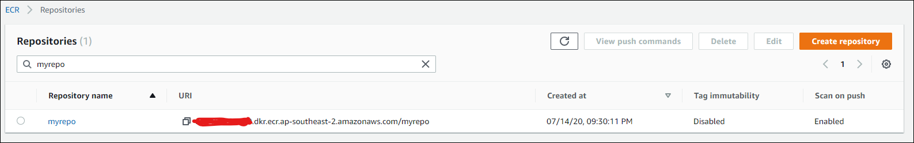

2. Build the Dockerfile.

        docker build -t myrepo .

3. Get the repository URL.

        ECR_URL=$(aws ecr describe-repositories --region ap-southeast-2 --repository-names myrepo --query 'repositories[].repositoryUri' --output text)

4. Tag your image.

        docker tag myrepo:latest "$ECR_URL":latest

5. Check if the image has the new tag.

        docker images

You should see something like:

**AWS_ACCOUNT.dkr.ecr.ap-southeast-2.amazonaws.com/myrepo   latest              ea8c3fb3cd86        9 hours ago         934MB**

6. Authenticate your docker client.

        aws ecr get-login-password --region ap-southeast-2 | docker login --username AWS --password-stdin $(echo $ECR_URL | cut -f1 -d"/")

7. Push the image.

        docker push "$ECR_URL":latest

Wait for the process to complete, and then open the ECR console to check if the new image is available.

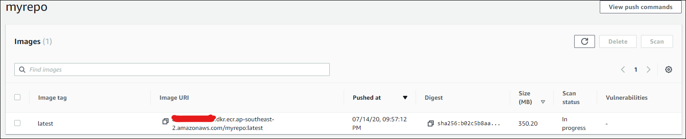

**Challenges:** 
1. Using the AWS CLI, check for any vulnerability to this image.
2. Delete the repository using the AWS CLI

# Deploying

## CDK

Parts of the tutorial below have been extracted from [Getting started with the AWS CDK](https://docs.aws.amazon.com/cdk/latest/guide/awscdk.pdf)

### What's CDK

The AWS Cloud Development Kit (AWS CDK) lets you define your cloud infrastructure as code in one of five supported programming languages. It is intended for moderately to highly experienced AWS users.

An AWS CDK app is an application written in TypeScript, JavaScript, Python, Java, or C# that uses the AWS CDK to define AWS infrastructure. An app defines one or more stacks. Stacks (equivalent to AWS CloudFormation stacks) contain constructs, each of which defines one or more concrete AWS resources, such as Amazon S3 buckets, Lambda functions, Amazon DynamoDB tables, and so on.

New Release - AWS Solutions Constructs are vetted architecture patterns, available as an open-source extension of the AWS Cloud Development Kit, that can be easily assembled to create a production-ready workload. AWS Solutions Constructs are built and maintained by AWS, using best practices established by the AWS Well-Architected Framework

References:
- [AWS Solutions Constructs](https://aws.amazon.com/solutions/constructs/)

### CDK Sample

        from aws_cdk import (
            aws_ec2 as ec2,
            aws_ecs as ecs,
            aws_ecs_patterns as ecs_patterns,
            core,
        )

        class BonjourFargate(core.Stack):

            def __init__(self, scope: core.Construct, id: str, **kwargs) -> None:
                super().__init__(scope, id, *kwargs)

                # Create VPC and Fargate Cluster
                # NOTE: Limit AZs to avoid reaching resource quotas
                vpc = ec2.Vpc(
                    self, "MyVpc",
                    max_azs=2
                )

                cluster = ecs.Cluster(
                    self, 'Ec2Cluster',
                    vpc=vpc
                )

                fargate_service = ecs_patterns.NetworkLoadBalancedFargateService(
                    self, "FargateService",
                    cluster=cluster,
                    task_image_options={
                        'image': ecs.ContainerImage.from_registry("amazon/amazon-ecs-sample")
                    }
                )

                fargate_service.service.connections.security_groups[0].add_ingress_rule(
                    peer = ec2.Peer.ipv4(vpc.vpc_cidr_block),
                    connection = ec2.Port.tcp(80),
                    description="Allow http inbound from VPC"
                )

                core.CfnOutput(
                    self, "LoadBalancerDNS",
                    value=fargate_service.load_balancer.load_balancer_dns_name
                )

        app = core.App()
        BonjourFargate(app, "Bonjour")
        app.synth()

Reference:
- [CDK Python - Deploying ECS and Fargate](https://github.com/aws-samples/aws-cdk-examples/blob/master/python/ecs/fargate-load-balanced-service/app.py)

## Docker Compose and ECS - NEW

Previously, taking a local Compose file and running it on Amazon ECS posed a challenge because of constructs in Amazon ECS that were not part of the Compose specification, but were necessary for the application to run in AWS. For example, in order to run a simple Compose file and deploy to Amazon ECS, a developer would first need to leave the Docker experience and configure an Amazon VPC, Amazon ECS Cluster, and Amazon ECS Task Definition to name just a few of the AWS resources needed. As part of the collaboration, developers can continue to leverage tools like the Docker CLI and Docker Compose without needing to setup those resources in AWS outside of the Docker experience because it is now handled natively. By creating and switching to a new context in Docker, a developer can simply issue an `up` command via Docker Compose, which will create those resources automatically in AWS. This provides an easy path for developers to deploy and run highly secure and scalable production applications in Amazon ECS.

Reference:
- [AWS and Docker collaborate to simplify the developer experience](https://aws.amazon.com/blogs/containers/aws-docker-collaborate-simplify-developer-experience/)
- [Docker ECS Plugin](https://github.com/docker/ecs-plugin)

### Let's play with Docker compose

Before we start, ensure that you have the latest version of the Docker Desktop Edge and your console is pointing to the `labs/compose`

[Edge for Windows](https://docs.docker.com/docker-for-windows/edge-release-notes/)
[Edge for Mac](https://docs.docker.com/docker-for-mac/edge-release-notes/)

1. Setup the ECS context using the docker command.
   
        docker ecs setup

PS: Leave the cluster name empty.

2. Change the context to use AWS.

        docker context use aws

3. Check the compose file used for this lab.
    
        cat docker-compose.yaml

4. Setup the environment.

        docker ecs compose up

The up command will spin all the resources using a cloudformation template.

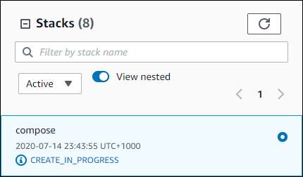

Wait for all lines to change to CREATE_COMPLETE and you are all set.

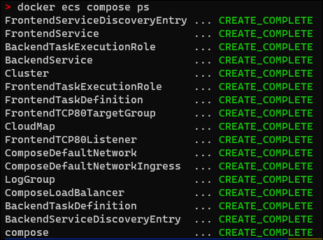

**Challenge:** Access the deployed frontend without using the public IP of the ECS Task.

1. Destroy the environment

        docker ecs compose down