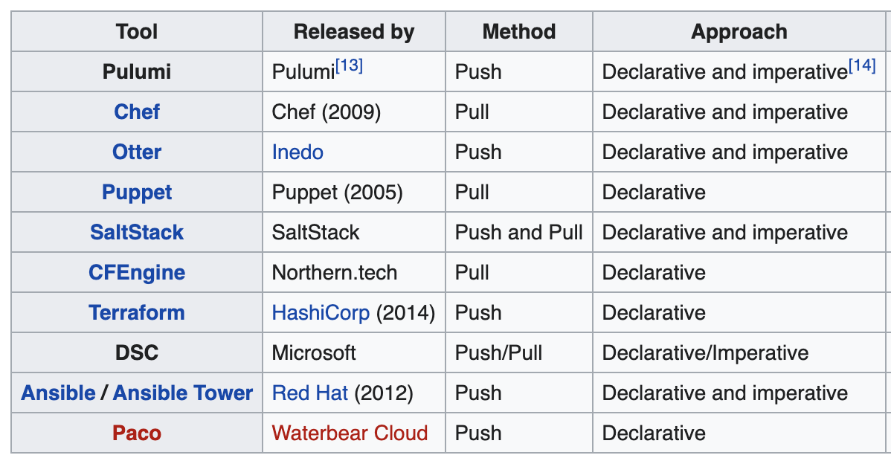
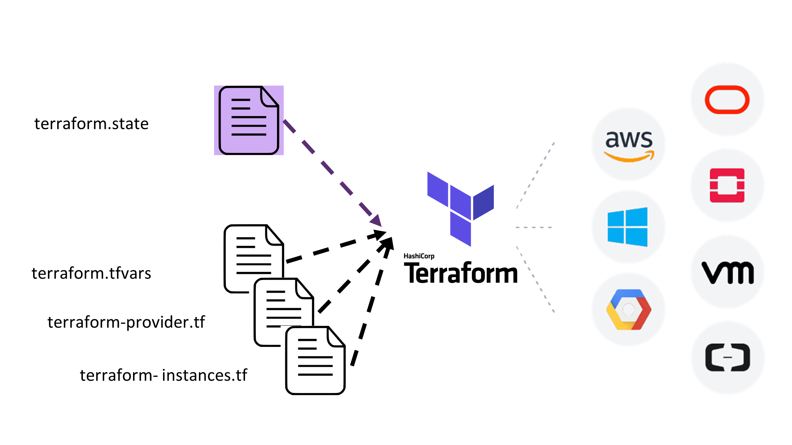

# Infrastructure as Code (IaC)

This class is an introduction to Infrastructure as Code (IaC).

The main goal is to explain the purpose, the benefits and how to use it.

In this class, we'll be using Terraform as the main tool to provision resources in AWS through code.

***Contents***
- [Infrastructure as Code (IaC)](#infrastructure-as-code-iac)
  - [What is IaC?](#what-is-iac)
    - [Benefits of IaC](#benefits-of-iac)
      - [Cost](#cost)
      - [Speed](#speed)
      - [Risk](#risk)
    - [IaC Models](#iac-models)
    - [IaC Methods](#iac-methods)
  - [Terraform Foundation](#terraform-foundation)
    - [Basic concepts](#basic-concepts)
    - [Terraform CLI](#terraform-cli)
    - [Terraform Providers](#terraform-providers)
    - [Terraform Resources](#terraform-resources)
    - [Terraform State](#terraform-state)
    - [The Power of Input Variables](#the-power-of-input-variables)
      - [Assigning values to variables](#assigning-values-to-variables)
    - [Data Source](#data-source)
    - [Outputs](#outputs)
    - [Best Practices: File Organization](#best-practices-file-organization)
    - [Show me some code!](#show-me-some-code)
  - [Appendix](#appendix)
    - [Formatting](#formatting)
    - [Validating](#validating)
    - [Modules](#modules)


## What is IaC?
Infrastructure as Code (IaC) is the process of create, configure and manage IT resources through machine-readable file. Instead of manually creating and configuring IT resources, it's possible to have everything created in an automated and repeatable way.

IaC won't replace physical installation (racking and cabling equipments, for example), but it can be used for most of the task executed after that.

As an example, all the configuration that was executed to create the VPC, subnets, routing tables during exercises from class 2 or even configuring ECS during exercises in class 3 could be coded.

With all those manual steps in a code format, it would be possible to create those resources multiple in a matter of minutes, instead of going into multiple clicks in the AWS console.


> Image from https://www.redhat.com/en/blog/helping-you-get-infrastructure-code

### Benefits of IaC
The benefits of IaC are normally around three pillars:

#### Cost
Repeatable tasks that are transformed into code can reduce costs. Instead of spending 2 hours creating an environment manually that needs to be created weekly, though code, that environment creation can take less than 5 minutes. 

With that, you're not only reducing the cost to deliver that environment, but the engineers will be able to focus on more critical things for the company.

#### Speed
IaC will make the resources available faster, enabling developers to start working sooner. Especially for environments with several changes or with fast innovation pace, where new environments need to be created frequently, IaC can enable this fast pace.

#### Risk
Because everything is defined through code, you can ensure that no manual mistake can be made during any of the configuration. Also, you'll know what is running on your environment, considering that deployments should only be made through code. Manual can be still possible, but much easier to restore the environment to a known state.

Decreasing the possibility of manual mistakes, you increase the availability and reliability of your environment and reduce your application downtime.

### IaC Models

There are multiple models of IaC, and the two main models are **Imperative** and **Declarative**. 

The more natural way to understand the difference between those two models would be that declarative focus on what and imperative focus on how.

In other words, in the *declarative model*, you define **what** the desired state is, and the system will execute the necessary steps to achieve that state. As an example, you can declare that you want a S3 bucket with a specific name.

In the *imperative model*, you need to determine what actions need to be performed as well as the order, so the machine knows what it needs to do to achieve the desired state. You need to specify the **how**. 

Using the same example as above, in an imperative model you would need to describe the steps needed to create an S3 bucket in the console or the exact command required to create the S3 bucket through the AWS CLI command.

### IaC Methods

There are two methods in IaC. **Push** and **Pull**. 

The difference is who starts the communication between the tool and the resource.

In the ***pull method***, the resource being managed by the IaC tool will pull the tool to check if there is any change in the desired state. 

If any new state definition is found in the IaC tool, the resource will converge to the desired state(either through imperative or declarative models, depending on the tool).

In the ***push method***, the resource being managed stays in a `sleep mode`, and the communication is initiated by the IaC tool. In that case, the tool will push the desired state to the resource being managed and the resource will converge to the desired state (either through imperative or declarative model).

Comparing some IaC and configuration management tools:

> Image from [Wikipedia](https://en.wikipedia.org/wiki/Infrastructure_as_code)

## Terraform Foundation

[Terraform](https://www.terraform.io/) is one of the main IaC tools available in the market, and it uses a **Declarative model** with a **push method**. 

It can be used to manage resources in multiple cloud providers (including AWS, Azure and GCP) as well as manage resources in on-premises (like in VMware and OpenShift).

It's a powerful tool that can be used to create, maintain and delete entire IT environments. This material will focus on how to use Terraform to manage AWS resources.


> Image from [Medium - hackernoon](https://medium.com/hackernoon/terraform-openstack-ansible-d680ea466e22)

### Basic concepts

- [CLI](#terraform-cli)
- [Providers](#terraform-providers)
- [Resources](#terraform-resources)
- [State](#terraform-state)
- [Input variables](#the-power-of-input-variables)
- [Data source](#data-source)
- [Outputs](#outputs)

### Terraform CLI

The Terraform is only a single command-line application. From that, you have subcommands to interact with the Terraform code that you have in your working directory. [Here](https://www.terraform.io/docs/commands/index.html) is a full list of the options available for the terraform application, but below you have some of the most common commands used.

- **terraform init**
    - Initialize a working directory containing Terraform configuration files. This would be the first command you run after creating your code. [Details for this command](https://www.terraform.io/docs/commands/init.html)
- **terraform plan**
    - Performs a refresh and determines what actions are necessary to achieve the desired state specified in the configuration files. [Details for this command](https://www.terraform.io/docs/commands/plan.html)
- **terraform apply**
    - Apply the changes required to reach the desired state of the configuration, or the pre-determined set of actions generated by a terraform plan execution plan. [Details for this command](https://www.terraform.io/docs/commands/apply.html)
- **terraform destroy**
    - Destroy the Terraform-managed infrastructure. [Details for this command](https://www.terraform.io/docs/commands/destroy.html)

The terraform command-line can be very helpful as well. The `--help` option will provide you with all the help you need based on the scope that you are working on.

This means that `terraform --help` and `terraform init --help` will provide different outputs. The first one will give information on the terraform in general, and the second will provide help for the init option of the terraform cli.

### Terraform Providers

[Terraform Providers](https://www.terraform.io/docs/providers/index.html) are plugins for Terraform that makes a collection of related resources available. A provider plugin is responsible for understanding API interactions with some kind of service and exposing resources based on that API.

For example, an AWS provider will enable terraform to create resources in AWS.

There are multiple Terraform Providers available, and anyone can create a provider for anything they need. Here is a list of all [Providers](https://www.terraform.io/docs/providers/index.html) provided by Terraform as well as some other [Providers](https://www.terraform.io/docs/providers/type/community-index.html) provided by the community.

During the terraform code that you'll create to deploy the resources, for example, in AWS, you'll need to inform which Provider should be used, the version of that Provider and the region where the code will be executed. Each Provider requires a different set of key/values to work properly.

```terraform
# Configure the AWS Provider
provider "aws" {
  version = "~> 2.0"
  region  = "ap-southeast-2"
}

# Create a VPC named devopsacademy-vpc
resource "aws_vpc" "devopsacademy_vpc" {
  cidr_block = "192.168.50.0.0/16"

  tags = {
    Name = "devopsacademy-vpc"
  }
}
```
During the code execution, considering that we're using AWS Provider, Terraform will look for credentials configured through the `aws cli` in its default location (~/.aws/credentials). You can search for different ways to authenticate [here](https://www.terraform.io/docs/providers/aws/index.html).

### Terraform Resources

Resources are the main component of a Terraform code. Each resource block represents an object in the infrastructure that will be created and managed by Terraform.

The resource block defines all the characteristics and configuration of the resource, and each resource type will have different required and optional arguments.

```terraform
# Define a new resource of the EC2 instace type
resource "aws_instance" "da_academy" {
  ami               = "ami-077007384e83bf4cc"
  availability_zone = "ap-southeast-2a"
  instance_type     = "t1.micro"

  tags = {
    Name = "DevOpsAcademy-Instance"
  }
}
```

In the example above, an EC2 Instance named `DevOpsAcademy-Instance` would be created. In this resource, we have also identified the AMI that needs to be used, the instance type and the Availability Zone that the instance should be created into. Many more optional Arguments could be added to this resource, like `key_name`, `subnet_id`, `security_group`, and many others. A list of all Argument options for EC2 can be found [here](https://www.terraform.io/docs/providers/aws/r/instance.html).

Each resource block declares a resource type and the resource name. In the example above, the instance type is `aws_instance`, and the resource name is `da_academy`.

This name defined by you have no importance outside of the Terraform scope, so it won't affect any configuration of the resource being created in AWS, in our case.

The name is essential to be referenced by another resource being created in the same Terraform code.

```terraform
# Define a new resource of the EC2 instace type
resource "aws_instance" "da_academy" {
  ami               = "ami-077007384e83bf4cc"
  availability_zone = "ap-southeast-2a"
  instance_type     = "t1.micro"

  tags = {
    Name = "DevOpsAcademy-Instance"
  }
}

# Define a new resource of the EIP type
resource "aws_eip" "da_academy" {
  vpc = true
}

# Associate an EC2 instance resource with a EIP resource
resource "aws_eip_association" "da_academy" {
  instance_id   = "${aws_instance.da_academy.id}"
  allocation_id = "${aws_eip.da_academy.id}"
}
```

In the example above, we're using the same EC2 instance creation code, but we're adding 2 new resources to it. One of them is the resource type `aws_eip`, which creates a new Elastic IP. The other new resource is an `aws_eip_association`, which we're using to associate the EIP named `da_academy` to the EC2 instance named `da_academy`.

Keep in mind that the full name of a resource(composed by the resource type + the name of the resource) must be unique in your Terraform code.

Note that for the resource reference, there is one additional component to the names we're referencing. For example, when we are referencing the EC2 instance in the EIP association resource, we're using `aws_instance.da_academy.id`.

The `aws_instance.da_academy` we already know that represents the unique name of that particular resource, however, the additional `id` part of the reference we've used is new to us.

Each resource, when created, have a list of `Attributes`, that, just like the list of Arguments, is different for each type or resource.

In the case of the EC2 instance, the ID represents the Instance ID of an instance. EC2 instances have other Attributes when created, such as `arn`, `public_ip`, `private_ip`, `public_dns` and many more.

As you can image, it's essential to know all Arguments and Attributes of each resource available on the AWS provider. Still, there is great documentation about each resource on the [Terraform AWS provider page](https://www.terraform.io/docs/providers/aws/index.html).

When creating any Terraform code, consider the Provider documentation page your best friend. No one creating Terraform code lives without it.

### Terraform State
To be able to create, change, delete and keep track of the current state of the resources being managed by itself, Terraform make uses of a file called `Terraform State`, which is used to store state about your managed infrastructure and configuration.

This state is used by Terraform to map real-world resources to your configuration, keep track of metadata, and to improve performance for large infrastructures.

This state is, by default, stored in a local file named "terraform.tfstate", but it can also be stored remotely in places like S3 or similar services from other cloud providers.

With this file, Terraform can, whenever you deploy new code to your environment, alert of which resources are being added, changed or deleted, so you can make sure that the new code is executing what you expect.

To specify where the Terraform State will be stored, we use the `backend` code, as the example below:

```terraform
# Define where the terraform state will be stored
terraform {
  backend "local" {
    path = "/devopsacademy/critical/terraform.tfstate"
  }
}
```
If for any reason the state file is lost, terraform won't be able to know the resources that are managed by it. In that case,  you'll need to rely on the [import feature](https://www.terraform.io/docs/import/index.html) to try to recover the existent state, but this is a very manual and arduous task, so make sure you keep your state file safe.

Also, when running your terraform code, the state file will be put in a `lock` state to guarantee that there is no way to have more than one change happening at the same time. This helps to keep the state file consistent.


More details around the Terraform State can be found [here](https://www.terraform.io/docs/state/index.html).

### The Power of Input Variables

Having your entire infrastructure as code with Terraform is very useful, so you can have a single source of truth for your environment as well as enables you to keep reasonable control over the changes that happen in your environment.

To make IaC even more powerful, we can use variables in our code that will be used to create our resources. Input Variables serve as parameters for a Terraform code, allowing aspects of the code to be customized without altering the source code, and allowing code to be shared between different configurations.

This enables the reuse of code, so if you want to create 10 similar resources or group of resources, you only need to change the variables that will be used to create those resources.

```terraform
# Define variables
variable "instance_type" {
  type    = string
  default = "t1.micro"
}
# Define a new resource of the EC2 instace type
resource "aws_instance" "da_academy" {
  ami               = "ami-077007384e83bf4cc"
  availability_zone = "ap-southeast-2a"
  instance_type     = var.instance_type

  tags = {
    Name = "DevOpsAcademy-Instance"
  }
}
```

In the case above, the `instance_type` argument of the `AWS Instance` resource can be informed during the execution of the code, allowing us to reuse this piece of code multiple times without having to change the code.

On the variable declaration, you can specify a default value, so if the value is not included during the code execution, it will use the default one.

> Check this [Variables documentation](https://www.terraform.io/docs/configuration/variables.html) 

#### Assigning values to variables

For setting the values of variables and automate your CI/CD pipelines, you will need to dynamically set their values. Here are the options.

- **Individually, with the -var command line option.**

```
terraform apply -var="image_id=ami-abc123"
terraform apply -var='image_id_list=["ami-abc123","ami-def456"]'
terraform apply -var='image_id_map={"us-east-1":"ami-abc123","us-east-2":"ami-def456"}'
```

- **In variable definitions (`.tfvars`) files**

The `.tfvar` file:
```
image_id = "ami-abc123"
availability_zone_names = [
  "us-east-1a",
  "us-west-1c",
]
```

Passing the file as argument to the CLI command:

```
terraform apply -var-file="testing.tfvars"
```

> Terraform also automatically loads a number of variable definitions files if they are present:
> - Files named exactly terraform.tfvars or terraform.tfvars.json.
> - Any files with names ending in .auto.tfvars or .auto.tfvars.json.

- **Environment variables**

Terraform searches the environment for environment variables named `TF_VAR_` followed by the name of a declared variable.

```
$ export TF_VAR_availability_zone_names='["us-west-1b","us-west-1d"]'
$ export TF_VAR_image_id=ami-abc123
$ terraform plan
...
```

> [Check variable precedence](https://www.terraform.io/docs/configuration/variables.html#variable-definition-precedence)

- **In a Terraform Cloud workspace**

[Check about workspace variables here](https://www.terraform.io/docs/cloud/workspaces/variables.html)

### Data Source

Data source performs **read-only operation** and is dependant on provider configuration (like AWS provider).

For example, you would like to launch an EC2 instance with the latest Amazon linux AMI. How do you automate this?

You can use the `aws_ami` data source provided by the AWS provider to filter out the AMI:

```
data "aws_ami" "example" {
  most_recent = true
  owners      = ["amazon"]
  filter {
    name   = "owner-alias"
    values = ["amazon"]
  }


  filter {
    name   = "name"
    values = ["amzn2-ami-hvm*"]
  }

  tags = {
    Name   = "app-server"
    Tested = "true"
  }
}
```

Then you just need to consume it as an input of type `data`:

```
resource "aws_instance" "da_academy" {
  ami           = data.aws_ami.example.id
  subnet_id     = aws_subnet.subnet_public_b.id
  instance_type = "t2.micro"

  tags = {
    Name = "DevOpsAcademy-Instance"
  }
}
```

Example: 
> From https://www.terraform-best-practices.com/key-concepts


### Outputs
Outputs are like return values from a terraform code. It can be useful, so you receive an attribute of a resource being created. It can also be used by another piece of code outside of your own.

```terraform
output "instance_ip_addr" {
  value = aws_instance.server.private_ip
}
```
The piece of code above would print, after executing the Terraform code, the private IP address of the instance created.

Each kind of resource has specific attributes that can be output, and you can check those attributes on the provider resource page.

### Best Practices: File Organization

Just like any other programming language, Terraform has it's best practices to organize the code you create.

By default, commands as `init`, `plan` and `destroy` will look into the current directory.

Everything (resources, outputs, providers, state, etc) could be written in a single file with a `.tf` extension, however, to make things easier, each kind of code block should be created on a specific file.

Example:

- **_provider.tf**
  - All providers are declared on this file
- **_backend.tf**
  - The backend to be used is declared on this file
- **_variables.tf**
  - The variables expected to be received during the code execution are declared on this file.
- **_outputs.tf**
  - All outputs from your code are declared on this file
- **resource_related.tf**
  - For the resources, you'll normally create a single file for each `family` of resources. Normally you'll have an `iam.tf`, `vpc.tf`, `s3.tf`, `rds.tf`, etc. In this example, all resources related to IAM, would go into the `iam.tf` file.
- **anything.tfvars**
  - In this file you would have the variables to be used during the code execution. If you have multiple environments, you can have your `dev.tfvars` and `prod.tfvars` files containing specific values for each environment and point to each file during execution based on the environment you want to apply your code.

### Show me some code!

Now that we have some understanding about terraform and its power let's give it a go and run some code.

First of all, make sure you have your AWS credentials configured on your machine. You can use the guide from [here](https://link-to-the-cli-config)

All the code we'll use is on the [artifacts folder](artifacts/terraform) of this repository, so just get into that directory. That way terraform will consider it as the working directory.

```bash
# Considering that you are on the folder of this file
$ cd artifacts/terraform
```

Let's initialize terraform

```bash
$ terraform init
```

The `terraform init` command will initialize the working directory and should only be run once unless you make any change on the following:
- Backend configuration
- Child Modules
- Providers

Now that terraform is initialized, we can run the next command, which would determine the resources that need to be created/updated/removed.

```bash
$ terraform plan -var-file=./class.tfvars
```

After this command, you should see 3 resources to be created in your account. Because it's the first time that terraform is running, it's basically creating all resources defined in the code.

```bash
$ terraform apply -var-file=./class.tfvars
```

By running the command above and saying `yes` to the question you'll receive, terraform will proceed with the creation of the resources informed.

The resources should be created, and you can go into your AWS console and check that the resources listed below were successfully created:
- S3 bucket: [8char]-devopsacademy
- SecurityGroup: devopsacademy-sg

Now edit the `class.tfvars` file and change the bucket name by adding a `-2` to its name.

Additionally, edit the `sg.tf` file and change the port from 80 to 443 in the `from_port` and `to_port` arguments.

Now let's re-run the following commands:
```
$ terraform plan -var-file=./class.tfvars
```
The plan should now inform that the changes that will be made to the stack. For the S3 modifications we've made, because we're changing the name of the bucket, it will recreate it. For the SecurityGroup, because the change can be done without the need of recreating it, it will just update the configuration with new values.

## Appendix

### Formatting

Use `terraform fmt` to format your code before commiting (or use another linter/formatting tool), your peers will thank you :)

### Validating

You can validate your terraform syntax (static) using `terraform validate`.

It is fast and can save some `plan` time as it catches common silly errors.

### Modules
Terraform Modules is an advanced topic and is used to reduce code duplication as well as to group up resources that are often created together.

For example, whenever a VPC is created, you normally will create Subnets, Routing Tables, NACLs, IGW and a few additional resources. With Modules, you can create a Module named `FullVPC` that receives a few input variables values and creates all the resources that compose that module

[This link](https://www.terraform.io/docs/modules/index.html) provides some good practices and examples around Terraform Modules.

The module will work in a similar way to an application function. It will receive input(Input Variables), it will process the input(create resources based on the variables), and generate an output(specific attribute of a resource created). Considering this, a Terraform module will normally be composed by the following files:
- _output.tf
- variables.tf
- resources.tf

When creating resource(s) from a module, you would add a terraform code block like this:

```terraform
module "full_vpc" {
  source         = "path_to_module"
  vpc_cidr       = "192.168.0.0"
  sn_prv_a_cird  = "192.168.10.0"
  sn_prv_b_cird  = "192.168.20.0"
  sn_pub_a_cird  = "192.168.100.0"
  sn_pub_b_cird  = "192.168.200.0"
}
```

All the resources to be created would be defined in a module located in the path specified, which can be within the same repository or in a different repository. [This link](https://www.terraform.io/docs/modules/sources.html) provides some additional information and options aboud the `source definition` and [this link](https://www.terraform.io/docs/modules/composition.html) provides an smaller example of a VPC+ Subnets module.

- [Terraform Modules](https://www.terraform.io/docs/configuration/modules.html)
  - Modules can be used to create a set of resource that is used to compose a single delivery. For example, when you create a VPC, you also want to create subnets, routing tables, IGW, ACL, etc. It's an excellent strategy to create a module to delivery VPCs with all those components
- [Terraform Expressions](https://www.terraform.io/docs/configuration/expressions.html)
  - Expressions are an advanced topic and can be very useful for complex code, and when you need to do things like loops and ifs. For example, you can create 4 subnets with a dynamic block loop using inputs from a variable.
- Other IaC Tools
  - [CloudFormation](https://aws.amazon.com/cloudformation/)
  - [Ansible](https://www.ansible.com/)
  - [Puppet](https://puppet.com/)
  - [Chef](https://www.chef.io/)
