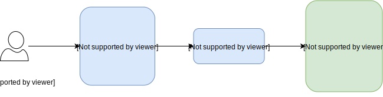

# 3 Musketeers - Consistency and Developer eXperience

- [3 Musketeers - Consistency and Developer eXperience](#3-musketeers---consistency-and-developer-experience)
  - [What's 3 Musketeers (3M)?](#whats-3-musketeers-3m)
  - [Why 3 Musketeers?](#why-3-musketeers)
  - [Hello World Example](#hello-world-example)
  - [Patterns in 3M](#patterns-in-3m)
    - [1. Separate Shell/Language files](#1-separate-shelllanguage-files)
    - [2. Technology-specific targets begins with _](#2-technology-specific-targets-begins-with)
    - [3. Docker and Compose commands as variables](#3-docker-and-compose-commands-as-variables)
    - [4. Clean Docker and files](#4-clean-docker-and-files)
    - [Example: Putting these patterns together](#example-putting-these-patterns-together)
  - [Environment variables](#environment-variables)
      - [Letting developers to pass .env files](#letting-developers-to-pass-env-files)
  - [Full Example: Calling a make target from GitHub Actions](#full-example-calling-a-make-target-from-github-actions)
  - [References](#references)

## What's 3 Musketeers (3M)?

The 3 muskeeters are:
- Docker
- Docker-Compose
- Make

You just need to have these tools installed to use this approach for any codebase.

It is an approach for organising your code in a way that pipeline steps are easily runnable for any developer in the team. Wouldn't be good to clone a repository with a step "build" that when you run it , it would just work?!

This is one benefit of 3Musketeers (I am going to use `3M` for brevity) approach. You can have a consistent step "build" that any developer can run using Docker-Compose, Docker and Make.

It always bring consistency to your test environment and confidence when deploying by using the same environment (Docker container) in any machine.

This avoids the problem of "Oh, it is broken. You said you could run it in your machine?" :(

Author's repo: https://github.com/flemay/3musketeers



## Why 3 Musketeers?

[Extracted from 3Musketeers.io website](https://3musketeers.io/)

- **Consistency**: Run the same commands no matter where you are: Linux, MacOS, Windows, CI/CD tools that supports Docker like GitHub Actions, Travis CI, CircleCI, and GitLab CI.

- **Control**: Take control of languages, versions, and tools you need, and version source control your pipelines with your preferred VCS like GitHub and GitLab.

- **Confidence**: Test your code and pipelines locally before your CI/CD tool runs it. Feel confident that if it works locally, it will work in your CI/CD server.

## Hello World Example

```bash
# As a developer using this project, just run the make target
$ make echo
```

```Makefile
# Makefile

# echo target runs a command in a Docker container
echo:
	docker-compose run --rm alpine echo 'Hello, World!'
```

```bash
# docker-compose.yml
version: '3'
services:
  alpine:
    image: alpine
```

It is possible to see here how the COMMAND parameter of docker-compose is leveraged. Thanks to this parameter we can pass the command `echo 'Hello, World!'` for the container to run.

## Patterns in 3M

There are some patterns describe [here](https://3musketeers.io/docs/patterns.html) for 3M. Let's highlight some of them important for this course.

### 1. Separate Shell/Language files

Instead of having command written in the `Makefile` as in the Hello World example [above](#hello-world-example), we'd like to keep the `Makefile` clean and tidy, just serving as an execution orchestrator for us.

This way anyone reading the `Makefile` will have a good idea of the steps being followed and they can dig down to the scripts if they want more details.

https://3musketeers.io/docs/patterns.html#shell-file

### 2. Technology-specific targets begins with _

In your `Makefile`, Make targets that runs on Docker don't need to begin with *underscore*. 

For technology-specific targets (like shell, NodeJS, Python, etc), create a new target beginning with `_`.

### 3. Docker and Compose commands as variables

In your `Makefile`, Docker and Compose commands can be assigned to variables.

```Makefile
COMPOSE_RUN_SERVERLESS = docker-compose run --rm serverless

deploy:
	$(COMPOSE_RUN_SERVERLESS) make _deploy

```

### 4. Clean Docker and files

Remember to include in your `Makefile` a target called `clean` or `cleanDocker` to clean up files and Docker images, volumes and networks.

```Makefile
clean: 
  rm -rf ./output

cleanDocker:
	docker-compose down --remove-orphans
```

### Example: Putting these patterns together

This is an example of a Python test flow. The developer just needs to run `make test`.

```Makefile
# Makefile
COMPOSE_RUN_PYTHON = docker-compose run --rm python

test: validate
	$(COMPOSE_RUN_PYTHON) make _test

_test:
	bash scripts/_test.sh
```

```Makefile
# scripts/_test.sh
pip install -r requirement_test.txt 
pytest test/
pylint src/
```

```bash
# docker-compose.yaml
version: '3'
services:
  python:
    image: python:3.7-stretch
    working_dir: /code
    volumes:
    - .:/code
```

## Environment variables

***How do you inject environment variables?***

A Developer may have different environment variables per environment. Something like:
- Dev:
  - DB_CONNECTION = dev.mydomain.com:3306
  - ENV = dev
- Prod:
  - DB_CONNECTION = prod.mydomain.com:3306
  - ENV = prod

You can manage this settings by injecting this environment variables in the container. A simple approach is creating a file `.env`:

```bash
# .env
DB_CONNECTION
ENV
```

We will make use of the `env_file` attribute in Docker-compose file to pass in a file containing the definition of the environment variables we want to expose to our container.

For example:
```bash
# file: docker-compose.yml
version: '3'
services:
  musketeers:
    image: busybox
    env_file: .env
```

Just passing a variable name to the Docker container will make the container to inherit the environment variable value from the Host machine (this is useful!)

#### Letting developers to pass .env files 

You can have several files for .env:
- .env.dev
- .env.prod

Then update your `Makefile` to accept the .env file name as parameter.Targets requiring .env file will fail if the file does not exist. The `.env` file can be created with `envfile` target.

```Makefile
# Makefile
COMPOSE_RUN_ALPINE = docker-compose run alpine
ENVFILE ?= env.template

envfile:
	ENVFILE=$(ENVFILE) $(COMPOSE_RUN_ALPINE) cp $(ENVFILE) .env

target: .env
	$(COMPOSE_RUN_ALPINE) cat .env

# clean removes the .env
clean: .env
	$(COMPOSE_RUN_ALPINE) rm .env

```

```bash
# fail if .env does not exist
$ make target
# overwrite .env based on env.template
$ make envfile
# overwrite .env with a specific file
$ make envfile ENVFILE=env.example
# execute a target with a specific .env file
$ make envfile target ENVFILE=env.example
```

***What if your container needs to access AWS? How do you share your credentials temporarily with it?***

Two main solutions:
- map `~/.aws` from the Host to the container in a Volume
- share environment variables like `AWS_ACCESS_KEY_ID`, `AWS_SECRET_ACCESS_KEY`

[Check this section](https://3musketeers.io/docs/environment-variables.html#aws-environment-variables-and-aws)

## Full Example: Calling a make target from GitHub Actions

In this example I using the flow created by the author of 3Musketeers, in this repo https://github.com/flemay/3musketeers.

Probably in your career you will see many pipelines containing a lot of logic to set up and run scripts, parse environment variables and create/delete files.

Here's where the 3 Musketeers shines. 
Check how easy and clean it is to call the CI flow using GitHub Actions: [.github/workflows/test.yml](https://github.com/flemay/3musketeers/blob/eda4b620eefdd7a67c212145e05365ebe8121391/.github/workflows/test.yml).

The only command that runs is `make ciTest` and it is expected to behave the same way locally in your laptop or in a machine in the cloud.

The [Makefile](https://github.com/flemay/3musketeers/blob/eda4b620eefdd7a67c212145e05365ebe8121391/Makefile#L12) is the one orchestrating the execution.

And the[ Docker-compose.yaml](https://github.com/flemay/3musketeers/blob/eda4b620eefdd7a67c212145e05365ebe8121391/docker-compose.yml#L21) contains the definitions for the containers and volume mapping.

## References
- Documentation: https://3musketeers.io
- Examples: https://github.com/flemay/3musketeers
- [3Musketeers: Environment variables details](https://3musketeers.io/docs/environment-variables.html
)