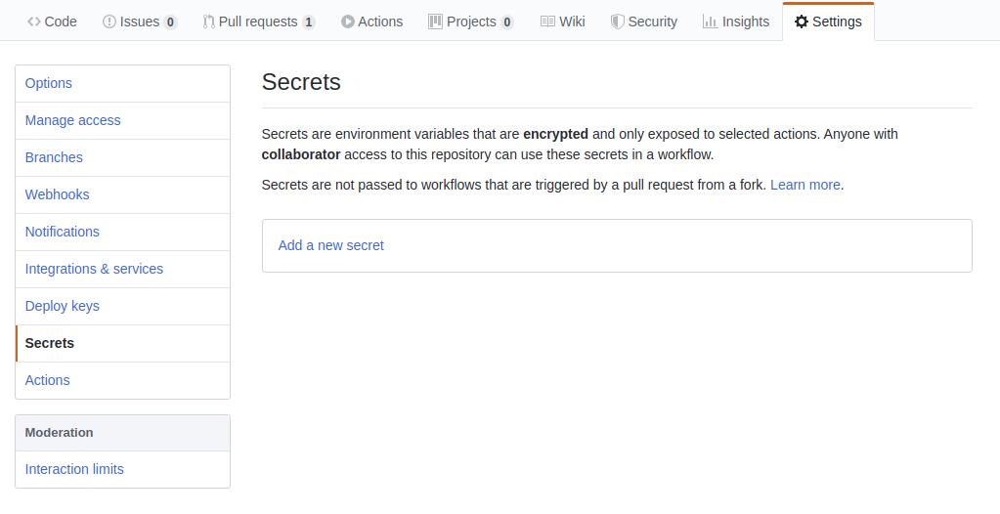
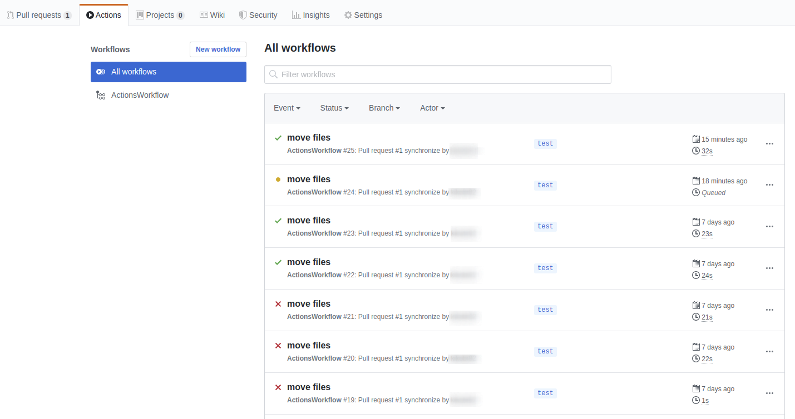
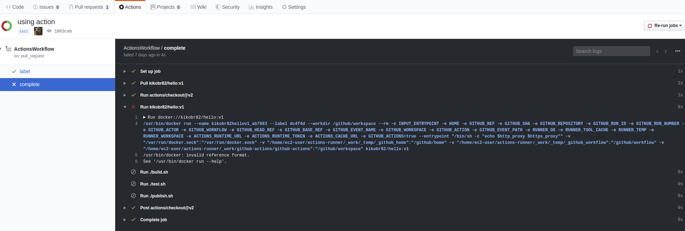

# GitHub Actions
This class is an introduction to GitHub Actions.
The main goal is to explain the purpose, the benefits and how to use it.

***Contents***
- [What is GitHub Actions?](#what-is-github-actions)
  - [Workflow](#workflow)
  - [Runners](#runners)
  - [Workflow](#workflow)
  - [Job](#job)
  - [Step](#step)
- [Creating a Workflow](#creating-a-workflow)
- [Using Environment Variables](#using-environment-variables) 
- [Secrets](#secrets)
- [Workflow Execution](#workflow-execution)
- [Appendix](#appendix)


## What is GitHub Actions?
GitHub Actions(GH Actions) is a a feature in GitHub that helps the automation the worfkflow of the software development. In the same repository used to store and version your application code, is possible to define the workflow as code whenever new events occurs in the repository.

With GH Actions we can build end to end continuous integration(CI) and continuous deployment(CD) of the code being developed.

### Runners
Workflows run in Linux, macOS, Windows, and containers on GitHub-hosted machines, called `Runners`. Alternatively, you can also host your own runners to run workflows on machines you own or manage, called `self-hosted Runners`. The type of host you'll use as well as if will be sed the GitHub-hosted or the self-hosted will be based on the requirements you'll have. Our usage here in the DevOps Academy will be mainly with GitHub-hosted Linux and containers.

### Workflow
A workflow is a configurable automated process that you set up in your repository to build, test, package, release, or deploy any project on GitHub. Workflows are made up of one or more jobs and can be scheduled or activated by an event.

For example, a workflow can be initiated when a new Pull request is created in the repository, and the workflow will execute a few tasks like build a container image and push it to a container registry. The options are endless.

The worflow is defined in a yaml file with at least one job. This file lives in the root of your GitHub repository in the `.github/workflows` directory.

### Job
A job is a set of steps that are executed on the same runner. You can define dependencies between jobs in the same workflow. You can have multiple jobs running in parallel or sequentially depending on the status of a previous job. 

For example, a workflow can have two sequential jobs that build and test code, where the test job only runs if the build step completed successfully. For GitHub-hosted runners, each job in a workflow runs in a fresh instance of a virtual environment.

### Action
Action is an individual tasks that you combine as steps to create a job. Actions are the smallest portable building block of a workflow. You can create your own actions, use actions shared from the GitHub community, and customize public actions. To use an action in a workflow, you must include it as a step.

### Step
A step is an individual task that can run commands or actions. A job is a composed by one or more steps. Each step in a job executes on the same runner, allowing the actions in that job to share information using the filesystem. 

For example, you can compile your application in one step and build a container in a nother step, everything being part of a single Job.

## Creating a Workflow
Workflows are created in the `.github/workflows` directory in the root of the repository. You can have multiple workflows per repository.

Workflows must have at least one job, with a set of steps that perform individual tasks. Steps can run commands or use an action. You can create your own actions or use actions shared by the GitHub community and customize them as needed.

The workflow can be configured to start when a GitHub event occurs, on a schedule, or from an external event. For example in this repository we have [this label.yaml](https://github.com/devopsacademyau/academy/blob/master/.github/workflows/label.yaml) and [this stale.yml](https://github.com/devopsacademyau/academy/blob/master/.github/workflows/stale.yml) workflows. The first one adds labels whenever a new pull request is created or updated with new commits and the second runs based on a cron schedule.

Both examples above have a single job with a single step as an action. Another example, but this one using commands instead of actions would be the one below:
```yaml
name: Builder
on: [pull_request]

jobs:
  build:
    runs-on: self-hosted
    steps:
      - uses: actions/checkout@v2
      - run: build.sh
        working-directory: ./scripts
      - run: test.sh
        working-directory: ./scripts
      - run: publish.sh
        working-directory: ./scripts
```

The workflow above is named `Builder` and runs on every pull request. It has a single Job, named `build` and this job is composed by four steps. The first one is using an action that checkout the files from the respository into the Runner. The other three steps are running three different scripts: `build.sh`, `test.sh`, `publish.sh`. All three scripts resides in the `scripts` directory of the repository. In this example, the workflow is using a self-hosted runner, instead of the ones from GitHub.

A similar workflow, but using a Makefile would look like this:
```yaml
name: Builder
on: [pull_request]

jobs:
  build:
    runs-on: self-hosted
    steps:
      - uses: actions/checkout@v2
      - run: make build
        working-directory: ./scripts
      - run: make test
        working-directory: ./scripts
      - run: make publish
        working-directory: ./scripts
```

Another option would be to run a container as one of the steps of your Job. The code below is an example of that option. 

```yaml
name: Builder
on: [push]

jobs:
  my_job:
    container:
      image: node:10.16-jessie
      env:
        NODE_ENV: development
      ports:
        - 80
      volumes:
        - my_docker_volume:/volume_mount
      options: --cpus 1
```

There is multiple configurations in a workflow, and a detailed documentation can be found [here](https://help.github.com/en/actions/reference/workflow-syntax-for-github-actions#jobsjob_idruns-on).

## Using Environment Variables
Environment variables is another feature that can be used in a workflow. There is already a set of default environment variables from GitHub, like `GITHUB_ACTION`, that identifies the id of the action or `GITHUB_SHA`, which is the git commit sha that triggered the worflow and many others, as listed [here](https://help.github.com/en/actions/configuring-and-managing-workflows/using-environment-variables#default-environment-variables).

It's also possible to create custom environment variables to be used in the workflow, as the example below:

```yaml
steps:
  - name: Hello world
    run: echo Hello world $First_Name $Last_Name!
    env:
      First_Name: DevOps
      Last_Name: Academy
```

Environment Variables are case sensitive so make sure you have no typos in your workflow file.

## Secrets
Depending on what a step is executing, it may need a token or a user/password in orther to authenticate. For example, if one of your steps is to publish a docker image in your DockerHub registry, an authentication process will be required so the task can be executed.

For this and other similar cases, we'll need to use the Secrets feature, so we can have this secret encrypted and not in a clear text inside the repository.

A secret can be created inside the `Settings` section of your repository, under the Secrets option. Once you click in the  `Add new secret`, you'll need to give a name and a value.
<p align="center">
    
</p>

With the secret created you can use it in your workflow. For example, your secret can be used as an Environment Variable on your step, like the example below:

```yaml
name: Build
on: [pull_request]

jobs:
  build:
    runs-on: ubuntu-latest
    steps:
      - uses: actions/checkout@v2
      - name: Authenticates
         env:  # as environment variables
           mypasssword: ${{ secrets.mypassword }}
           myusername: ${{ secrets.myusername }}
         with:  # as input
           mypasssword: ${{ secrets.mypassword }}
           myusername: ${{ secrets.myusername }}
        run: docker login -u $myusername -p $mypassword
      - run: ./build.sh
        working-directory: ./scripts
      - run: ./test.sh
        working-directory: ./scripts
      - run: ./publish.sh
        working-directory: ./scripts
```
## Workflow Execution

The workflow will be executed based on the event defined on the workflow file. To check the status of the run as well as the logs, you can check on the `Actions` section of your repository. 

The image below shows a set of executions for a workflow and the color on the side of it indicates if it succeds (green), failed (red) or if still in progress (yellow).

<p align="center">
    
</p>

To get more information about a specific workflow execution, by clicking on it you'll be taken to the workflow logs and you can see all the details and logs for each job/step in your workflow, as the image below:
<p align="center">
    
</p>


## Appendix
- [GitHub Actions](https://help.github.com/en/actions)
