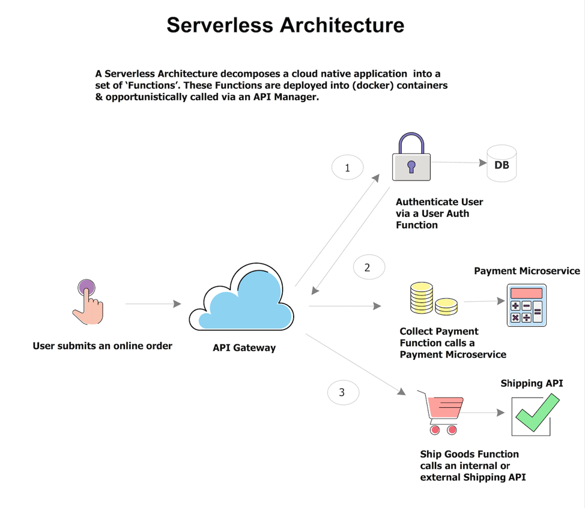
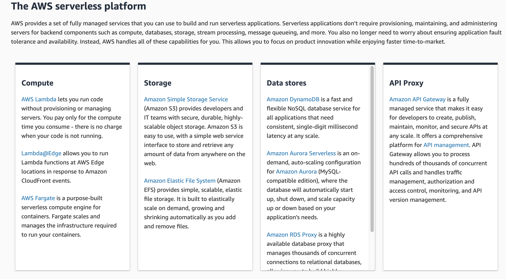

# Class 06

## Agenda

- [What's serverless?](#whats-serverless)
- [AWS API Gateway](/classes/06class/apigateway/README.md)
- [AWS Lambda](/classes/06class/lambda/README.md)
- [AWS DynamoDB - NoSQL database](/classes/06class/dynamodb/README.md)
- [AWS KMS - Key Management](/classes/06class/kms/README.md)
- [AWS SSM Parameter Store](/classes/06class/parameterstore/README.md)
## [Exercises](/classes/06class/exercises/README.md)

## What's serverless?

Serverless computing refers to the concept of building and running applications that **do not require server management**. It describes a finer-grained deployment model where applications, bundled as one or more functions (Functions-as-a-Service (FaaS)), are uploaded to a platform and then executed, scaled, and billed in response to the exact demand needed at the moment.

**Serverless computing does not mean that we no longer use servers to host and run code**; nor does it mean that operations engineers are no longer required.

It refers to the idea that consumers of serverless computing no longer need to spend time and resources on server provisioning, maintenance, updates, scaling, and capacity planning.

Instead, all of these tasks and capabilities are handled by a serverless platform and are completely abstracted away from the developers and IT/operations teams.

As a result, **developers focus on writing their applications’ business logic**. Operations engineers are **able to elevate their focus to more business critical tasks**.

Extracted from: https://github.com/cncf/wg-serverless/tree/master/whitepapers/serverless-overview

## Why use serverless?

Serverless enables you to focus more on the business solution and increase agility, lowering total cost of ownership (no servers to manage!).

This is an very common example of an application flow using an integration via API Gateway, highlighting some business functions.

[Serverless architecture: function-oriented](https://hackernoon.com/what-is-serverless-and-what-it-means-for-you-part-1-d541329172c8)

AWS offers a range of serverless services:

Extracted from: https://aws.amazon.com/serverless/

## What are the benefits of serverless?

- **No server management**: There is no software or runtime to install, maintain, or administer. 
- **Flexible scaling**: You can adjust scaling per business functionality, not per server.
- **No Compute Cost When Idle**: Many serverless services scale to zero, e.g., you only pay when you use them.
- **Automated high availability**: Serverless provides built-in availability and fault tolerance. You don't need to architect for these capabilities.

## Processing Model

- **Event sources** - trigger or stream events into one or more function instances

- **Function instances** - a single function/microservice, that can be scaled with demand

- **FaaS Controller** - deploy, control and monitor function instances and their sources

- **Platform services** - general cluster or cloud services used by the FaaS solution (sometimes referred to as Backend-as-a-Service)

Extracted from: https://github.com/cncf/wg-serverless/tree/master/whitepapers/serverless-overview

## AWS training (free)

- [Introduction to Serverless Development](https://www.aws.training/Details/eLearning?id=27074)

- [Architecting Serverless Solutions](https://www.aws.training/Details/eLearning?id=42594)

- [Other AWS courses](https://www.aws.training/LearningLibrary?filters=language%3A1&filters=digital%3A1&search=serverless&tab=view_all)
