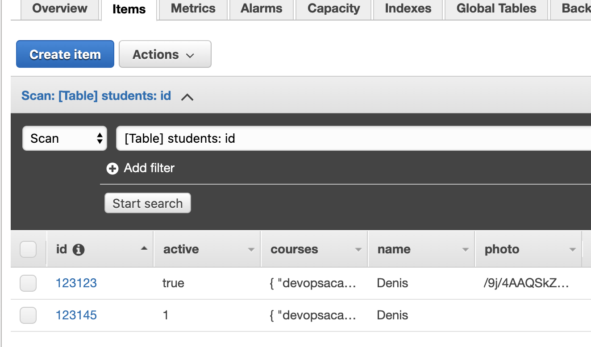
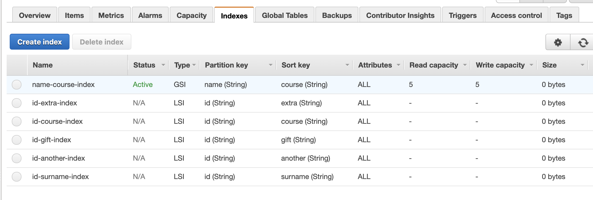
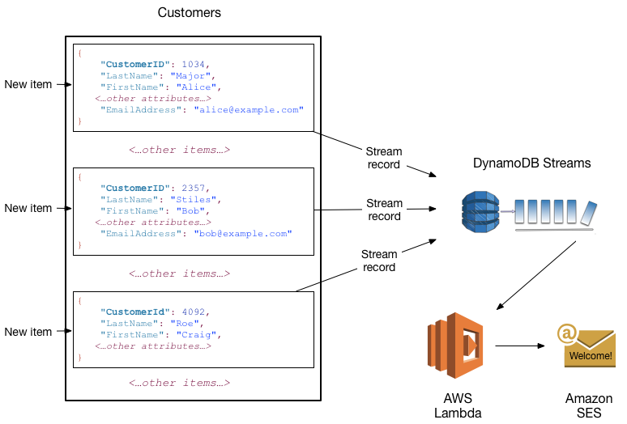

# AWS Dynamo DB

- [AWS Dynamo DB](#aws-dynamo-db)
- [What's AWS DynamoDB?](#whats-aws-dynamodb)
- [Why AWS DynamoDB?](#why-aws-dynamodb)
- [Main building blocks](#main-building-blocks)
  - [Tables, Items, and Attributes](#tables-items-and-attributes)
  - [Example: Table Students](#example-table-students)
  - [Primary Key](#primary-key)
  - [Indexes](#indexes)
    - [Secondary Index](#secondary-index)
- [Consistency Model](#consistency-model)
- [Provisioned capacity mode: Read Capacity Units (RCUs) and Write Capacity Units (WCUs)](#provisioned-capacity-mode-read-capacity-units-rcus-and-write-capacity-units-wcus)
- [Appendix](#appendix)
  - [Attribute Types](#attribute-types)
  - [DynamoDB Streams](#dynamodb-streams)

# What's AWS DynamoDB?

Amazon DynamoDB is a NoSQL database for storing key-value and document data.

It is a serverless service as well, meaning you do need to manage any servers to scale and operate DynamoDB.

You can scale up or scale down your tables' throughput capacity without downtime.

DynamoDB provides on-demand **backup** capability. It allows you to create full backups of your tables for long-term retention and archival for regulatory compliance needs.

# Why AWS DynamoDB?

- **No servers to manage**: DynamoDB is serverless with no servers to provision, patch, or manage and no software to install, maintain, or operate. 
- **Performance at scale**: single-digit millisecond response times at any scale. DynamoDB global tables replicate your data across multiple AWS Regions to give you fast, local access to data for your globally distributed applications.
- Support to **ACID transactions**
- Encryption at Rest
- DynamoDB Streams offers a mechanism to fan-out changes in items so you can easily integrate with other services

Good use cases for DynamoDB include:
- Serverless Web Apps
- Mobile Backends
- Microservices

# Main building blocks

## Tables, Items, and Attributes

The following are the basic DynamoDB components:

**Tables**: DynamoDB stores data in tables which is just a collection of data. 

**Items**: Each table contains zero or more items. An item is a group of attributes that is uniquely identifiable among all of the other items. 

In DynamoDB, there is __no limit__ to the number of items you can store in a table.

**Attributes** – Each item is composed of one or more attributes. Each attribute has Name and Type. 

There are several attribute types, like Bool:

```
"BOOL": true
```

and String:
```
"S": "Hello"
```

Check the [other Attribute Types here](#attribute-types).

## Example: Table Students

This is how an item is stored in DynamoDB. Notice that the attribute types are stored along with the item as the Table does not have a schema itself.

```
{
  "active": {
    "BOOL": true
  },
  "courses": {
    "SS": [
      "devopsacademy2020",
      "python2020",
      "softwarearchitecture2020"
    ]
  },
  "id": {
    "S": "123123"
  },
  "name": {
    "S": "Denis"
  }
}
```

It means that in the same table it is possible for the same attribute to have two different attribute types. For example, `active` can be a Boolean or a Number in different items:



## Primary Key

When you create a table, in addition to the table name, you must specify the primary key of the table.

A table must have a Primary Key which is a special Attribute responsible to uniquely identify each item of a Table.

DynamoDB supports two different kinds of primary keys:

- **Partition key**: A simple primary key. No two items can have the same partition key value.
- **Partition key and sort key**: A combination of two keys. It's possible for two items to have the same partition key value. However, those two items must have different sort key values.

You can query the Table by passing just the **partition key** and it will fetch all sort keys for you, but it does not work the other way around, e.g., the partition key is mandatory when querying by primary key.

Partition Keys and Sort Keys can be:
- String
- Binary
- Number

## Indexes

It is possible to create other indexes than Primary Key to offer flexibility and efficiency for you queries.

Consider the previous example. Let's say the `partition key  = id`  and `sort key = name`.

What if you want to query by course?

```
{
  "active": {
    "BOOL": true
  },
  "courses": {
    "SS": [
      "devopsacademy2020",
      "python2020",
      "softwarearchitecture2020"
    ]
  },
  "id": {
    "S": "123123"
  },
  "name": {
    "S": "Denis"
  }
}
```

There would be no choice unless you do a full scan in the Table to find the item. This is **not recommended**, as full scans may have poor performance depending on the number of items you can in the table. 

So the choice would creating a Secondary Index.

### Secondary Index

There are two types of secondary indexes: 
- Local Secondary Index (LSI): An index that **has the same partition key** as the table, but a different sort key.
- Global Secondary Index (GSI): An index with a partition key and sort key that can be different from those on the table.

In our example, we want to query by `course` and as it is not the partition key, we don't have a choice but create a GSI.

Another important consideration is that LSIs can only be created at Table creation time, meaning that after the table creation there is no way to add a LSI, you would need to go with GSI or recreate the Table.

Each table in DynamoDB has a limit of **20 GSIs** (default limit) and **5 LSIs** per table.



# Consistency Model

**Writing to a Table**

When your application writes data to a DynamoDB table and receives an HTTP 200 response (OK), the write has occurred and is durable. 

The data is eventually consistent across all storage locations, usually within one second or less.

**Reading from a Table**

DynamoDB supports eventually consistent and strongly consistent reads.

Read operations (such as GetItem, Query, and Scan) provide a ConsistentRead parameter. If you set this parameter to true, DynamoDB uses strongly consistent reads during the operation.

- Eventually Consistent Reads

When you read data from a DynamoDB table, the response might not reflect the results of a recently completed write operation. 

The response might include some **stale data**.

- Strongly Consistent Reads

When you request a strongly consistent read, DynamoDB returns the most recent data (not stale data).

Strongly consistent reads have the following drawbacks:
- are not supported on global secondary indexes
- use more throughput capacity than eventually consistent reads
- may have higher latency than eventually consistent reads.

Obs: DynamoDB uses eventually consistent reads, unless you specify otherwise.

# Provisioned capacity mode: Read Capacity Units (RCUs) and Write Capacity Units (WCUs)

For many cases the on-demand capacity mode will be enough for not worrying about capacity.

If you choose provisioned mode (instead of on-demand), you specify the number of reads and writes per second that you require for your application.

Provisioned mode is a good option if you have predictable application traffic or can forecast capacity requirements to control costs.

- One *read capacity unit* represents one strongly consistent read **per second**, or *two* eventually consistent reads **per second**, for an item up to **4 KB** in size.

- One *write capacity unit* represents one write **per second** for an item up to **1 KB** in size.

You can calculate the capacity needed based on the demand expected in your application.

There is also Auto Scaling for provisioned capacity, that will increase/decrease you RCU/WCUs based on utilization automatically, leading to savings.

# Appendix

- [Developer Guide](https://docs.aws.amazon.com/amazondynamodb/latest/developerguide/Introduction.html)

## Attribute Types

**B** - An attribute of type Binary. For example: 
```
"B": "dGhpcyB0ZXh0IGlzIGJhc2U2NC1lbmNvZGVk"
```

**BOOL** - An attribute of type Boolean. For example: 
```
"BOOL": true
```

**BS** - An attribute of type Binary Set. For example: 
```
"BS": ["U3Vubnk=", "UmFpbnk=", "U25vd3k="]
```

**L** - An attribute of type List. For example: 
```
"L": [ {"S": "Cookies"} , {"S": "Coffee"}, {"N", "3.14159"}]
```

**M** - An attribute of type Map. For example:
```
"M": {"Name": {"S": "Joe"}, "Age": {"N": "35"}}
```

**N** - An attribute of type Number. For example: 
```
"N": "123.45"
```

Numbers are sent across the network to DynamoDB as strings, to maximize compatibility across languages and libraries. However, DynamoDB treats them as number type attributes for mathematical operations.

**NS** - An attribute of type Number Set. For example:
```
"NS": ["42.2", "-19", "7.5", "3.14"]
```
Numbers are sent across the network to DynamoDB as strings, to maximize compatibility across languages and libraries. However, DynamoDB treats them as number type attributes for mathematical operations.

**NULL** - An attribute of type Null. For example: 
```
"NULL": true
```

**S** - An attribute of type String. For example:
```
"S": "Hello"
```

**SS** - An attribute of type String Set. For example:
```
"SS": ["Giraffe", "Hippo" ,"Zebra"]
```

## DynamoDB Streams

DynamoDB Streams is an optional feature that captures data modification events in DynamoDB tables. The data about these events appear in the stream in near-real time, and in the order that the events occurred.

Each event is represented by a stream record. If you enable a stream on a table, DynamoDB Streams writes a stream record whenever one of the following events occurs:

- A **new item** is added to the table: The stream captures an image of the entire item, including all of its attributes.

- An **item is updated**: The stream captures the "before" and "after" image of any attributes that were modified in the item.

- An **item is deleted** from the table: The stream captures an image of the entire item before it was deleted.

Stream records have a lifetime of **24 hours**; after that, they are automatically removed from the stream.

