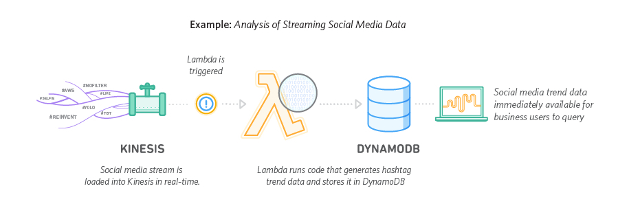
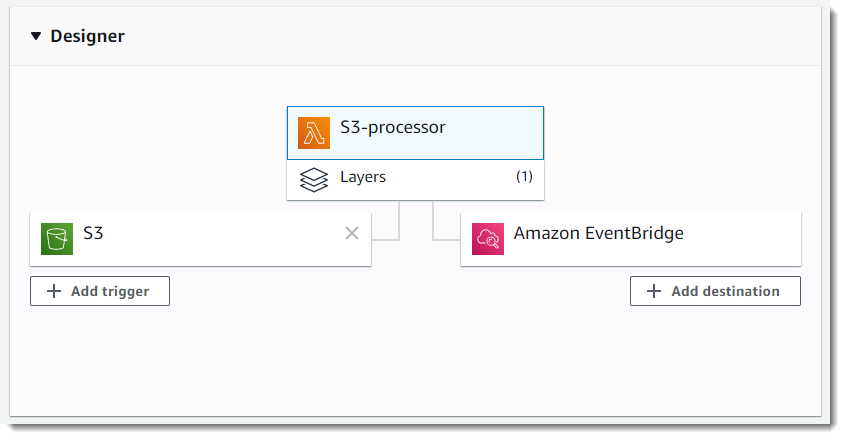

# Lambda Functions
This class is an introduction to Lambda Functions.
The main goal is to explain the purpose, the benefits and how to use it.

***Contents***
- [Lambda Functions](#lambda-functions)
  - [What is Lambda Functions?](#what-is-lambda-functions)
  - [Benefits](#benefits)
  - [Who it works?](#who-it-works)
  - [Event Sources](#event-sources)
  - [Lambda Invocation](#lambda-invocation)
    - [Synchronous invocation](#synchronous-invocation)
    - [Asynchronous invocation](#asynchronous-invocation)
  - [Execution Role](#execution-role)
  - [Common Use Cases](#common-use-cases)
  - [Appendix](#appendix)
    - [Lambda event sources](#lambda-event-sources)

## What is Lambda Functions?

Lambda Functions is one of the computing services in the AWS. Similar to the EC2 service, where you can run your application code, the purpose of the Lambda Function service is also to run application code, but you don't need to manage the server that your code is running on.

With lambda you don't need to provision, scale, patch servers, you just need to care about your business function.

That's why Lambda Functions is a serverless service. You upload your code (list of languages can be found [here](https://aws.amazon.com/lambda/faqs/)) and your code will be executed when invoked.

## Benefits

The biggest benefit of using Lambda Function is the fact that you only pay for what you use. For services like EC2, you pay for the time your instance is up, which already provide you with a lot of cost benefits, since you can turn some of your servers down when your application load is reduced.

Since you'll only pay for the time your application is being executed, if your application has no requests, there are no invocations of your Lambda Function and no costs for you. This capability in a service is called `scale-to-zero`.

It's important to make clear that in order to move your application to a service like this, some code changes might be required. Be sure you carry an analysis about the application being migrated to check if it could be broke down in Lambdas.

## Who it works?

A Lambda is invoked by an event (configured as an Event Source) or manually.

After it is invoked, the lambda service will call the method you configured as being the entry point of the Lambda function.

Once the lambda executed the business logic and integrated with any other service needed, it completes by returning a response.

This is an example of a Lambda triggered by AWS Kinesis and communicating with DynamoDB.



> Image extracted from [here](https://aws.amazon.com/lambda/data-processing/)

## Event Sources

There are multiple events that can be used to invoke a Lambda Function. Common event sources are S3 events (like a new file upload), a new message in a SNS Topic, a new message in a SQS queue, API Gateway requests and DynamoDB events(like new item), but there are many more. 

[Here](https://docs.aws.amazon.com/lambda/latest/dg/lambda-services.html) you can find a list of AWS services that integrates with Lambda with examples.

A Lambda can have one or more events configured to trigger it. Once the event happens, the function is executed.


> Image extracted from [here](https://docs.aws.amazon.com/lambda/latest/dg/configuration-console.html)
> 
## Lambda Invocation

Lambda Functions can be invoked in many ways. Those ways can be either **Synchronous** or **Asynchronous**.

### Synchronous invocation

In the Synchronous mode when you directly invoke your lambda function the caller will wait for the execution response.

By invoking a lambda from the AWS CLI, like the example below, you're using the synchronous mode by default.
```bash
aws lambda invoke --function-name my-function --payload '{ "key": "value" }' response.json
{
    "ExecutedVersion": "$LATEST",
    "StatusCode": 200
}
```

For synchronous invocation, details about the function response, including errors, are included in the response body and headers.

### Asynchronous invocation

In the Asynchronous mode, the Lambda Function is normally invoked by an event in the AWS ecosystem. An event like a new file in a S3 bucket, a new update on your DynamoDB or new message in a SQS queue are good examples of asynchronous Lambda invocation.

In this mode, the Lambda is invoked similar to the synchronous mode, but in this case, there is no wait for the Lambda response.

For this kind of invocation, Lambda places the event in a queue and just returns a success response without any additional information about the execution.

It's still possible to invoke a Lambda function in this mode using the CLI by using the `--invocation-type Event` parameter when invoking a function. In the example below, using the same function, you can see a different response for the previous example.

```bash
$ aws lambda invoke --function-name my-function  --invocation-type Event --payload '{ "key": "value" }' response.json
{
    "StatusCode": 202
}
```

More details around those two types of invocation can be found [here](https://docs.aws.amazon.com/lambda/latest/dg/invocation-async.html) and [here](https://docs.aws.amazon.com/lambda/latest/dg/invocation-sync.html).


## Execution Role

Because the Lambda Function may need to interact with other AWS services, like creating a file in S3, interacting with DynamoDB or even logging the execution in CloudWatch, it's possible to configure a role to be used by the Lambda during it's execution. This is called Lambda Execution Role.

This role is similar to any other role in AWS and it is created using IAM service. A single Execution Role can be attached to a Lambda Function, so make sure that all permissions that will be required by the Lambda to successfully interact with AWS services are included in the Role configured in the Function.

The Principal for this role is the lambda service:
```
{
    "Effect": "Allow",
    "Principal": {
        "Service": "lambda.amazonaws.com"
    },
    "Action": "sts:AssumeRole"
}
```

Example:


[Read more about lambda execution roles here](https://docs.aws.amazon.com/lambda/latest/dg/lambda-intro-execution-role.html)

## Common Use Cases

Lambda Functions can be used for pretty much anything. From executing a daily job in your AWS Account, like shutting down instances that do not have a specific tag, to run an entire website, Lambda Function is one of the most powerfull services provided by AWS.

Some of the most common use cases are described below:

- Real Time Data Processing
    - Use AWS Lambda to thumbnail images, transcode videos, index files, process logs, validate content, and aggregate and filter data in real-time.
- Real Time Data Streaming
    - Use AWS Lambda and Amazon Kinesis to process real-time streaming data for application activity tracking, transaction order processing, click stream analysis, data cleansing, metrics generation, log filtering, indexing, social media analysis, and IoT device data telemetry and metering
- Web Applications
    - Use AWS Lambda with other AWS services to build powerful web applications that automatically scale up and down and run in a highly available configuration across multiple data centers 
- Operations Tasks
    - Use AWS Lambda to automate common task to manage your AWS environment, like cleaning up unused EIP or EBS volumes or shutting down resources that were not created with the right tags.

## Appendix

### Lambda event sources

https://docs.aws.amazon.com/lambda/latest/dg/lambda-services.html)

Services that Lambda reads events from:

- Amazon Kinesis
- Amazon DynamoDB
- Amazon Simple Queue Service

Services that invoke Lambda functions synchronously:

- Elastic Load Balancing (Application Load Balancer)
- Amazon Cognito
- Amazon Lex
- Amazon Alexa
- Amazon API Gateway
- Amazon CloudFront (Lambda@Edge)
- Amazon Kinesis Data Firehose
- AWS Step Functions
- Amazon Simple Storage Service Batch

Services that invoke Lambda functions asynchronously:

- Amazon Simple Storage Service
- Amazon Simple Notification Service
- Amazon Simple Email Service
- AWS CloudFormation
- Amazon CloudWatch Logs
- Amazon CloudWatch Events
- AWS CodeCommit
- AWS Config
- AWS IoT
- AWS IoT Events
- AWS CodePipeline