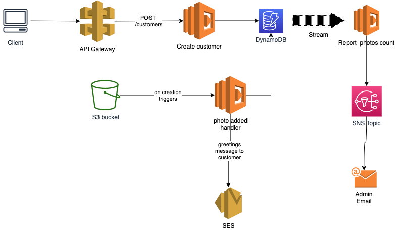

## Upload profile images

Use as base for this exercise, your solution for the exercise from the last class (API gateway -> Lambda -> DynamoDB).

**Requirements**:
- the name of the image is the email address of the user (to keep codification simpler)
- Using a new Lambda (you need to create it) triggered by the S3 object creation, update the DynamoDB Table you created in the previous exercise to store the photo location path (S3 prefix) new attribute `photo_location` for that user by email address.
  - Example:
    - If I upload the file PNG `bob@gmail.com.png` to the S3 bucket `s3://mycustomersphotos`, then the Item in DDB for the email address `bob@gmail.com` needs to update the attribute `photo_location` to `bob@gmail.com.png`
- Also, in the previous lambda, if the update was successful, send an email (SES) to the user saying "Thanks for adding your awesome photo :)"

- As soon as a new customer is created in the DynamoDB Table, stream it (DDB Streams) and send a report message by email (SNS) to the admin email (your email here) saying "Number of records: X", where X is the number of customers in the table

At this stage you probably already have this:

Target state:

