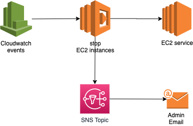

## Compliance - Shutdown EC2 instances not tagged

Requirement:
- If an EC2 instance is running and is not tagged with `CostCentre` (any value), terminate it and notify subscribed admins via a SNS topic that has only your email subscribed.

Tips:
- Solution will include a Cloudwatch event rule (see below) and a Lambda ([check the ./src folder](../c07-serverless02/src/))



Sample CloudWatch Event rule:
```json
{
  "source": [
    "aws.ec2"
  ],
  "detail-type": [
    "EC2 Instance State-change Notification"
  ],
  "detail": {
    "state": [
      "running"
    ]
  }
}
```

## Submit a PR with the following files:
- README.md based on the [ANSWER.md file](ANSWER.md) with a link to the following files from your answer (the actual solution may have more files):
    - `main.tf`: terraform code for all resources
    - `docker-compose.yaml`: part of 3M 
    - `Makefile`: 3 Musketeers implementation
    - In the `README.md` file include details on the execution of the test below:
