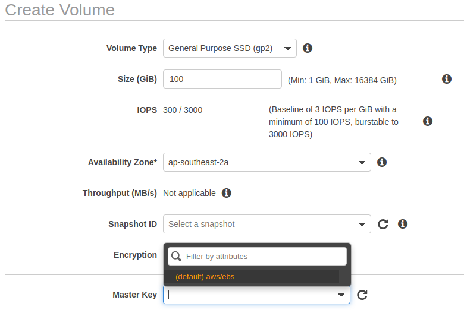

# KMS
This class is an introduction to AWS KMS.
The main goal is to explain the purpose, the benefits and how to use it.

***Contents***
- [What is AWS KMS?](#what-is-aws-kms)
- [Purpose of KMS](#purpose-of-kms)
- [Types of Keys](#types-of-keys)
- [How to use KMS](#purpose-of-kms)
- [Keys' Management](#keys-management)
- [Main AWS Services Integrated with KMS](#main-aws-services-integrated-with-kms)

## What is AWS KMS?
AWS KMS(Key Management Service) helps you to centrally manage and store you cryptographic keys and control their usage across several AWS services and in applications. It's a managed regional service, which means that the HA across AZ is already handled by AWS and keys can only be used inside the region it exists.


## Purpose of KMS
KMS purpose is to encrypt data. Many services in AWS provide an encryption option which will make the data be encrypted when it is handled by an AWS service like S3, DynamoDB, EBS and RDS. [Here](https://aws.amazon.com/kms/features/) you can find a list of all services that integrate with KMS. 

This helps enhance the data security, since only people with permission to read the data `and` with access to the key used to encrypt the data will be able to properly read it.

## Types of Keys
AWS works with two types of keys. The `Symmetric` has a single encryption key that is used for both encryption and decryption operations. The `Asymmetric` have a public and a private key pair that can be used for encrypting/decrypting or signing/verifying operations. Asymmetric keys are not available in all regions yet.

For each type of key a list of types and algorithms are supported and can be found in the [KMS FAQ page](https://aws.amazon.com/kms/faqs/).

## How to use KMS?
KMS is easy to use and in most cases you can encrypt/decrypt your data without having to interact with the KMS service directly. When creating resources (through the console, API or terraform) you can specify if encryption is enabled or disabled. In this situation, you're already making use of KMS indirectly.

For example, when creating an EBS volume in terraform:
```terraform
resource "aws_ebs_volume" "example" {
  availability_zone = var.az
  size              = var.disk_size
  encrypted         = true

  tags = {
    Name = var.name
  }
}
```
In the example above, the EBS volume being created will use a KMS key to be encrypted. Since we're not specifying the key to be used through the `kms_key_id` argument, the resource will be created using the default KMS key for its service (EBS in this case).

Using the console, it's easier to see which key is being used in the case that no key is provided:


Because it's not possible to have a lot of controls over the service default's key, it's recommended to have your own keys to increase the security being applied to the resources. 

The terraform code below is using a custom key to encrypt the EBS volume.

```terraform
resource "aws_kms_key" "my_key" {
  description = "My KMS Key"
}

resource "aws_ebs_volume" "example" {
  availability_zone = var.az
  size              = var.disk_size
  encrypted         = true
  kms_key_id        = aws_kms_key.my_key.arn
  tags = {
    Name = var.name
  }
}
```

With that approach, by using AWS IAM it's possible to create policies to restrict which users/roles can perform encrypt/decrypt action using that key.

## Key's Management
For the AWS managed key (service's defaults), there is nothing to do. Keys will be fully managed by AWS and will be rotated every three years. There is no way to change/rotate/expire/delete those keys.

For Customer Managed Keys (created by users), there is minimum management, but you have more control over the key lifecycle. For example, it's possible to expire and delete a customer manager key. The key rotation can be done by the user or can be configured to be rotated automatically by AWS, which will rotate the key every year. 

The example below shows a key that will be automatically rotated by AWS:

```terraform
resource "aws_kms_key" "my_key" {
  description         = "My KMS Key"
  enable_key_rotation = true
}
```

Because customer-managed keys can be expired and deleted, is important to note that the key deletion action is destructive and potentially dangerous and must be done only when you are absolutely sure that there is no data encrypted with that key.

Any data encrypted with a deleted key can no longer be recoverable and becames useless.

Because of this risk, any key deletion action can only be done after a waiting period that the key will need to wait before being deleted. This helps the identification of data still encrypted with the key being deleted.

## Main AWS Services Integrated with KMS
There is a long list of services that integrates with KMS, but below is the list of some of the more common ones:
- Amazon Aurora
- Cloudwatch Logs
- DynamoDB
- EBS
- EFS
- S3/Glacier
- RDS
- SNS
- SQS
- CloudTrail
- System Manager
- Many others

## Appendix
- [KMS Key Rotation](https://docs.aws.amazon.com/kms/latest/developerguide/rotate-keys.html)
- [KMS Developer Guide](https://docs.aws.amazon.com/kms/latest/developerguide/overview.html)
