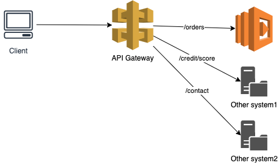
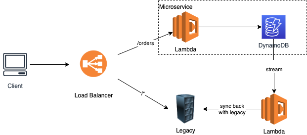
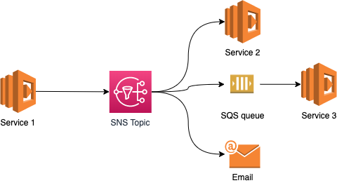
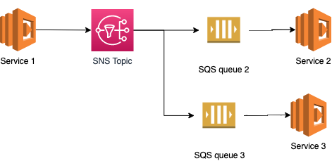
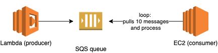
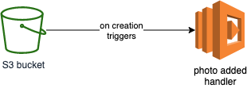
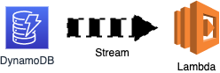

## Summary
- [Serverless Integration patterns](#serverless-integration-patterns)
  - [Simple API and Robust APIs](#simple-api-and-robust-apis)
  - [Strangler pattern](#strangler-pattern)
  - [Publish/Subscriber messaging](#publishsubscriber-messaging)
  - [Persistent Asynchronous Messaging](#persistent-asynchronous-messaging)
  - [Queue-based Load Leveling](#queue-based-load-leveling)
  - [Flat files integration](#flat-files-integration)
  - [Scheduled jobs](#scheduled-jobs)
  - [Event triggers](#event-triggers)
  - [References](#references)
- [AWS services](#aws-services)
  - [DynamoDB Streams](#dynamodb-streams)
  - [Simple Notification Service (SNS)](#simple-notification-service-sns)
    - [Message filtering](#message-filtering)
  - [Simple Queue Service (SQS)](#simple-queue-service-sqs)

# Serverless Integration patterns

While using serverless computing and managed services, you can really leverage the pay-as-you-go model and flexibility to build complex solutions.

You don’t have to worry much about managing infrastructure, provisioning or planning for demand and scale (keep an eye on service limits).

Here are some architectural patterns that you can apply in your solution.

## Simple API and Robust APIs 

> https://www.enterpriseintegrationpatterns.com/patterns/messaging/EncapsulatedSynchronousIntegration.html

Routing to multiple systems using API gateway resources. 



It’s highly recommended that functions are stateless, sessions are cached and connections to downstream services are handled appropriately.

## Strangler pattern

The Strangler pattern is a technique to gradually migrate legacy systems. In this pattern a service acts as a facade that intercepts requests from the clients, and routes them to either the legacy service or new services.



An Application Load Balancer (or API gateway - proxy) routes clients’ requests to the Orders Service, the first microservice the team implemented. Everything else continues to go to the Legacy application.

The Legacy components gradually becomes smaller and smaller until you completely migrate it to microservices.

Reference:
- [DynamoDB Streams](#dynamodb-streams)


## Publish/Subscriber messaging

> https://www.enterpriseintegrationpatterns.com/patterns/messaging/PublishSubscribeChannel.html

In Publisher-Subscriber services publish events through a channel as messages. Multiple interested consumers listen to the events by subscribing to these channels.

It allows building loosely-coupled architectures that overcome the limits of remote service communication, like latency and unreliability. - [Eduardo Romero](https://medium.com/@eduardoromero/serverless-architectural-patterns-261d8743020#ba1c)



In this example the `Service 1` publishes a message to the SNS Topic. The service is not aware of what is subscribed to the Topic. The subscriptions to the SNS topic are created usually when a service is deployed or another process (for email/SMS subscriptions for example). The message is then published at least once for every subscriber.

> Besides the known limitation and guarantees of each messaging service there should be conscious considerations for message duplication, message ordering, poisonous messages, sharding, and data retention.
> Publisher / Subscriber is a great match for event-driven architectures.

Technical References:
- [Simple Notification Service (SNS)](#simple-notification-service-sns)

## Persistent Asynchronous Messaging

A queue decouples tasks from services, creating a buffer that holds requests for less scalable backends or third-party services.



A common example is using SQS to buffer API requests to amortize spikes in traffic.
The endpoint returns `202 — Accepted` to the client, with a transaction id and a location for the result. On the client-side the UI can give feedback to the user emulating the expected behavior.

## Queue-based Load Leveling

> https://read.acloud.guru/applying-the-decoupled-invocation-pattern-with-aws-lambda-2f5f7e78d18

AWS Lambda and Kinesis can scale quickly, overwhelming downstream services that are less elastic or slower to scale.

By polling at a constant rate, you can ensure the consuming service does not get overloaded, without limiting the producer or creating higher latencies on the producer side.



Technical Reference:
- [Simple Queue Service (SQS)](#simple-queue-service-sqs)

## Flat files integration

> https://www.enterpriseintegrationpatterns.com/patterns/messaging/FileTransferIntegration.html

There are some use cases where you need to trigger the processing when a file is created, updated or deleted. Common use cases for this are for image resizing, where the original image is resized to different dimensions and becoming thumbnails used by mobile applications.

For those cases you can use S3 Event Notifications to notify Lambda, SQS or SNS about an object.



[Read more here](https://docs.aws.amazon.com/AmazonS3/latest/dev/NotificationHowTo.html)

## Scheduled jobs

If you need to implement for example power management process to alleviate the costs of your infra, probably you will look into some kind of scheduler (like `cron`) to help you triggering the jobs.

A common use case for it is stopping `dev` EC2 instances out of business hours to avoid paying extra instance hours when no one is using them.

AWS CloudWatch Events (AWS EventBridge) can be used to schedule cronjobs and trigger 

## Event triggers

Events are important information sources. In event-driven architectures, after services handle requests applying business logic, zero or many domain events can be published.

Other services can subscribe to these events and invoke their handlers. The source service is not aware of which services are invoked as the result of a published event, and this leads to a decoupled inter-service communication.


Amazon CloudWatch Events delivers a near real-time stream of system events that describe changes in Amazon Web Services (AWS) resources. CloudWatch Events becomes aware of operational changes as they occur. 

You can configure a variety of targets to handle an event, like:

- Amazon EC2 instances
- AWS Lambda functions
- Streams in Amazon Kinesis Data Streams
- Delivery streams in Amazon Kinesis Data Firehose
- Log groups in Amazon CloudWatch Logs
- Amazon ECS tasks
- Systems Manager Run Command
- Systems Manager Automation
- AWS Batch jobs
- Step Functions state machines
- Pipelines in CodePipeline
- CodeBuild projects
- Amazon Inspector assessment templates
- Amazon SNS topics
- Amazon SQS queues
- Built-in targets: EC2 CreateSnapshot API call, EC2 RebootInstances API call, EC2 StopInstances API call, and EC2 TerminateInstances API call.
- The default event bus of another AWS account


[Read more about CloudWatch Events](https://docs.aws.amazon.com/AmazonCloudWatch/latest/events/WhatIsCloudWatchEvents.html)


## References

- https://medium.com/@eduardoromero/serverless-architectural-patterns-261d8743020#d84d

# AWS services

## DynamoDB Streams

DynamoDB Streams is a feature in DynamoDB service that allows you to stream in a time series temporary storage (max TTL 24 hours) the changes that happened to a Table.



Key points:
- A DynamoDB stream is an *ordered flow*. Each stream record is a change in the Table and appears just once in the stream.
- Encryption at rest encrypts the data in DynamoDB streams. 
- Each stream record appears exactly once in the stream.
- For each item that is modified in a DynamoDB table, the stream records appear in the same sequence as the actual modifications to the item.

DynamoDB Streams supports the following stream record views:

- **KEYS_ONLY**: Only the key attributes of the modified item
- **NEW_IMAGE**: The entire item, as it appears after it was modified
- **OLD_IMAGE**: The entire item, as it appears before it was modified
- **NEW_AND_OLD_IMAGES**: Both the new and the old images of the item

Some use cases include (some the AWS website):
- An application in one AWS Region modifies the data in a DynamoDB table. A second application in another Region reads these data modifications and writes the data to another table, creating a replica that stays in sync with the original table.

- A popular mobile app modifies data in a DynamoDB table, at the rate of thousands of updates per second. Another application captures and stores data about these updates, providing near-real-time usage metrics for the mobile app.

- A global multi-player game has a multi-master topology, storing data in multiple AWS Regions. Each master stays in sync by consuming and replaying the changes that occur in the remote Regions.

- An application automatically sends notifications to the mobile devices of all friends in a group as soon as one friend uploads a new picture.

- A new customer adds data to a DynamoDB table. This event invokes another application that sends a welcome email to the new customer.

## Simple Notification Service (SNS)

Amazon Simple Notification Service (Amazon SNS) is a web service that coordinates messages to subscribing endpoints. 

In Amazon SNS, there are two types of clients — publishers and subscribers.

**Publishers** communicate asynchronously with subscribers by producing and sending a message to a topic, which is a logical access point and communication channel. 

**Subscribers** (that is, web servers, email addresses, Amazon SQS queues, AWS Lambda functions) consume or receive the message or notification over one of the supported protocols (that is, Amazon SQS, HTTP/S, email, SMS, Lambda) when they are subscribed to the topic.

Messages have two main parts:
- **Message body**: the actual content of the message
- **Message attributes**: metadata about the message

For attribute mapping between Amazon SNS and Amazon SQS, each message can have *up to 10 attributes*. When using raw mode or an endpoint other than Amazon SQS, a message can have *more than 10 attributes*.

Key takeaways:
- SNS supports resource policies per Topic. You need to allow identities or services to publish or subscribe to a Topic.
- SNS supports server-side encryption (SSE) using CMKs.
- Message attributes can be used for message filtering (see below)
- Check [message retries policy](https://docs.aws.amazon.com/sns/latest/dg/sns-message-delivery-retries.html)

> Although most of the time each message will be delivered to your application exactly once, the distributed nature of Amazon SNS and transient network conditions could result in occasional **duplicate messages** at the subscriber end. Developers should design their applications such that **processing a message more than once does not create any errors or inconsistencies**.

### Message filtering

By default, an Amazon SNS topic subscriber receives every message published to the topic. To receive a subset of the messages, a subscriber must assign a **filter policy** to the **topic subscription**.

A **filter policy** is a simple JSON object containing attributes that define which messages the subscriber receives.

Example SNS message:
```json
{
   "Type": "Notification",
   "MessageId": "a1b2c34d-567e-8f90-g1h2-i345j67klmn8",
   "TopicArn": "arn:aws:sns:us-east-2:123456789012:MyTopic",
   "Message": "message-body-with-transaction-details",
   "Timestamp": "2019-11-03T23:28:01.631Z",
   "SignatureVersion": "4",
   "Signature": "signature",
   "UnsubscribeURL": "unsubscribe-url",
   "MessageAttributes": {
      "customer_interests": {
         "Type": "String.Array",
         "Value": "[\"soccer\", \"rugby\", \"hockey\"]"
      },
      "store": {
         "Type": "String",
         "Value":"example_corp"
      },
      "event": {
         "Type": "String",
         "Value": "order_placed"
      },
      "price_usd": {
         "Type": "Number", 
         "Value":210.75
      }
   }
}
```

Example Filter Policy:
```json
{
   "store": ["example_corp"],
   "event": [{"anything-but": "order_cancelled"}],
   "customer_interests": [
      "rugby",
      "football",
      "baseball"
   ],
   "price_usd": [{"numeric": [">=", 100]}]
}
```

If any single attribute in this policy doesn't match an attribute assigned to the message, the policy rejects the message.

> - The maximum size of a policy is 256 KB.
> - A filter policy can have a maximum of 5 attribute names.
> - [Read more about filter policies](https://docs.aws.amazon.com/sns/latest/dg/sns-subscription-filter-policies.html#example-filter-policies)

## Simple Queue Service (SQS)

Amazon Simple Queue Service (Amazon SQS) offers a secure, durable, and available hosted queue that lets you integrate and decouple distributed software systems and components.

Two queue types:
- **Standard**: At-least once delivery, best-effort ordering.
- **FIFO**: First-in-first-out delivery, message ordering is preserved

When receiving a message there are some attributes you can set as:
- *Delivery delay*: amount of time to delay the first delivery of each message added to the queue. Up to 15 minutes.
- *Visibility timeout*: time that a message received from a queue will not be visible to the other message consumers. Up to 12 hours.
- *Retention period*: up to 14 days.
- *Maximum message size*: up to 256 KB.
- *Receive message wait time*: maximum amount of time that polling will wait for messages to become available to receive. Useful for long polling and avoiding empty responses from SQS.


SQS key points:
- A single SQS queue can contain an unlimited number of messages
- Supports Server-side encryption using KMS keys
- Supports resource-based policies to control access
- Supports Dead-letter queue configuration. **Dead-letter queues** let you isolate problematic messages to determine why they are failing
